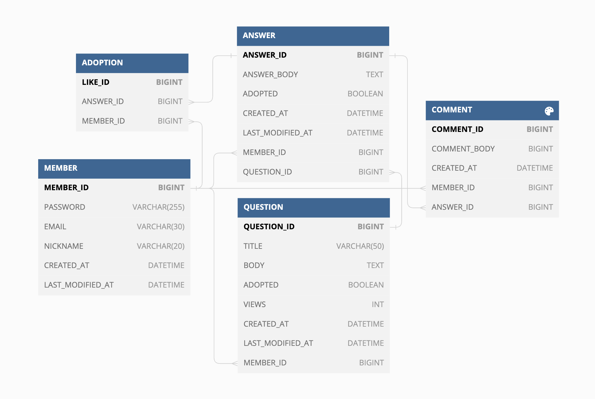
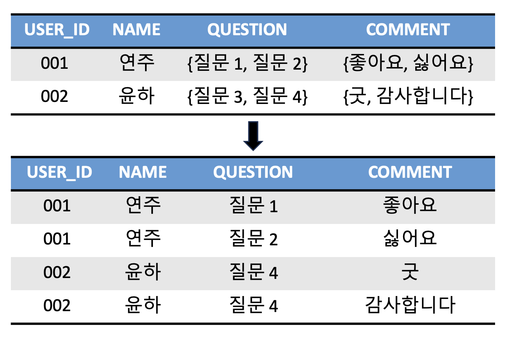
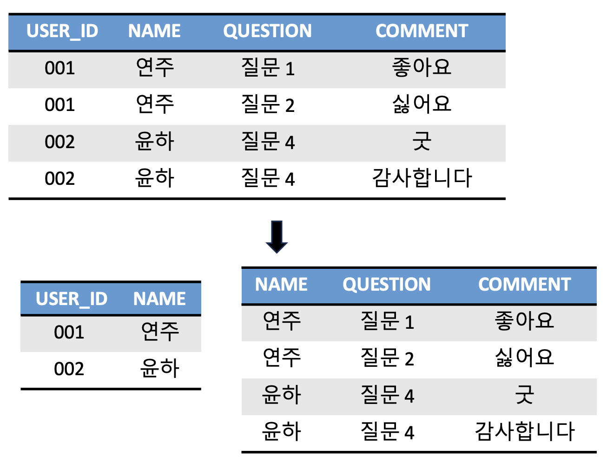
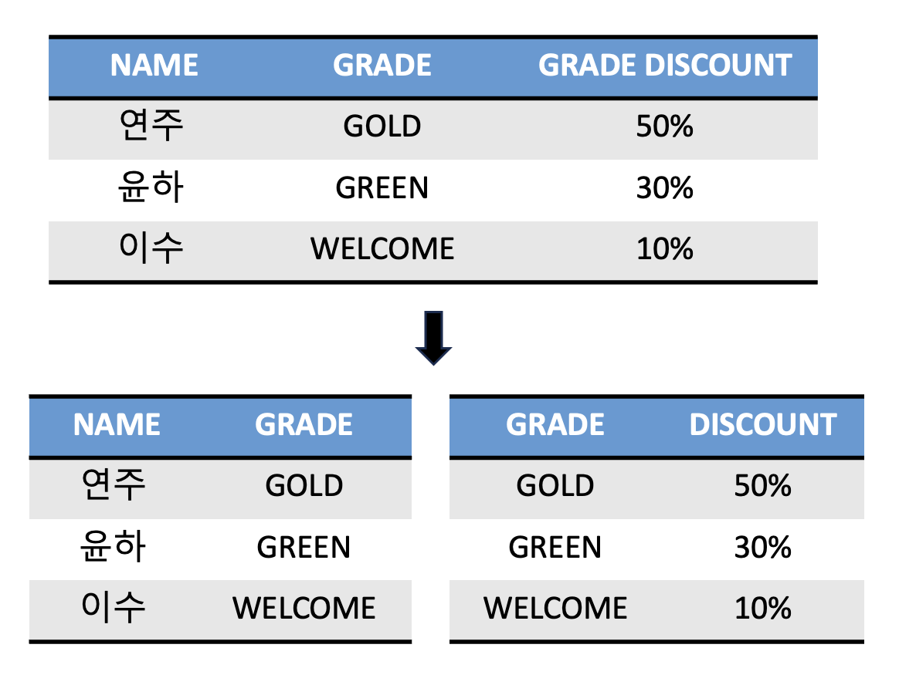
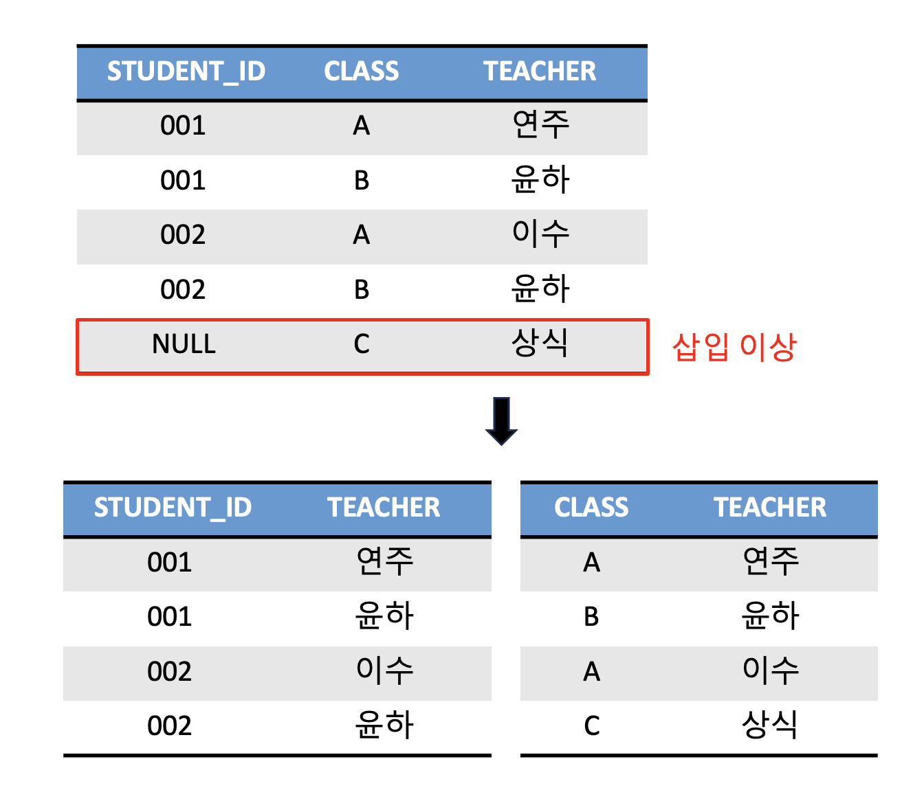

# 💡 ERD와 정규화

## ERD(Entity Relationship Diagram)
ERD는 DB를 구축할 때 가장 기초적인 뼈대 역할을 하며, 테이블 간의 관계를 정의한 것이다.   
서비스를 구축할 때 가장 먼저 신경써야 할 부분이다.

ERD는 시스템의 요구 사항을 기반으로 작성되며 이 ERD를 기반으로 DB를 구축한다.  
DB를 구축한 이후에도 디버깅 또는 비즈니스 프로세스 재설계가 필요한 경우에 설계도 역할을 하기도 한다.

ERD는 관계형 구조로 표현할 수 있는 데이터를 구성하는 데 유용하지만,        
`비정형 데이터`를 충분히 표현할 수 없다는 단점이 있다.

> `비정형 데이터`: 비구조화 데이터. 미리 정의된 데이터 모델이 없거나 미리 정의된 방식으로 정리되지 않은 정보를 말한다.

> 위 그림은 스택 오버플로우 클론 프로젝트 진행 시 설계했던 ERD이다.

##  정규화(Normalization)
### 📍 정규화 과정
- 잘못된 종속 관계로 인해 `데이터베이스 이상 현상`이 일어난 경우, 이를 해결하는 과정      
- 저장 공간을 효율적으로 사용하기 위해 관계를 여러 개로 분리하는 과정
- `정규형 원칙`을 기반으로 정규형을 만들어가는 과정

### 📍 이상 현상(Anomaly)
1. 삭제 이상: 삭제 시, 같이 저장된 필요한 정보까지 연쇄적으로 삭제되는 현상
2. 삽입 이상: 삽입 시, 특정 속성에 해당하는 값이 없어 **NULL**을 입력해야하는 현상
3. 수정 이상: 수정 시, 중복된 데이터의 일부만 수정되어 일어나는 데이터 불일치 현상

이상 현상은 서로 공유하는 데이터임에도 각각 독립적으로 존재하기 때문에 발생한다.       
이를 방지하기 위해 적절하게 테이블을 분리해야 한다.(정규화)

## 정규형(NF, Normal Form) 원칙
- 같은 의미를 표현하는 릴레이션이지만 더 좋은 구조로 만들어야 함
- 자료의 중복성은 감소해야 함 
- 독립적인 관계는 별개의 릴레이션으로 표현해야 함
- 각각의 릴레이션은 독립적인 표현이 가능해야 함

### 📍 제 1 정규형   
- 릴레이션의 모든 도메인이 더 이상 분해될 수 없는 원자 값(atomic value)만으로 구성되어야 함.
- 릴레이션의 속성 값 중에서 한 개의 기본키에 대해 두 개 이상의 값을 가지는 반복 집합이 있어서는 안 됨.         
- 만약 반복 집합이 있다면 제거해야 함

### 📍 제 2 정규형
- 제 1 정규형이며 부분 함수의 종속성을 제거한 형태
  - 모든 컬럼이 부분적 종속이 없어야 함
- 릴레이션을 분해할 때 정보 손실이 발생하지 않아야 함

### 📍 제 3 정규형
- 제 2 정규형이며 기본키가 아닌 모든 속성이 `이행적 함수 종속`이 없어야 한다.
> `이행적 함수 종속(Transitive Funtional Dependency)`     
>  A -> B 이고 B -> C 이면, 논리적으로 A -> C 이다.    
> 이때 집합 C가 A에 이행적으로 함수 종속이 되었다고 말한다.

위 그림에서, `Name -> Grade`, `Grade -> Discount` 를 만족하므로(이행적 함수 종속 되었으므로)   
제 3 정규화를 통해 분리할 수 있다.

### 📍 보이스/코드 정규형(BCNF)
결정자가 후보키가 아닌 함수 종속 관계를 제거하여 릴레이션의 함수 종속 관계에서 모든 결정자가 후보키인 상태를 말한다.    
제 3 정규화로 해결할 수 없는 이상현상을 해결할 수 있다.

> `결정자와 종속자`: X -> Y일 때, X는 결정자, Y는 종속자

한 명의 교사는 한 개의 클래스만 담당할 수 있고, 학생은 여러 클래스를 선택 할 수 있는 예시를 들어보자.
이 때, `{STUDENT_ID, CLASS}`로 `TEACHER`를 결정할 수도 있고,   
`{STUDENT_ID, TEACHER}`로 `CLASS`를 결정할 수도 있다.    

즉, 후보키가 두 개인 상황이 되는 것이다.
이런 경우, 만약 `상식`이 `C`클래스를 담당한다고 했을 때 이를 삽입하면 `STUDENT_ID`가 `NULL`이 되는 삽입 이상 현상이 나타난다.

이렇듯, PK는 하나만 되어야 하기 때문에 둘 중 하나를 선택해서 테이블을 분리한다.

## 역정규화(Denormalization)
- 정규화된 테이블을 다시 결합하는 `비정규화(Unnormalization)`의 방법 중 하나
- DB의 완벽한 구조설계를 포기하고 데이터의 무결성을 떨어트리는 대신, 관계형 DB의 조회 성능을 향상시키기 위한 방법
- 주의할 점
  - 데이터의 일부만 수정되는 등, **무결성**(데이터의 정확성)이 떨어지는 것
  - **조회** 속도는 빨라지지만 **삽입/수정/삭제** 속도는 느려지는 것
  - 중복 데이터의 공간차지로 인한 저장 공간 효율성 저하
  - 쉽게 수정할 수 없기 때문에 유지보수가 어려움

## 정규화의 장단점
### 장점
- 이상 현상을 해결할 수 있다.
- 정규화된 테이블들과 관계를 클라이언트에 제공할 수 있다.
### 단점
- 릴레이션 간의 쿼리 JOIN이 많아져서 오히려 느려질 수 있다.

정규화 과정을 거쳐 테이블을 나눈다고 해서 성능이 무조건 좋아지는 것은 아니다.        
쿼리 조인 등의 이유로 오히려 느려질 수도 있기 때문에, 서비스에 따라 정규화/비정규화 과정을 진행해야 한다.

-------------------------------------------------

### References
- [정규화(Normalization) / 이상현상, 함수종속성, 정규화](https://jeongm1n.tistory.com/entry/%EB%8D%B0%EC%9D%B4%ED%84%B0%EB%B2%A0%EC%9D%B4%EC%8A%A4-%EC%A0%95%EA%B7%9C%ED%99%94Normalization-%EC%9D%B4%EC%83%81%ED%98%84%EC%83%81-%ED%95%A8%EC%88%98%EC%A2%85%EC%86%8D%EC%84%B1-%EC%A0%95%EA%B7%9C%ED%99%94)
- [비정규화, 역정규화](https://chankim.tistory.com/7)
- [정규형](https://jeongm1n.tistory.com/entry/%EB%8D%B0%EC%9D%B4%ED%84%B0%EB%B2%A0%EC%9D%B4%EC%8A%A4-%EC%A0%95%EA%B7%9C%ED%99%94Normalization-%EC%9D%B4%EC%83%81%ED%98%84%EC%83%81-%ED%95%A8%EC%88%98%EC%A2%85%EC%86%8D%EC%84%B1-%EC%A0%95%EA%B7%9C%ED%99%94)