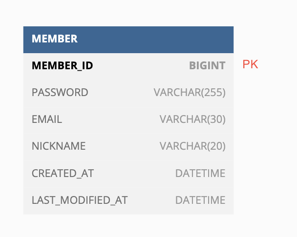
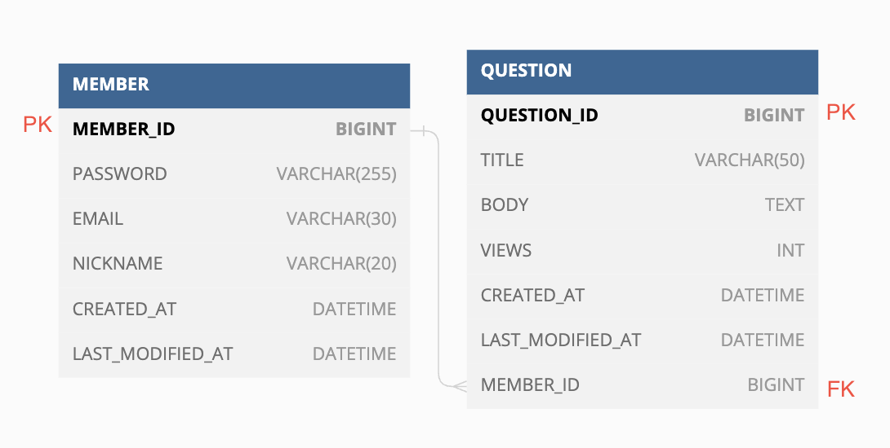
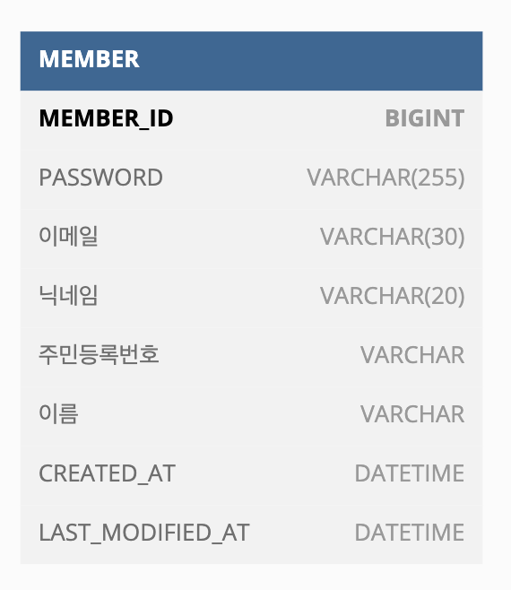

# 🔑 Key
Key는 테이블 간의 관계를 조금 더 명확하게 하고 테이블 자체의 인덱스를 위해 설정된 장치로, 
기본키, 외래키, 후보키, 슈퍼키, 대체키가 있다.

## 기본키(PK, Primary Key)
기본키는 `유일성`과 `최소성`을 만족하며, 테이블의 데이터 중 고유하게 존재하는 속성이다.
> `유일성`: 중복되는 값이 없음   
> `최소성`: 필드를 조합하지 않고 최소 필드만 써서 키를 형성할 수 있는 것

기본키는 자연키 또는 인조키 중에 골라 설정한다.
- 자연키       
  Member 테이블을 만든다고 가정하면, 비밀번호, 이메일, 닉네임, 성별 등의 속성이 있다.        
  성별, 닉네임 등은 중복 값이 가능하므로 자연스럽게 남은 이메일이 기본키가 된다.           
  이렇듯, 자연스럽게 나오는 키를 자연키라고 한다.
- 인조키     
  인위적으로 id등을 부여해서 고유 식별자를 만드는 키를 말한다. (MEMBER_ID가 해당)   
  오라클은 sequence, MySQL은 auto increament로 설정한다.

## 외래키(FK, Foreign Key)
다른 테이블의 기본 키를 그대로 참조하는 값으로 개체와의 관계를 식별하는데 사용하는 키를 말한다.      
외래키는 중복되어도 괜찮다.

## 슈퍼키(Super Key)
테이블에서 각 행을 유일하게 식별할 수 있는 속성들의 집합으로, 유일성은 만족하지만 최소성은 만족하지 않는다.

위 예시에서 슈퍼키는       
{이메일}, {주민등록번호}, {이메일, 주민등록번호} 가 된다.

## 후보키(Candidate Key)
기본키가 될 수 있는 후보를 말한다.
유일성과 최소성을 동시에 만족한다.   
위 예시에서는 이메일과 주민등록번호가 후보키가 된다.

## 대체키(Alternate Key)
후보키가 두 개 이상일 경우 어느 하나를 기본키로 지정하고 남은 후보키를 말한다.   
{이메일, 주민등록번호}가 슈퍼키라면, 주민등록번호를 기본키로 지정했을 시, 이메일이 후보키가 된다.