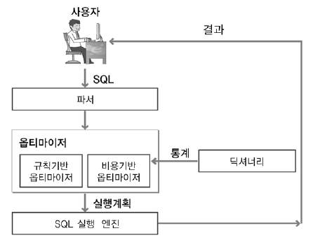

### 데이터베이스 관리 시스템 [ DBMS, Database Management System ]

응용프로그램이 데이터에 접근하기 위해 거쳐야하는 시스템으로, OS 위에서 작동하며 데이터베이스의 생성과 조작 담당

# 🗳 DBMS의 필수 기능과 SQL 문법

## 1. Data Definition [정의]

데이터베이스를 생성하고, 응용 프로그램과 DB 사이의 인터페이스 제공

### DDL (Data Definition Language) : 데이터 정의

- 데이터 전체의 골격을 정의한다:
    - 테이블 자체나 엔티티의 속성에 대응되는 열을 관리
- 명령어를 입력하는 순간 Auto Commit(즉시반영)되어 사용시 주의

| 명령어 | 내용 |
| --- | --- |
| CREATE | 테이블 생성 |
| ALTER | 테이블 구조(열) 수정 |
| DROP | 테이블 삭제 |
| RENAME | 테이블 이름 수정 |
| TRUNCATE | 테이블 초기화 |

 

## 2. Data Manipulation [조작]

사용자가 데이터를 처리할 수 있도록 인터페이스를 제공하고 처리

### DML (Data Manipulation Language) : 데이터 조작

- 내부 데이터 조회/추가/변경/삭제 등을 수행
- Auto Commit되지 않기 때문에 ROLLBACK으로 되돌릴 수 있다.
- 다루는 테이블을 메모리 버퍼에 올려두고 수행하므로 실시간으로 테이블에 반영되지 않음 ⇒ commit 명령으로 Transaction을 종료해야 반영

| 명령어 | 내용 |
| --- | --- |
| SELECT | 데이터 검색 |
| INSERT | 데이터 추가 |
| UPDATE | 기존 데이터 수정 |
| DELETE | 데이터 삭제 |

 
## 3. Data Control [제어]

- 보안유지 / 권한검사 : 사용자를 식별해 데이터 보호
- 무결성 유지 : 권한이 있는 사용자가 정확성과 일관성 있게 데이터 갱신 및 조작하도록 제어
- 병행 수행 유지: 동시에 여러 작업이 이루어지도록 제어

### DCL (Data Control Language) : 데이터 제어

- 보안, 회복, 무결성, 병행 제어 등 데이터를 관리하기 위한 설정
- 보안(데이터 보호), 무결성(데이터의 정확성 보증), 회복/병행제어(시스템 장애에 대비)

| 명령어 | 내용 |
| --- | --- |
| GRANT | 권한 정의 (보안) |
| REVOKE | 권한 삭제 (보안) |

 
 

# 🧨 트리거 Trigger

특정 테이블에 데이터 변경 이벤트(삽입, 수정, 삭제 등) 발생시 자동 실행되는 프로그램

DML을 주된 목적으로 함.

이벤트 테이블, 뷰, DB작업을 대상으로 정의 가능

특정 테이블의 데이터 변경이 일어나면 관련된 작업을 자동으로 수행하기 위해 트리거 사용.

행 트리거

- 데이터 변화가 생길때마다 = 데이터 변화가 생긴 행 각각에 실행

문장 트리거

- 트리거에 의해 단 한번 실행 = INSERT, UPDATE, DELETE 문에 대해 한번만 실행

구성 (사용자정의 함수와 비슷)
  
트리거 작성 문법: https://benggri.tistory.com/78
트리거 작성 실습: https://hanhyx.tistory.com/20

 
 

# 🧰 옵티마이저 Optimizer

SQL을 수행할 최적의 처리 경로를 생성하는 DBMS의 핵심엔진
  
1. 개발자 SQL 작성 후 실행 ⇒ Parsing
2. 옵티마이저에서 실행계획 여러 개 중 최적 비용 실행계획 산정
3. 산정된 실행계획으로 SQL엔진에서 SQL 실행

### 규칙 기반 옵티마이저

- 실행 속도가 빠른 순으로 우선순위에 따라 채택
- 우선순위가 정해져 있어 실행 예측 가능

### 비용 기반 옵티마이저

- 옵티마이저에서 최대 2천개 실행 계획을 세운 뒤 최소 비용의 실행계획 수행
- 다양한 통계정보를 사용

|  | 규칙 기반 |  비용 기반 |
| --- | --- | --- |
| 개념 | 사전에 정의된 규칙 기반 | 최소비용 계산 실행계획 수립 |
| 기준 | 실행우선 순위(Ranking) | 액세스 비용(Cost) |
| 인덱스 | 인덱스 있으면 가장 우선시 | Cost에 의한 결정 |
| 성능 | 사용자 SQL 작성 숙련도 | 옵티마이저 예측 성능 |
| 장점 | 규칙에 의한 실행 예상 가능 | 통계정보를 통한 현실 요소 적용 |
| 단점 | 예측 통계정보 요소 무시 | 최소 성능 보장 계획의 예측 제어 어려움 |

 
# 🪄 튜닝 (Tuning)

데이터베이스 시스템이 복잡화, 대량화 되어도 시스템을 유지하면서 성능을 향상시키는 작업

- 작업 처리량을 많게, 응답 시간을 짧게
- 사용자의 만족과 관리자의 관리 능력 향상

### 1단계: DB 설계 튜닝 (모델링 관점)
- DB 설계 단계에서 성능 고려
- 데이터 모델링, 인덱스 설계
- 데이터 파일, 테이블 스페이스 설계
- 데이터베이스 용량 산정 

### 2단계: DBMS 튜닝 (환경 관점)
- 성능을 고려해 메모리/블록 크기 지정
- CPU, 메모리의 관점

### 3단계: SQL 튜닝 (APP 관점)
- SQL 작성 시 성능 고려
- Indexing(인덱스 기반 속도 향상), SQL Execution Plan(실행 계획)

https://velog.io/@jummi10/데이터베이스-튜닝