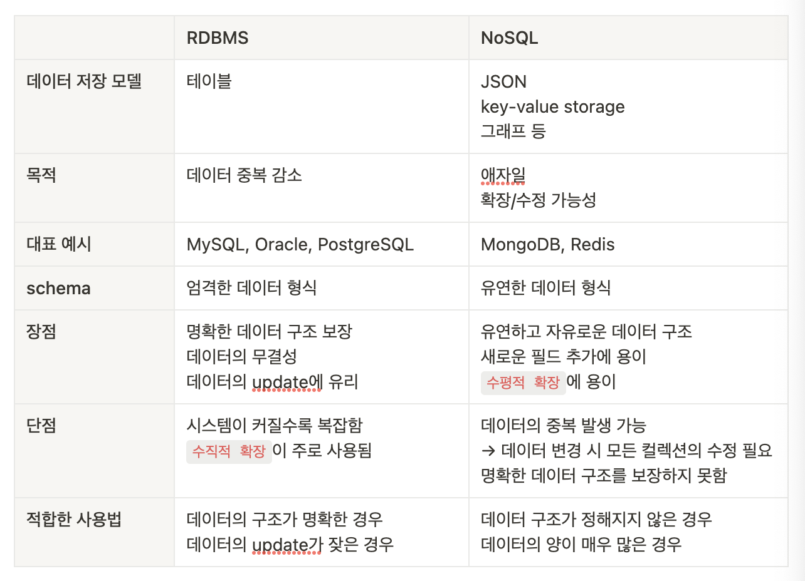
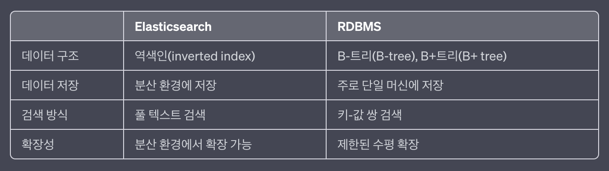

# 🗂️ 관계형 데이터베이스 (RDBMS)
RDBMS(Relational Database Management System)는 데이터가 하나 이상의 행과 열을 가지는 테이블에 저장되어, 
서로 다른 데이터 구조가 어떻게 관련되어 있는지 쉽게 파악하고 이해할 수 있도록 사전 정의된 관계로 데이터를 구성하는 정보 집합이다. 

### RDBMS의 특징
- SQL이라는 언어를 사용하여 조작
- 정해진 schema에 따라 데이터를 저장해야 함
  - 기존에 작성된 스키마를 수정하기 어려움
- 데이터의 분류/정렬/탐색 속도가 빠름
- 중복 가능성이 적기 때문에 신뢰성이 높고, `데이터의 무결성`을 보장해줌
- 성능 향상을 위해서는 `수직적 확장(Scale-Up)`을 해야함
- DB의 부하를 분석하기 어려움

### 📍 MySQL
- 대부분 운영체제와 호환되며 가장 많이 사용되는 DB
- 쿼리 캐시를 지원함 ➡️ 입력된 쿼리 문에 대한 전체 결과 집합을 저장
  - 사용자가 작성한 쿼리가 캐시에 있는 쿼리와 동일하면 서버는 단순히 구문 분석, 최적화 및 실행을
    건너뛰고 캐시의 출력만 표시함

### 📍 PostgreSQL
- 디스크 조각이 차지하는 영역을 회수할 수 있는 장치인 VACUUM이 특징
- SQL 뿐만 아니라 JSON을 이용해서 데이터에 접근 가능
- 지정 시간에 복구하는 기능, 로깅, 접근 제어, 중첩된 트랜잭션, 백업 등에 사용됨

# NoSQL 
`Not Only SQL`이라는 슬로건에서 생겨났으며, SQL을 사용하지 않는 비관계형 데이터베이스를 말한다.   
빅데이터의 등장으로 데이터와 트래픽이 증가함에 따라 `RDBMS`의 단점인 성능을 향상시킬 필요가 있었다.   
하지만 그를 위해서는 장비를 업그레이드하는 등의 `Scale-Up`을 해야만 했다.
이는 비용을 기하급수적으로 증가시키 때문에, 데이터의 일관성은 포기하되 데이터를 분산하여 저장하는 `Scale-Out`을 목표로 한다.      

### NoSQL의 특징
- 테이블 간의 관계를 정의하지 않음
- 테이블 형식이 아닌 비정형 데이터를 저장할 수 있도록 지원
- `Scale-Out(수평적 확장)`을 목표로 한다.

### 📍 MongoDB
- JSON을 통해 데이터에 접근
- Binary Json(BSON) 형태로 데이터가 저장됨
- 와이드타이거 엔진이 기본 스토리지 엔진으로 장착된 key-value 데이터 모델에서 확장된, 도큐먼트 기반의 DB
- 확장성이 뛰어나며, 빅데이터를 저장할 때 성능이 좋음
- 스키마를 정해놓지 않고 데이터를 삽입할 수 있기 때문에 다양한 도메인의 DB를 기반으로 분석하거나
로깅 등을 구현할 때 강점을 보임
- 도큐먼트를 생성할 때마다 다른 컬렉션에서 중복된 값을 지니기 힘든 유니크한 값인 ObjectID가 생성됨

### 📍 Redis
- 인메모리 DB
- key-value 데이터 모델 기반의 DB
- 기본적인 데이터 타입은 String이며 최대 512MB 까지 저장할 수 있음
- Set, Hash 지원
- 주로 사용되는 곳
  - 채팅 시스템
  - 다른 DB 앞단에 두어 캐싱 계층으로 이용
  - key-value 가 필요한 세션 정보 관리
  - 정렬된 set 자료 구조를 이용한 실시간 순위표 서비스

> `Redis vs Memcached`   
Redis는 다양한 데이터 타입을 지원하며, 데이터 지속성, 분산 저장 등의 기능을 제공한다.    
반면 Memcached는 단순히 key-value의 빠른 메모리 캐싱 솔루션으로, 주로 캐시 용도로 사용된다.   
따라서 부가적인 기능을 제공하지 않기 때문에 데이터의 지속성과 분산 저장 기능이 제한적이다.

## RDBMS vs NoSQL

## Elastic Search란
아파치 루씬(Apache Lucene)기반의 JAVA 오픈소스 분산 검색 엔진으로, 
많은 양의 데이터를 신속하게, 실시간으로 저장/검색/분석할 수 있다.
일반적인 용도로는 로그 분석, 전체 텍스트 검색, 데이터 분석, 실시간 모니터링 등이 있다.

### RDBMS vs Elastic Search

- `역색인(inverted index`: 용어를 문서에 매핑하여 어떤 문서에 어떤 용어가 포함되어 있는지 기록하는 방식. 인덱싱 된 용어를 사용하여 빠른 풀 텍스트 검색을 제공
- `B 트리 구조`: 정렬된 key-value 쌍을 저장하고 검색에 사용됨

### Elastic Search의 키워드 검색과 RDBMS의 LIKE 검색 기능
Elastic Search의 키워드 검색은 풀 텍스트 검색으로, 역색인을 활용하여 빠르고 정확한 검색을 제공한다.   
반면, RDBMS의 LIKE 검색은 문자열 패턴 매칭을 통해 데이터를 검색하며, 대량의 데이터에서는 성능과 유연성에 제약이 있을 수 있다.

-------------------------------------------------
### References
- https://hyuuny.tistory.com/158
- https://choseongho93.tistory.com/231