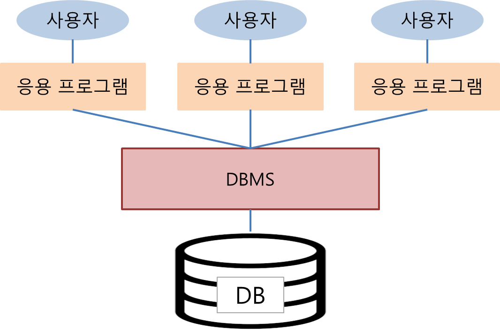
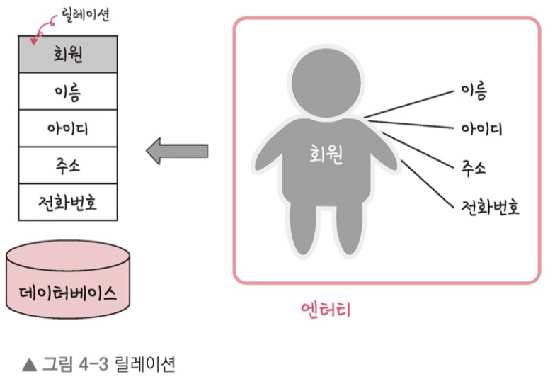
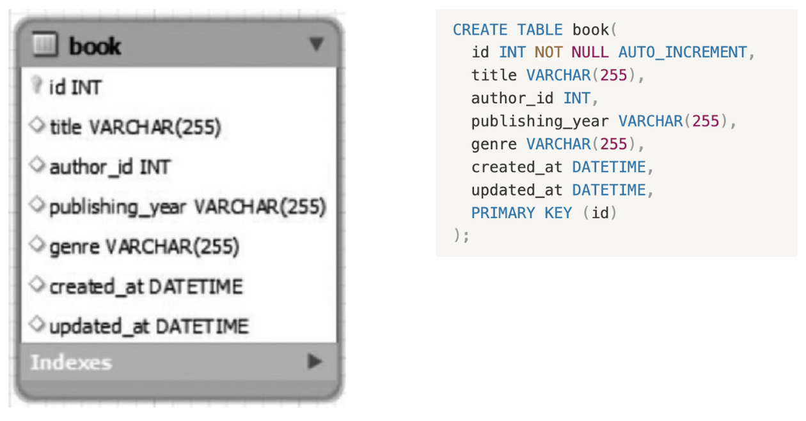
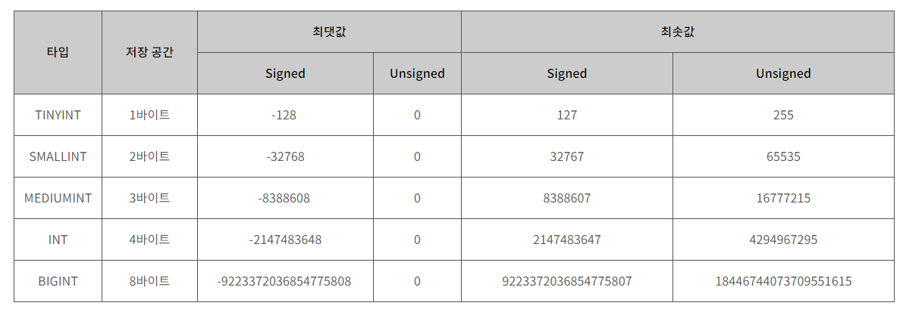
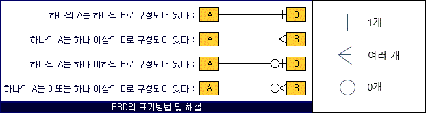
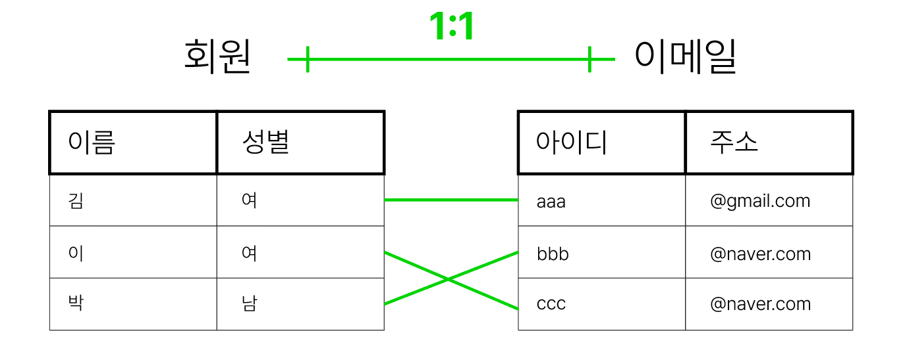
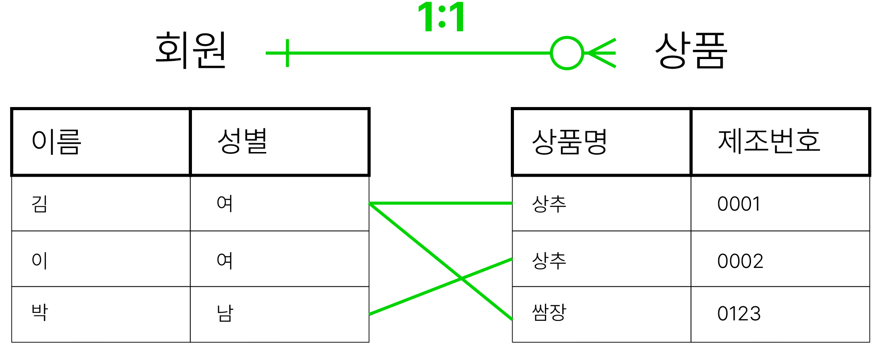

# 🥞 데이터의 모음, 데이터베이스
  
데이터베이스 / DB / DataBase
- 일정한 규약으로 구조화되어 저장되는 데이터의 모음

DBMS / DataBase Management System
- 데이터베이스를 제어, 관리하는 통합 시스템
- DBMS마다 정의된 쿼리 언어로 데이터 조작(manipulation)/정의(definition)/제어(control)
- 응용프로그램은 DBMS를 통해 DB의 데이터에 접근, 관련 로직 구축
    - Node.js, php

 
# 🧐데이터베이스의 구성

## Entity

- 데이터베이스에서 관리되는 대상으로, “여러 개의 속성을 지닌 명사”를 의미
    - ex) 이름, 아이디, 메일 등의 정보를 속성으로 가진 “회원”이라는 entity
- 약하고 강한 엔티티
    - 혼자서 존재하지 못해 종속적인 약한 엔티티와, 약한 엔티티를 포함하면서 독립적인 강한 엔티티
    - 호텔 엔티티와 그 호텔의 객실 엔티티 
    ⇒ **강한 호텔 엔티티**, 강한 호텔에 붙어야 하는 **약한 객실 엔티티**

## Relation
  
- “데이터베이스에서 정보를 구분, 저장하는 기본 단위”
여러 속성을 가진 엔티티를 테이블 등의 데이터베이스로 구현해 둔 것.
- EX) 학생 관리를 목적으로 설계하는 경우
    - 각 학생 개개인의 정보를 저장하기 위해, 학생 단위로 정보를 모으자 : entity를 학생으로 설정
    - 실제로 조사를 진행해 여러 학생의 정보를 테이블로 정리해 냈다 : 수집한 정보로 데이터를 채워낸 형태인 relation
- 데이터베이스의 종류에 따라 Relation의 구현 형태가 다르다.
    - 관계형DB: table / NoSQL: document
- 속성 (attribute)
    - relation으로 저장할 entity가 가진 구체적이며 고유한 이름의 정보
    - 서비스를 위해 관리가 필요한 속성만 다룸
- 도메인 (Domain)
    - 각 속성마다 가질 수 있는 값의 집합
        - 속성 “성별”의 도메인 = {남, 여}

 
# 🪢 데이터베이스의 종류별 relation 구현

### SQL

- Structured Query Language: **구조화 된** 쿼리 언어
- 특정 유형의 DB와 상호작용할 때 사용하는 쿼리 언어

### 관계형 데이터베이스 : SQL DB

- 엔티티의 속성을 열로, 각 데이터를 행으로 저장하는 테이블로 relation 구현.
- 사전에 테이블의 구조와 데이터타입 정의
- RDBMS = 관계형DB의 DBMS (MySQL, Oracle, MariaDB, …)
    - 테이블로 정리된 데이터는 구조화되어 있기 때문에 SQL을 사용
    - SQL이 관계형DB 전용 언어이기 때문에 SQL DB라고도 부른다.

### 비관계형 데이터베이스 : NoSQL DB

- 관계형이 아닌 모든 유형으로, SQL을 사용하지 않아서 NoSQL데이터베이스라고도 부른다.
- 여러 유형을 포함함.
    - Key-Value 타입: 속성을 Key-Value쌍의 배열로 저장
    - Document DB: 각 속성을 각각 문서화하고 컬렉션이라는 그룹으로 묶어서 관리

 
# 🪑 Table: 관계형DB의 relation

### table = field & records

- **table**: entity에 데이터를 채워나가는 표로, 관계형DB의 relation
- **field**: relation의 각 속성의 데이터타입을 정해 열에 배치
- **record**: 각 행에 기록되는 데이터세트 (or **tuple**)
    - RECORD ∈ TABLE ⇒ 관계형 DB
    - DOCUMENT ∈ COLLECTION ⇒ 비관계형 DB
- record 없이 field의 데이터타입을 정해 table을 만든 예시
      

 
# 📑 Field의 dataType

MySQL 기준 (DBMS마다 타입정의가 다름)

### 숫자 타입
  

### 날짜 타입

- `DATE` : 날짜O 시간X (3 Bytes)
    - 1000-01-01 ~ 9999-12-31
- `DATETIME` : 날짜O 시간O (8 Bytes)
    - 1000-01-01 00:00:00 ~ 9999-12-31 23:59:59
- `TIMESTAMP` : 날짜O 시간O (4 Bytes)
    - 1970-01-01 00:00:01 ~ 2038-01-19 03:14:07

### 문자타입

- [문자열] `CHAR` vs `VARCHAR`
    - 몇 자까지 입력할 수 있는지 정해야 한다. ⇒ `CHAR(30)` : 최대 30글자
    - `CHAR(n)`: 0~255 범위에서 선언한 길이 n byte로 고정되어 저장
    - `VARCHAR(n)`: 0~65,535 범위에서 선언한 길이 n은 최대치일 뿐, 입력된 데이터의 글자수 + 1(길이기록용) byte로 저장
- [큰 데이터] `TEXT` vs `BLOB`
    - `TEXT` : 큰 문자열 (게시판 본문 등)
    - `BLOB` : 이미지, 동영상 등 큰 데이터
- [문자열 열거] `ENUM` vs `SET`
    - `ENUM` : (순서형) 미리 정해진 내용을 열거해 순서를 저장하기 때문에 메모리를 적게 사용하지만, 정해진 내용 중에서 단일 선택만 가능. (최대 65,535개)
    - `SET` : (집합형) 복수 선택이 가능하고 비트 연산이 가능하다. 하나의 필드에 여러 값을 묶어서 넣는 용도로 사용 (최대 64개)

 
# 🤝🏼 Relationships

데이터베이스 내부 여러 테이블의 관계

### 관계 화살표
  

### 1:1 관계
  

### 1:N 관계
  

### N:M 관계
  
직접 연결해서 구축하지 않고, 두 개의 관계로 분리

   

---
 
### References
https://hanamon.kr/데이터베이스-sql-vs-nosql/