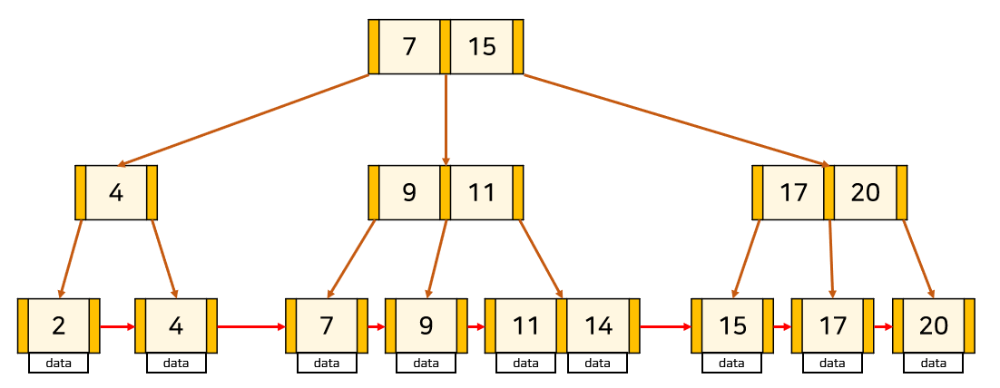

# 인덱스

## 📍 인덱스의 필요성

- 데이터를 빠르게 찾을 수 있는 하나의 장치
- 데이터베이스 테이블에 대한 검색 성능의 속도를 높여주는 자료 구조
- 책에 있는 목차와 비슷하다.
  - `데이터` = `책의 내용`, `인덱스` = `책의 목차`, `물리적 주소` = `책의 페이지`
- 대부분의 속도 저하는 바로 Select문, 특히 조건 검색 Where절에서 발생
  - 가장 먼저 생각해 볼 수 있는 대안이 Index임으로 알아둘 필요가 있다.

## 📍 인덱스의 자료 구조

- 인덱스는 여러 자료구조를 이용해서 구현할 수 있음
- 대표적인 자료구조: 해시 테이블, B+Tree가 있음

### 1. 해시 테이블


- 컬럼의 값과 물리적 주소를 (key, value)의 한 쌍으로 저장하는 자료구조
- 실제로 인덱스에서 잘 사용하지 않음
  - 해시 테이블은 등호(=) 연산에 최적화되어있기 때문
  - 그러나, 데이터베이스에선 부등호(<,>) 연산이 자주 사용

### 2. B+트리

- 대부분의 DBMS 그리고 오라클에서 특히 중점적으로 사용하고 있는 가장 보편적인 인덱스
- Root Node(기준)/Branch Node(중간)/Leaf Node(말단)으로 구성



- Node는 데이터가 존재하는 공간이다.
- Leaf Node만 인덱스(Key)와 함께 데이터(Value)를 가지고 있고, 나머지 Root Node와 Branch Node는 데이터를 위한 인덱스(Key)만을 갖는다.
- Leaf Node에만 데이터를 저장하고 Leaf Node들끼리 LinkedList로 연결되어 있 선형 시간이 소모되어 시간 효율이 올라간다.
- Root Node에서 경로를 확인 후, 그에 알맞는 Node들로 이동하여 최종적으로 원하는 데이터가 있는 Leaf Note에 도달한다.

## 📍 인덱스의 장단점

### 인덱스가 효율적인 이유와 대수 확장성

- 인덱스가 효율적인 이유
  - 효율적인 단계를 거쳐 모든 요소에 접근할 수 있는 균형 잡힌 트리 구조와 트리 깊이의 대수 확장성 때문
- 대수확장성?
  - 트리 깊이가 리프 노드 수에 비해 매우 느리게 성장하는 것
  - 기본적으로 인덱스가 한 깊이씩 증가할 때마다 최대 인덱스 항목의 수는 4배씩 증가
  - EX. 트리 깊이 10개 => 100만개의 레코드를 검색할 수 있음
  - 실제 인덱스는 이것보다 훨씬 효율적이며, 그렇기 때문에 인덱스가 효율적이라고 볼 수 있음

### 장점

- 데이터가 정렬되어 있기 때문에 테이블에서 검색과 정렬 속도를 향상시킨다.
- 인덱스를 사용하면 테이블 행의 고유성을 강화시킬 수 있다.
- 시스템의 전반적인 부하를 줄일 수 있다.

### 단점

- 인덱스의 가장 큰 문제점은 정렬된 상태를 계속 유지시켜야 한다는 점이다.
  INSERT, UPDATE, DELETE 등과 같은 DML 작업은 테이블과 함꼐 인덱스를 변경해야 하기 때문에 오히려 느려질 수 있다는 단점이 존재한다. 따라서 테이블의 성격을 분석해야 하며 INSERT, UPDATE가 많을 경우 인덱스를 사용하지 않는 편이 나을 수 있다.

- 무조건 인덱스 스캔이 좋은 것은 아니다

- 속도 향상을 위해 인덱스를 많이 만드는 것이 좋지 않다.

## 📍 인덱스 만드는 방법

데이터베이스마다 다르다.

### MySQL

클러스터형 인덱스와 세컨더리 인덱스가 있다.

1. `클러스터형 인덱스`

   - 영어사전과 같음
   - 테이블당 하나를 설정할 수 있음
   - 영어사전처럼 책의 내용이 이미 알파벳 순서대로 정렬되어 있는 것이다. 따라서 별도의 찾아보기가 없고 책 자체가 찾아보기가 되는 것이다.
   - EX. age라는 하나의 필드만으로 쿼리를 보낼 때

     ```SQL
     USE market_db;

     CREATE TABLE table1 (
         col1 INT PRIMARY KEY,
         col2 INT,
         col3 INT
     );

     SHOW INDEX FROM table1;
     ```

2. `세컨더리 인덱스`

   - 책 뒤에 찾아보기가 있는 일반적인 책과 같음
   - 보조 인덱스는 일반적인 책과 같이 찾아보기가 별도로 있고, 찾아보기에서 해당 단어를 찾은 후에 옆에 표시된 페이지를 펼쳐야 실제 찾는 내용이 있는 것을 말한다.
   - EX. age, name, email 등 다양한 필드를 기반으로 쿼리를 보낼 때

   ```SQL
   USE market_db;

    CREATE TABLE table2 (
        col1 INT PRIMARY KEY,
        col2 INT UNIQUE,
        col3 INT UNIQUE
    );

    SHOW INDEX FROM table2;
   ```

> 즉, 클러스터형 인덱스는 테이블 당 하나만 존재하며 보조 인덱스는 여러 개 존재할 수 있다.

### MongoDB

- 도큐먼트를 만들면 자동으로 ObjectID가 형성되며, 해당 키가 기본키로 설정됨
- 세컨더리키도 부가적으로 설정해서 기본키와 세컨더리키를 같이 쓰는 복합 인덱스를 설정할 수 있음

## 📍 인덱스 최적화 기법

> 데이터베이스마다 조금씩 다르지만 기본적인 골조는 똑같기 때문에 특정 데이터베이스를 기준으로 설명해도 무방

1. 인덱스는 비용이다.
   - 인덱스는 두 번 탐색하도록 강요함
     - 인덱스 리스트, 그 다음 컬렉션 순으로 탐색하기 때문
     - 관련 읽기 비용이 들게 됨
   - 컬렉션이 수정되었을 때 인덱스도 수정되어야 함
     - B-트리의 높이를 균형 있게 조절하는 비용이 듬
     - 데이터를 효율적으로 조회할 수 있도록 분산시키는 비용이 듬
   - 쿼리에 있는 필드에 인덱스를 무작정 다 설정하는 것이 답은 아님
   - 컬렉션에서 가져와야 하는 양이 많을수록 인덱스를 사용하는 것은 비효율적
2. 항상 테스팅하라
   - 인덱스 최적화 기법은 서비스 특징에 따라 달라짐
   - 항상 테스팅하는 것이 중요
   - explain() 함수를 통해 인덱스르 만들고 쿼리를 보낸 이후에 테스팅을 하며 걸리는 시간을 최소화해야 함
   ```SQL
   EXPLAIN
   SELECT * FROM t1
   JOIN t2 on t1.c1 = t2.c1
   ```
3. 복합 인덱스는 같음, 정렬, 다중 값, 카디널리티 순이다

   - 여러 필드를 기반으로 조회를 할 때 복합 인덱스를 생성
     - 이 인덱스를 생성할 때는 순서가 있고 생성 순서에 따라 인덱스 성능이 달라짐
   - 순서
     1. 어떠한 값과 같음을 비교하는 ==이나 equal이라는 쿼리가 있다면 제일 먼저 인덱스로 설정
     2. 정렬에 쓰는 필드라면 그다음 인덱스로 설정
     3. 다중 값을 출력해야 하는 필드, 즉 쿼리 자체가 > 이거나 < 등 많은 값을 출력해야 하는 쿼리에 쓰이는 필드라면 나중에 인덱스를 설정
     4. 카디널리티(유니크한 값의 정도)가 높은 순서를 기반으로 인덱스를 생성
        - age, email 중 email이 더 unique => email 필드에 대한 인덱스 먼저 생성

<br />
<br />
<br />

## References

- [데이터베이스 인덱스란 무엇인가?](https://coding-factory.tistory.com/746)
