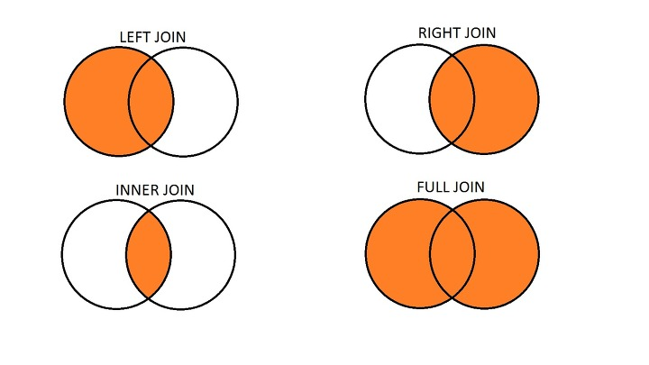
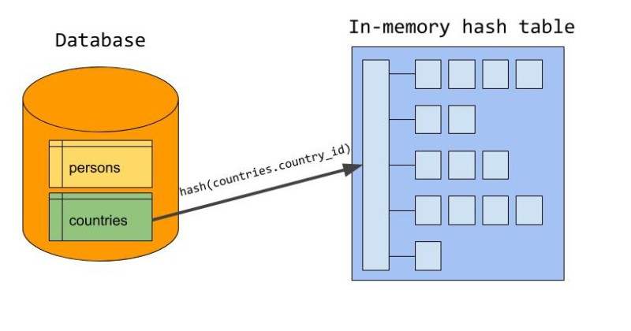
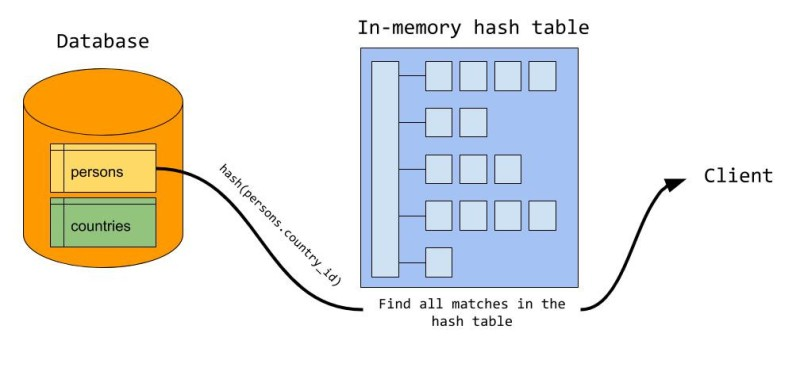

# 조인

## 🤔 조인(join)이란?

- 하나의 테이블이 아닌 두 개 이상의 테이블을 묶어서 하나의 결과물을 만드는 것
- `MySQL`에서는 `JOIN`, `MongoDB`에서는 `lookup`이라는 쿼리로 이를 처리
  - 그러나, MongoDB를 사용할 때도 `lookup`은 되도록 사용하지 말아야 함
    - 관계형 데이터베이스보다 조인 연산 성능이 떨어짐
    - 여러 테이블을 조인하는 작업이 많을 경우 관계형 데이터베이스를 써야 함

## 📍 조인의 종류



> 왼쪽 테이블 A, 오른쪽 테이블 B로 설명

### 1. 내부 조인

- 두 테이블에 모두 데이터가 있어야만 결과가 나온다
- 두 테이블 간에 교집합
- 그냥 조인이라 부르면 내부 조인을 의미
- 조인되는 테이블간 중복되는 컬럼명은 제대로 명시해줘야 함

```SQL
SELECT <열 목록>
FROM <첫 번째 테이블>
INNER JOIN <두 번째 테이블> # 그냥 JOIN만 적어도 됨
ON <조인될 조건>
[WHERE 검색 조건]

SELECT * FROM TableA A
INNER JOIN TableB B ON
A.key = B.key

SELECT B.mem_id, M.mem_name, B.prod_name, M.addr, CONCAT(M.phone1, M.phone2) AS '연락처'
FROM buy B
INNER JOIN member M
ON B.mem_id = M.mem_id;
```

### 2. 외부 조인

- 한쪽 테이블에만 있어도 결과를 추출할 수 있음

```SQL
SELECT <열 목록>
FROM <첫 번째 테이블(LEFT 테이블)>
<LEFT | RIGHT | FULL> OUTER JOIN <두 번째 테이블(RIGHT 테이블)>
ON <조인될 조건>
[WHERE 검색 조건];
```

### 2-1. 왼쪽 조인

- 왼쪽 테이블의 모든 행이 결과 테이블에 표기
- 테이블 B의 일치하는 부분의 레코드 + 테이블 A의 모든 레코드
- 테이블 B에 일치하는 항목이 없으면 해당 값은 NULL이 됨

```SQL
SELECT * FROM TableA A
LEFT JOIN TableB B ON
A.key = B.key
```

### 2-2. 오른쪽 조인

- 오른쪽 테이블의 모든 행이 결과 테이블에 표기
- 테이블 A에서 일치하는 부분의 레코드 + 테이블 B의 모든 레코드
- 테이블 A에 일치하는 항목이 없으면 해당 값은 NULL이 됨

```SQL
SELECT * FROM TableA A
RIGHT JOIN TableB B ON
A.key = B.key
```

### 2-3. 합집합 조인

- 두 개의 테이블을 기반으로 조인 조건에 만족하지 않는 행까지 모두 표기
- 양쪽 테이블에서 일치하는 레코드 + 테이블 A와 테이블 B의 모든 레코드
- 일치하는 항목이 없으면 누락된 쪽에 null값이 포함되어 출력

```SQL
SELECT * FROM TableA A
FULL OUTER JOIN TableB B ON
A.key = B.key
```

## 📍 조인의 원리

### 1. 중첩 루프 조인 (NLJ, Nested Loop Join)

- 중첩 for 문과 같은 원리로 조건에 맞는 조인을 하는 방법
- 대용량의 테이블에서는 사용하지 않음

```SQL
FOR 선행 테이블 읽음 -> 외부 테이블
        FOR 후행 테이블 읽음 -> 내부 테이블
                (선행 테이블과 후행 테이블 조인)
```

### 2. 정렬 병합 조인

- 각각 테이블을 조인할 필드 기준으로 정렬하고 정렬이 끝난 이후에 조인을 수행하는 작업
- 조인할 때 쓸 적절한 인덱스가 없고 대용량의 테이블들을 조인하고 조인 조건으로 <, > 등 범위 비교 연산자가 있을 때 사용

```
1. 선행 테이블에서 주어진 조건에 만족하는 행을 찾음
2. 선행 테이블의 조인 키를 기준으로 정렬 작업을 수행
3. 1~2번 작업을 선행 테이블의 조건을 만족하는 모든 행에 대해 반복 수행
4. 후행 테이블에서 주어진 조건에 만족하는 행을 찾음
5. 후행 테이블의 조인 키를 기준으로 정렬 작업을 수행
6. 3~4번 작업을 선행 테이블의 조건을 만족하는 모든 행에 대해 반복 수행
7. 정렬된 결과를 이용하여 조인을 수행하며 조인에 성공하면 추출버퍼에 넣음
```

> Sort Meger Join은 대량의 정렬 작업이 필요로 하므로 Hash Join이 성능상 더 유리하다고 한다.

### 3. 해시 조인

- 해시 테이블을 기반으로 조인하는 방법
- 두 개의 테이블을 조인한다고 했을 때 하나의 테이블이 메모리에 온전히 들어간다면 보통 중첩 루프 조인보다 더 효율적
- 동등(=) 조인에서만 사용할 수 있음
- Hash Join은 작은 테이블을 선행 테이블로 사용하는 것이 성능 관점에서 좋다고 함

```
  1. 선행 테이블에서 주어진 조건을 만족하는 행을 찾음
  2. 선행 테이블의 조인 키를 기준으로 해쉬 함수를 적용하여 해쉬 테이블을 생성 (조인 칼럼과 SELECT 절에서 필요로 하는 칼럼도 함께 저장됨)
  3. 1~2번 작업을 선행 테이블의 조건을 만족하는 모든 행에 대해 반복 수행
  4. 후행 테이블에서 주어진 조건을 만족하는 행을 찾음
  5. 후행 테이블의 조인 키를 기준으로 해쉬 함수를 적용하여 해당 버킷을 찾음 (조인 키를 이용하여 실제 조인될 데이터를 찾음)
  6. 조인에 성공하면 추출버퍼에 넣음
  7. 3~5번 작업을 후행 테이블의 조건을 만족하는 모든 행에 대해서 반복 수행
```

#### 🤔 MySQL의 해시 조인 단계

MySQL 8.0.18 이 배포되면서 hash join 을 사용할 수 있게 되었다.

```SQL
SELECT
  given_name, country_name
FROM
  persons JOIN countries ON persons.country_id = countries.country_id;
```

1.  `빌드 단계`

    

    - 입력 테이블 중 하나를 기반으로 메모리 내 해시 테이블을 빌드하는 단계
    - 두 개의 테이블이 있을 때, 둘 중에 바이트가 더 작은 테이블을 기반으로 해시 테이블을 빌드
    - 조인에 사용되는 필드가 해시 테이블의 키로 사용

<br />

2. `프로브 단계`

   

   - 레코드 읽기를 시작
   - 일치하는 레코드를 찾아서 결과값으로 반환

> - 이를 통해 각 테이블은 한 번씩만 읽게 됨
> - 중첩해서 두 개의 테이블을 읽는 중첩 루프 조인보다 보통은 성능이 더 좋음

<br />
<br />
<br />

## References

- [SQL 최적화 및 성능 튜닝](https://qwefgh90.github.io/sphinx/database/sql_optimize.html)
