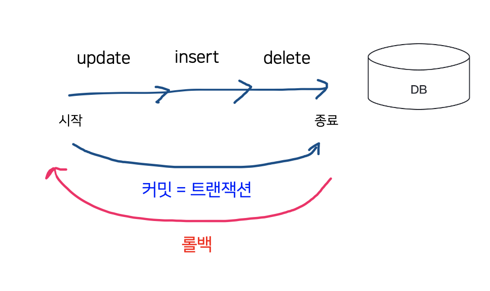
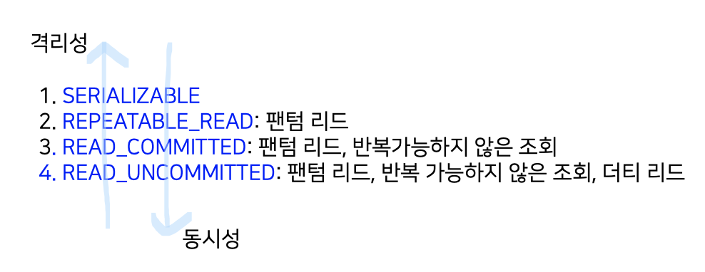

# 💰 트랜잭션과 무결성

## 🤝 트랜잭션

- 데이터베이스에서 하나의 논리적 기능을 수행하기 위한 작업의 단위
- 여러 개의 `쿼리`들을 하나로 묶는 단위
  - 쿼리: 데이터베이스에 접근하는 방법
- 특징
  - ACID (`원자성`, `일관성`, `격리성`, `지속성`)

<br />

### 1. 원자성 (Atomicity)

- all or nothing
- 시스템에서 한 트랜잭션의 연산들이 모두 성공하거나, 반대로 전부 실패되는 성질
- 작업이 모두 반영되거나 모두 반영되지 않음으로서 결과를 예측할 수 있어야 함
  - EX. 트랜잭션을 커밋했는데, 문제가 발생하여 롤백하는 경우 그 이후에 모두 수행 되지 않음을 보장하는 것
- 트랜잭션 단위로 여러 로직들을 묶을 때 외부 API를 호출하는 것이 있으면 안됨
  - 만약 있다면 롤백이 일어났을 때 어떻게 해야 할 것인지에 대한 해결 방법이 있어야 하고 트랜잭션 전파를 신경 써서 관리해야 함


#### 커밋과 롤백



1. `커밋(commit)`

   - 여러 쿼리가 성공적으로 처리되었다고 확정하는 명령어
   - 변경된 내용이 모두 영구적으로 저장되는 것
   - 트랜잭션 단위로 수행

     - "커밋이 수행되었다" = "하나의 트랜잭션이 성공적으로 수행되었다"

2. `롤백`

   - 트랜잭션으로 처리한 하나의 묶음 과정을 일어나기 전으로 돌리는 일 = 취소
   - 에러나 여러 이슈 때문에 트랜잭션 전으로 돌려야 할 때

<br />

> - 커밋과 롤백 덕에 데이터의 무결성이 보장됨
> - 데이터 변경 전에 변경 사항을 쉽게 확인할 수 있고 해당 작업을 그룹화할 수 있음

#### 트랜잭션 전파

- 트랜잭션을 수행할 때 Connection 단위로 수행하기 때문에 Connection 객체를 넘겨서 수행해야 함
  하지만, 이를 매번 넘겨주기가 어렵기도 하고 귀찮기도 함
  따라서 이를 넘겨서 수행하지 않고 여러 트랜잭션 관련 메서드의 호출을 하나의 트랜잭션에 묶이도록 하는 것이 `트랜잭션 전파`임
- 즉,`트랜잭션 전파`란 하나의 트랜잭션 내부에 다른 트랜잭션이 있는 경우, 트랜잭션 정책에 따라 어떻게 동작할지 결정하는 것

<br />

<details>
<summary>예시: Spring</summary>

Spring 프레임워크에서는 @Transactional 애너테이션을 통해 여러 쿼리 관련 코드들을 하나의 트랜잭션으로 처리함

```java
@Service
@Transactional(readOnly = true)
public class MemberService {
    private final MemberRepository memberRepository;
    public MemberService(MemberRepository memberRepository) {
        this.memberRepository = memberRepository;
    }
}
```

📍 옵션 종류

- `REQUIRED(default)`
  - 부모 트랜잭션이 존재한다면 부모 트랜잭션에 합류. 그렇지 않다면 새로운 트랜잭션을 만듬.
  - 중간에 자식 / 부모에서 예외가 발생한다면 자식과 부모 모두 rollback.
- `REQUIRES_NEW`
  - 무조건 새로운 트랜잭션을 만듬.
  - nested한 방식으로 메소드 호출이 이루어지더라도 rollback은 각각 이루어 짐.
- `MANDATORY`
  - 무조건 부모 트랜잭션에 합류시킴.
  - 부모 트랜잭션이 존재하지 않는다면 예외를 발생시킴.
- `SUPPORTS`
  - 메소드가 트랜잭션을 필요로 하지는 않지만, 진행 중인 트랜잭션이 존재하면 트랜잭션을 사용.
  - 진행 중인 트랜잭션이 존재하지 않으면 트랜잭션이 적용되지 않은 채로 메소드가 정상 동작.
- `NESTED`
  - 부모 트랜잭션이 존재하면 부모 트랜잭션에 중첩시키고, 부모 트랜잭션이 존재하지 않으면 새로운 트랜잭션을 생성.
  - 부모 트랜잭션에 예외가 발생하면 자식 트랜잭션도 rollback.
  - 여기까지, Required와 동일.
  - 하지만 자식 트랜잭션에 예외가 발생하더라도 부모 트랜잭션은 rollback하지 않음.
- `NEVER`
  - 메소드가 트랜잭션을 필요로 하지 않음.
  - 만약 진행 중인 트랜잭션이 존재하면 예외가 발생.

</details>

  <br />

### 2. 일관성 (Consistency)

- `허용된 방식`으로만 데이터를 변경해야 하는 것을 의미
- 트랜잭션이 일어난 이후의 데이터베이스도 데이터베이스의 여러 가지 조건, 규칙을 만족해야 함
- EX. 모든 고객은 이름을 가지고 있어야 함
  - 이름 없는 새로운 고객을 추가하는 쿼리 => 일관성 X

<br />

### 3. 격리성 (Isolation)

- 모든 트랜잭션은 다른 트랜잭션으로부터 독립되어야 함
  - 트랜잭션 수행 시 서로 끼어들지 못하는 것
  - 복수의 병렬 트랜잭션은 서로 격리되어 마치 순차적으로 실행되는 것처럼 작동되어야 함
- 데이터베이스는 여러 사용자가 **같은** 데이터에 접근할 수 있어야 함
- 격리성은 여러 개의 `격리 수준`으로 나뉘어 격리성을 보장함

#### 격리 수준

1. `SERIALIZABLE`
   - 트랜잭션을 순차적으로 진행시키는 것
   - 여러 트랜잭션이 동시에 같은 행에 접근할 수 없음
   - 매우 엄격한 수준
   - 교착 상태가 일어날 확률 높음
   - 가장 성능이 떨어짐
2. `REPEATABLE_READ`
   - 하나의 트랜잭션이 수정한 행을 다른 트랜잭션이 수정할 수 없도록 막아줌
   - 새로운 행을 추가하는 것은 막지 않음
3. `READ_COMMITTED`
   - 가장 많이 사용되는 격리 수준
   - MySQL8.0, PostgreSQL, SQL Server, 오라클에서 기본값으로 설정되어 있음
   - 다른 트랜잭션이 커밋하지 않은 정보는 읽을 수 없음
   - 어떤 트랜잭션이 접근한 행을 다른 트랜잭션이 수정할 수 있음 => 같은 행을 다시 읽을 때 다른 내용이 발견될 수 있음
4. `READ_UNCOMMITTED`
   - 가장 낮은 격리 수준, 가장 빠름
   - 하나의 트랜잭션이 커밋되기 이전에 다른 트랜잭션에 노출되는 문제 존재
   - 거대한 양의 데이터를 '어림잡아' 집계하는 데 사용하면 좋음

#### 격리 수준에 따라 발생하는 현상

1. `팬텀 리드 (phantom read)`
   한 트랜잭션 내에서 동일한 쿼리를 보냈을 때 해당 조회 결과가 다른 경우
2. `반복 가능하지 않은 조회`
   한 트랜잭션 내의 같은 행에 두 번 이상 조회가 발생했는데, 그 값이 다른 경우
   - 팬텀리드와 다른점
     - 반복 가능하지 않은 조회: 행 값이 달라질 수도 있음
     - 팬텀 리드: 다른 행이 선택될 수도 있음
3. `더티 리드`
   한 트랜잭션이 실행 중일 때 다른 트랜잭션에 의해 수정되었지만 아직 '커밋되지 않은' 행의 데이터를 읽을 수 있을 때 발생



<br />

### 4. 지속성 (Durability)

- 성공적으로 수행된 트랜잭션은 영원히 반영되어야 함
  - 하나의 트랜잭션이 성공적으로 수행되었다면, 해당 트랜잭션에 대한 로그가 남아야함
- 데이터베이스에 시스템 장애가 발생해도 원래 상태로 복구하는 회복 기능이 있어야 함
- 체크섬, 저널링, 롤백 등의 기능
  - 체크섬
    - 중복 검사의 한 형태로, 오류 정정을 통해 송신된 자료의 무결성을 보호하는 단순한 방법
  - 저널링
    - 파일 시스템 또는 데이터베이스 시스템에 변경 사항을 반영하기 전에 로깅하는 것, 트랜잭션 등 변경 사항에 대한 로그를 남기는 것

<br />
<br />

## ✅ 무결성

- 데이터의 정확성, 일관성, 유효성을 유지하는 것
- 무결성이 유지되어야 데이터베이스에 저장된 데이터 값과 그 값에 해당하는 현실 세계의 실제 값이 일치하는지에 대한 신뢰가 생김
- 만약 데이터 무결성 설계를 하지 않는다면?
  - 테이블에 중복된 데이터 존재, 부모와 자식 데이터 간의 논리적 관계 깨짐, 잦은 에러와 재개발 비용 발생 등과 같은 문제 발생

### 종류

1. `개체 무결성`

   - 기본 키 제약
   - 기본키로 선택된 필드는 빈 값을 허용하지 않음

2. `참조 무결성`

   - 외래 키 제약
   - 서로 참조 관계에 있는 두 테이블의 데이터는 항상 일관된 값을 유지해야 함

3. `고유 무결성`

   - 특정 속성에 대해 고유한 값을 가지도록 조건이 주어진 경우 그 속성 값은 모두 고유한 값을 가짐
   - EX. 주민번호는 서로 다른 값을 가져야 한다.

4. `NULL 무결성`

   - 특정 속성 값에 NULL이 올 수 없다는 조건이 주어진 경우, 그 속성 값은 NULL이 될 수 없음

### 장단점

- 장점
  - 스키마를 작성할 떄 무결성 제약조건을 한 번만 명시하면, 데이터베이스가 갱신될 때마다 DBMS가 자동으로 제약조건을 검사하므로 어플리케이션들은 제약조건을 일일이 검사할 필요가 없음.
  - 제약조건을 사용하면 데이터를 실생활의 의미에 맞게 사용할 수 있음.
  - 응용 프로그램에서 직접 조건을 유지하는 경우보다 에러가 발생할 가능성이 더 낮음.
  - 무결성 제약조건 덕분에 데이터에 대한 신뢰도가 올라감.
- 단점
  - 프로그래밍 작업이 훨씬 복잡해지고, 무결성 제약조건을 반복해서 구현해야 하고, 무결성 제약조건들 간에 서로 충돌이 발생할 수 있음

<br />
<br />

## 🔒 DB락

### Lock

- 데이터베이스는 여러 사용자들이 같은 데이터를 동시에 접근하는 상황에서, 데이터의 무결성과 일관성을 지키기 위해 Lock을 사용
- 트랜잭션 처리의 순차성을 보장하기 위한 방법

### Lock의 종류

1. 공유 락 (Shared Lock) => S
   - 데이터를 변경하지 않는 읽기 명령에 대해 주어지는 락
   - 여러 사용자가 동시에 데이터를 읽어도 데이터의 일관성에는 아무런 영향을 주지 않기 때문에, 공유 락끼리는 동시에 접근이 가능
2. 베타 락 (Exclusive Lock) => X
   - 데이터에 변경을 가하는 쓰기 명령들에 대해 주어지는 락
   - 다른 세션이 해당 자원에 접근(ex, SELECT, INSERT..) 하는 것을 막음
3. 업데이트 락 (Update Lock)
   - 데이터를 수정하기 위해 베타 락(X)을 걸기 전, 데드 락을 방지하기 위해 사용되는 락
   - 일반적으로 업데이트 락은 UPDATE 쿼리의 필터(WHERE)가 실행되는 과정에서 적용
4. 내재 락 (Intent Lock) => IS, IX, SIX
   - 사용자가 요청한 범위에 대한 락(ex, 테이블 락)을 걸 수 있는지 여부를 빠르게 파악하기 위해 사용되는 락

### 블로킹 (Blocking)

- Lock간(베타 - 베타, 베타 - 공유)의 경합이 발생하여 특정 Transaction이 작업을 진행하지 못하고 멈춰선 상태
- 공유락 끼리는 블로킹이 발생하지 않지만 베타락은 블로킹을 발생시킴
- 블로킹을 해소하기 위해서는 이전의 트랜잭션이 완료(커밋 OR 롤백)되어야 함

### 교착상태(DeadLock)

- 두 트랜잭션이 각각 Lock을 설정하고 다음 서로의 Lock에 접근하여 값을 얻어오려고 할 때 이미 각각의 트랜잭션에 의해 Lock이 설정되어 있기 때문에 양쪽 트랜잭션 모두 영원히 처리가 되지않게 되는 상태
- 일반적인 블로킹은 언젠가는(블로킹한 트랜잭션이 끝나면) 사라지게 됨.
- 하지만 교착상태는 서로가 서로에게 블로킹을 걸었기 때문에 상대 트랜잭션이 끝나기만을 서로 기다리다가 끝나지 않음

<br />
<br />
<br />

## References

- [데이터베이스 트랜잭션의 acid 성질](https://hanamon.kr/%EB%8D%B0%EC%9D%B4%ED%84%B0%EB%B2%A0%EC%9D%B4%EC%8A%A4-%ED%8A%B8%EB%9E%9C%EC%9E%AD%EC%85%98%EC%9D%98-acid-%EC%84%B1%EC%A7%88/)
- [데이터 무결성이란?](https://cocoon1787.tistory.com/778)
- [데이터베이스 Lock의 종류와 역할](https://velog.io/@koo8624/Database-%EB%8D%B0%EC%9D%B4%ED%84%B0%EB%B2%A0%EC%9D%B4%EC%8A%A4-%EB%9D%BDLock%EC%9D%98-%EC%A2%85%EB%A5%98%EC%99%80-%EC%97%AD%ED%95%A0)
