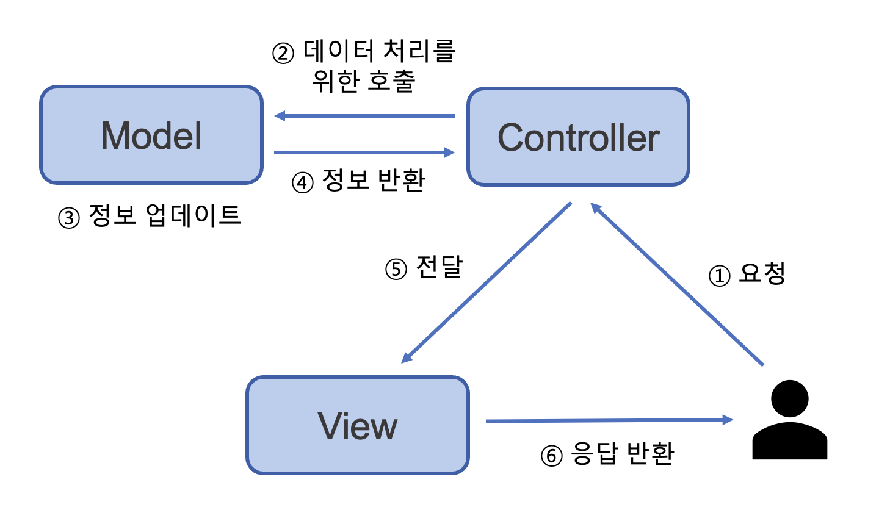
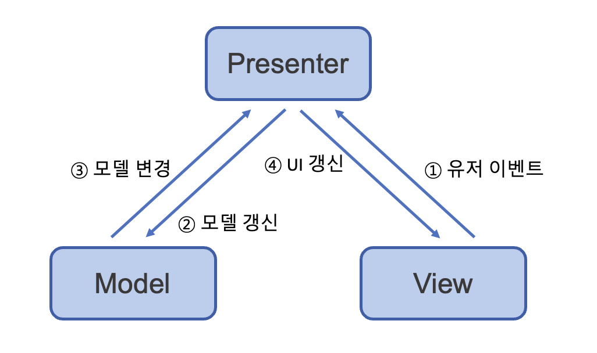
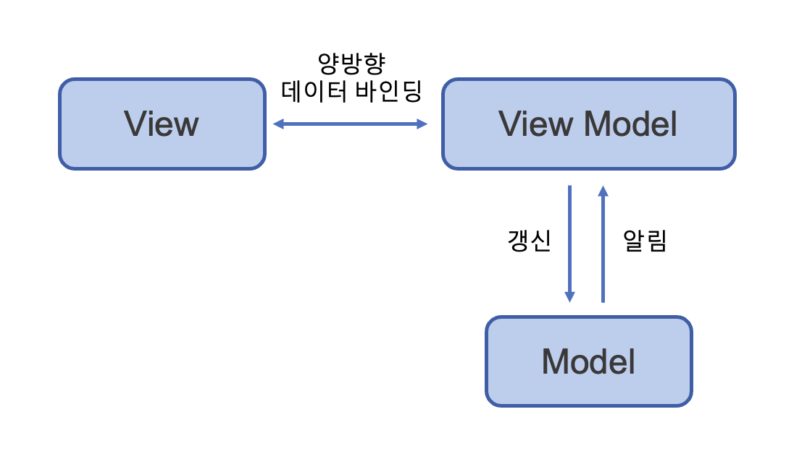

# 🎨 디자인 패턴 (2)

## 💡 프록시(Proxy) 패턴
- 클라이언트와 실제 객체 사이에 인터페이스를 제공하여 클라이언트가 실제 객체를 직접 접근하는 것을 방지
- 객체의 속성, 변환 등을 보완 ➡️ 코드의 유지보수성, 재사용성, 보안성 등을 향상
- 보안, 데이터 검증, 캐싱, 로깅에 사용

### 📍 프록시 서버
- 클라이언트와 원격 서버 간의 중개 역할을 하는 서버
- 요청과 응답에서 해당 서비스에 대한 간접적인 접근을 제공하는 중개자 역할을 수행

> ⭐️ nginx      
> - 비동기 이벤트 기반의 구조와 다수의 연결을 효과적으로 처리 가능한 웹 서버         
> - 주로 Node.js 서버 앞단의 프록시 서버로 활용됨
> - 커넥션 연결 후 요청이 없으면 다른 커넥션의 요청을 처리하거나 새로운 커넥션을 형성하므로, 서버 자원을 효율적으로 사용
> - 워커 프로세스는 처리할 요청의 시간이 오래 걸릴 것 같으면 스레드 풀에 이벤트를 위임하고 다른 이벤트를 처리함

> ⭐️ CloudFlare
> - 인터넷 보안 및 성능 최적화를 제공하는 기업
> - **CDN**과 웹 애플리케이션 방화벽(WAF) 기능 등을 통해 사이트의 안정성과 보안성을 향상시킴
> - DDOS 공격 방어, HTTPS 구축, 방화벽 기능, 로드 밸런싱, DNS 서비스 등을 제공함

> ⭐️ CDN(Content Delivery Network)
> - 웹 사이트의 컨텐츠를 전 세계에 분산된 여러 개의 서버에 캐시하여 사용자들이 가장 가까운 서버로부터 컨텐츠를 빠르게 제공받도록 하는 기능
> - 페이지의 로딩 속도를 향상시킴
> - 트래픽 부하를 분산하여 서버 성능을 최적화함

 

#### 👍🏻 **프록시 서버의 사용 목적**
`캐싱`: 클라이언트의 요청을 서버로 보내기 전에 미리 해당 데이터를 캐시에 저장해둘 수 있다.       
`보안`: 웹 방화벽 기능 등을 제공하여 악성 코드나 스팸을 차단할 수 있다. 실제 포트를 숨길 수 있다.     
`접근 제어`: 특정 웹 사이트나 서비스에 대한 접근을 제어할 수 있다.        
`익명성`: 프록시 서버를 통해 인터넷에 접속하면 클라이언트의 IP 주소를 감추거나 변경하여, 사용자의 개인 정보를 보호하거나 지역 제한을 우회할 수 있다.     
`부하 분산`: 여러 개의 프록시 서버를 사용하여 요청을 분산할 수 있다.       
`CORS 에러 해결`: 프론트에서 CORS 에러를 해결하기 위해 프록시 서버를 활용하기도 한다. 

## 💡 이터레이터(Iterator) 패턴
- 이터레이터를 사용하여 컬렉션의 요소들에 순차적으로 접근하는 디자인 패턴

#### 👍🏻 장점
- 순회할 수 있는 여러가지 자료형의 구조와 상관없이 이터레이터라는 하나의 인터페이스로 순회할 수 있음
- 컬렉션 내부 구조를 노출하지 않고도 요소에 접근할 수 있음
  - 컬렉션 객체의 구현이 변경되더라도 코드를 수정할 필요가 없음
- 이터레이터와 컬렉션을 분리함으로써 유연성과 재사용성을 높일 수 있음

## 💡 노출모듈(Revealing Module) 패턴
- 즉시 실행 함수를 통해 private, public과 같은 접근 제어자를 만드는 디자인 패턴
- 모듈의 인터페이스를 정의하고, 외부에 노출할 특정 속성과 메서드를 선택적으로 공개함
- ES6 이후에는 class 문법과 export 키워드를 사용하여, 모듈을 구성하는 데 보다 간편한 방법이 등장함

#### 👍🏻 장점
- 모듈의 사용법을 단순화하고, 코드의 가독성을 높임.
- 코드의 유지보수에 용이함
- 비공개 멤버들은 외부에서 접근할 수 없으므로, 노출하고 싶지 않은 상세 구현 내용을 감추는데 유용함

## 💡 MVC 패턴
- 애플리케이션의 구조를 Model, View, Controller로 분리하여 개발하는 방법을 제공하는 디자인 패턴
- 각 구성 요소가 담당하는 역할을 명확히 분리함으로써 코드의 재사용성과 유지보수성을 향상시킴
- 대표적으로 Spring 프레임워크에서 사용됨

### 📍 Model
- 애플리케이션의 비즈니스 로직과 데이터를 담당
- 데이터의 상태를 관리/조작하는 로직을 포함
- 일반적으로 DB, 서비스, API와 같은 데이터 소스와 상호작용함
- View의 데이터 변경에 따라 Controller를 통해 Model을 생성하거나 업데이트 함

### 📍View
- 사용자 인터페이스를 담당
- 데이터를 시각적으로 표현
- 사용자의 입력을 받아 Controller에 전달하거나 모델의 상태를 보여주는 역할을 함
- View는 Model의 데이터를 직접 변경하지 않아야 함
- 오직 사용자와의 상호작용과 Model의 변경을 감지하여 화면을 업데이트함

### 📍Controller
- Model과 View를 잇는 다리 역할
- 사용자의 입력을 받아 Model에 전달
- Model의 변경사항을 감지하여 View를 업데이트
- View와 Model의 역할을 분리하고, 둘 사이의 의존성을 최소화함

## 💡 MVP 패턴
- MVC 패턴으로부터 파생(Controller 대신 Presenter로 구성됨)
- Presenter가 View와 직접적으로 상호작용
- MVC 패턴보다 더 강한 결합을 지님
- 안드로이드 앱 개발 등에서 많이 사용

## 💡 MVVM 패턴
- MVC 패턴으로부터 파생(Controller 대신 View Model로 구성됨)
- View Model은 View를 더 추상화한 계층으로, View와 View Model 사이의 양방향 데이터 바인딩을 지원함
- UI를 별도의 코드 수정 없이 재사용할 수 있으며, 단위 테스팅에 용이함
- 대표적으로 반응형인 Vue.js 프레임워크에서 사용됨

-------------------------------------------------

### References
- https://ssdragon.tistory.com/60