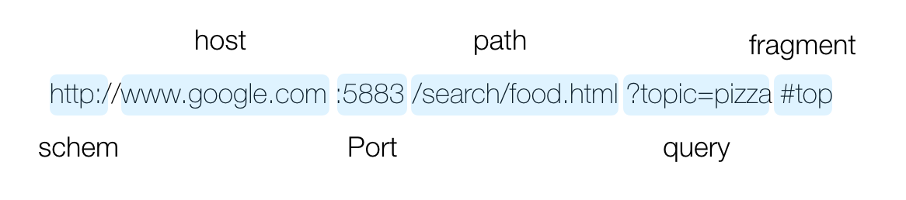

# 🎯 URI

URI
: **U**niform: 리소스를 식별하는 통일된 방식
: **R**esource: URI로 식별 가능한 모든 자원 (HTML파일, 실시간 교통정보 등)
: **I**dentifier: 다른 항목과 구분하는 데 필요한 정보

 
### URI ⊃ URL, URN
- **URL**: Uniform Resource **Location** : 리소스의 위치
- **URN**: Uniform Resource **Name** : 리소스의 이름
    - 이름만으로 리소스를 찾아내는 방법이 보편화되지 않아 거의 사용하지 않음

 
### URL문법
 
- scheme
    - 주로 프로토콜을 사용 → 어떤 방식으로 리소스에 접근할지
    - http의 포트 80, https의 포트 443는 생략 가능
- userinfo
    - scheme과 host 사이 사용자 정보를 포함시켜 인증
    - 거의 사용하지 않음
- host
    - 호스트명: 도메인명 / IP주소
- port
    - 접속 포트
    - 일반적으로 생략: 생략시 scheme을 통해 포트 유추 가능
- path
    - `/`를 사용한 계층적 구조
- query
    - key=value 형태로 한 쌍
    - `?`로 시작, `&`로 추가
    - 웹서버에 제공하는 파라미터라서 query parameter, 문자로 넘어가기 때문에 query string으로 불리기도 함
- fragment
    - `#`로 시작
    - 서버에 전송하지 않는 정보로 html 내부 북마크 등으로 사용