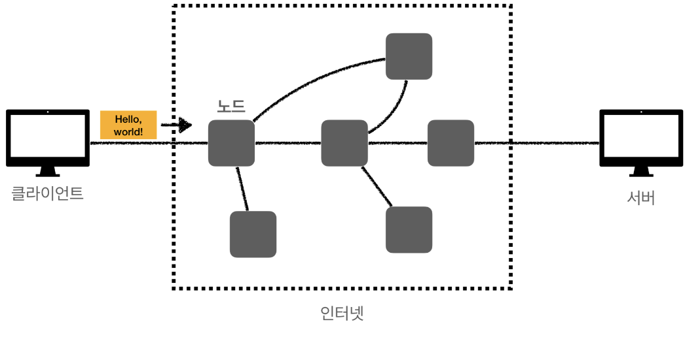
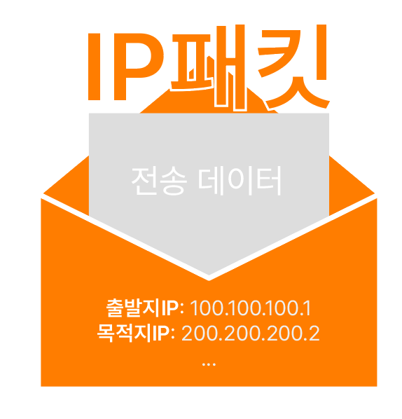
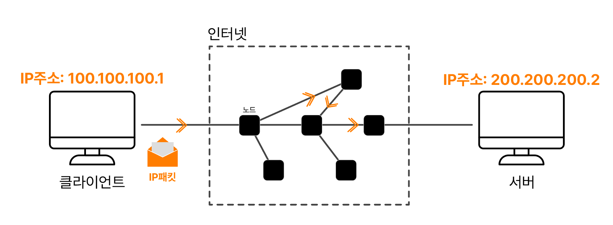
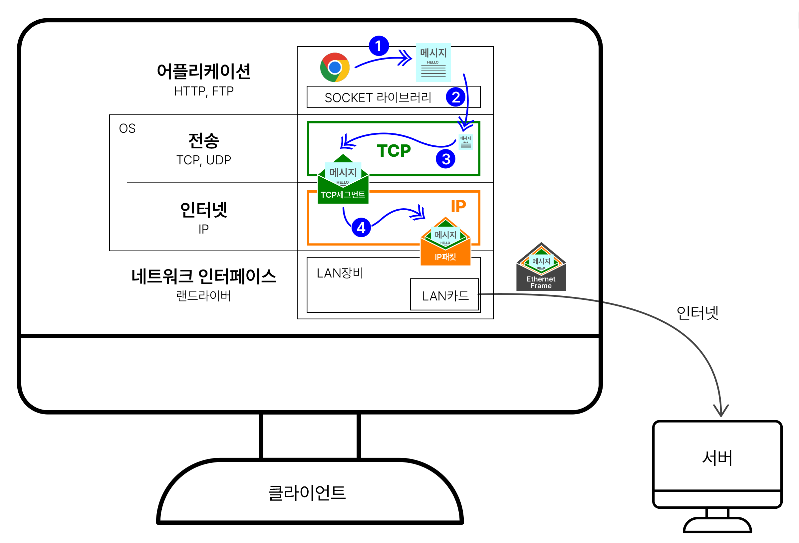
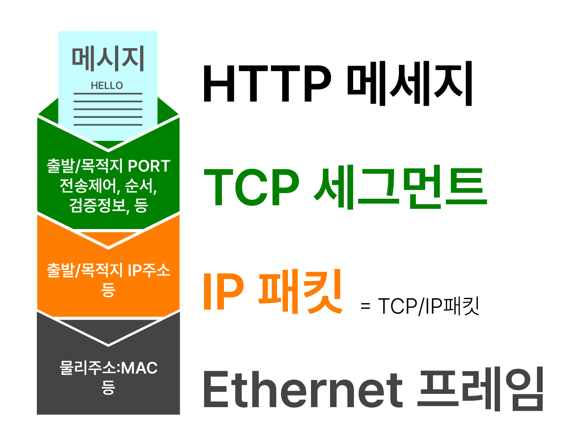
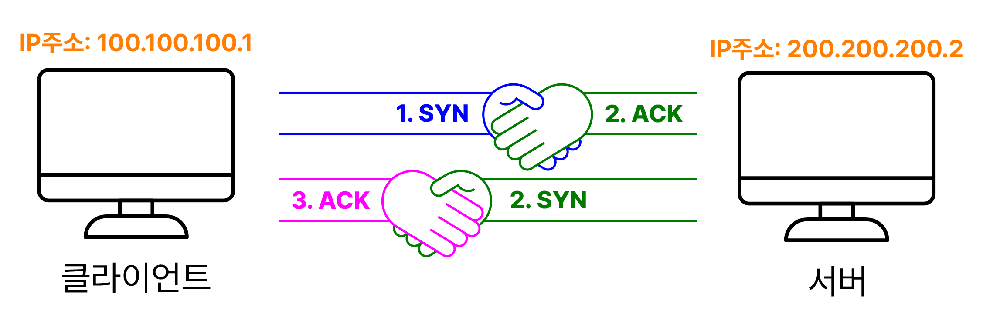
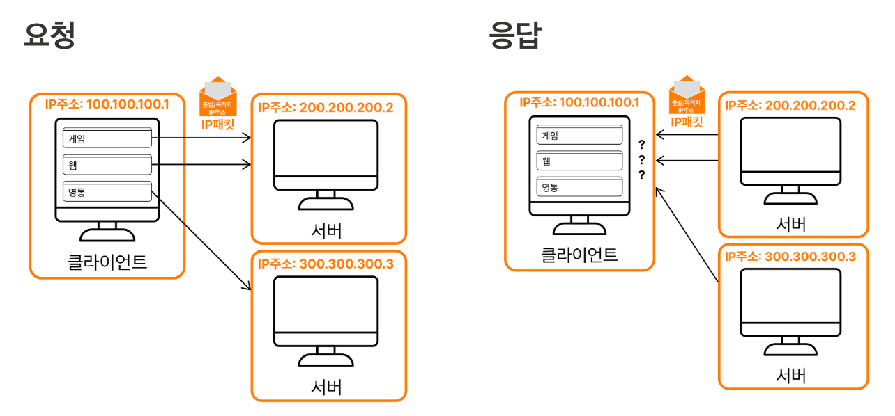
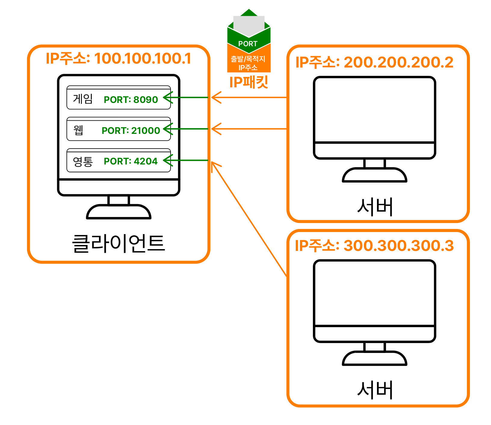
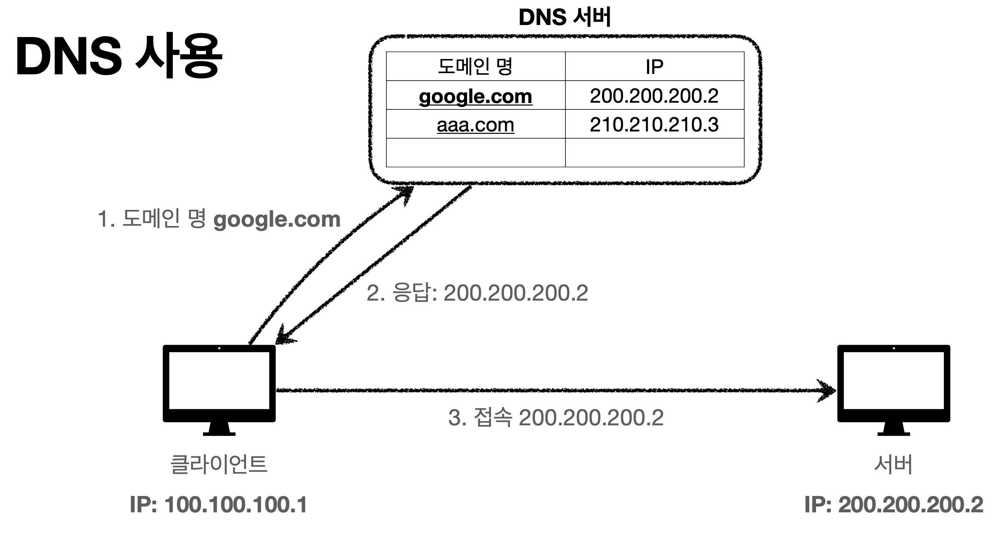

# 🌐 인터넷 네트워크
미리 보는 요약
- 인터넷을 통해 통신해야하는 두 컴퓨터의 기본 통신 규정(규약) - **IP 프로토콜**
- IP프로토콜의 단점을 보완하기 위해 추가해서 사용하는 단계 - **TCP**
- TCP와 같은 계층이지만 하는 일이 없어 외면받다가 요즘들어 조금 주목 받는 - **UDP**

 

###  인터넷에서의 기본 통신

 

- 클라이언트와 서버는 인터넷을 통해 메세지를 주고 받는다.
- 인터넷은 “노드”라고 하는 수많은 서버들이 망을 이룬 형태
- 클라이언트와 서버의 통신은 수많은 서버들을 거쳐 메세지를 주고받는 것

 
# 📨 IP
Internet Protocol : 수많은 중간 서버들을 통해 어떻게 메세지를 전달할지 약속한 규약

- Packet이라는 통신 단위로 전달 = 전달할 내용 편지봉투에 곱게 담아 보내기
    - Packet = Package + Bucket ≒ 무언가를 담아 보내는 상자
- 각각 IP 주소를 부여하고, 지정 주소에 데이터 전달 = 받는 사람과 보내는 사람의 주소 쓰기

 
- 요청: 클라이언트의 패킷 전달 / 응답: 서버의 패킷 전달
- 인터넷의 노드들은 모두 IP프로토콜을 따르기 때문에 패킷에 저장된 정보를 보고 도착지까지 전달되도록 서버들끼리 패킷을 토스한다

### IP프로토콜의 한계
- 비연결성
    - 연결 상태에 대한 확신 없이 패킷 전송: ex) 대상이 없거나 서비스 불능 상태
- 비신뢰성
    - 중간 과정에서 패킷이 사라져도 알 수 없음
    - 일련의 패킷을 보낼 때 도착 순서를 보장할 수 없음
        - 클라이언트가 순서를 지켜 보내더라도, 상황에 따라 각 패킷이 다른 노드들을 거쳐 전달될 수 있음
- 프로그램 구분
    - 한 PC에서 여러 어플리케이션이 네트워크 통신을 하고 있다면 같은 IP주소를 사용하기 때문에 어떤 어플리케이션의 요청인지 구분할 수 없음

 
###  🗄 인터넷 프로토콜의 4계층 흐름
IP계층을 보완하기 위해 전송계층(TCP, UDP)을 올렸다.
 
1. 프로그램이 메세지(전송데이터, 보통 HTTP메세지) 작성
2. 어플리케이션 내 Socket 라이브러리를 통해 전송계층으로 전달
3. 전송계층에서 TCP정보를 더해 IP계층으로 전달
4. IP계층에서 IP정보를 더해 네트워크 인터페이스 계층으로 전달
* 웹 기준으로 IP 프로토콜까지만 자세히 알면 되고, 이더넷 프레임은 궁금하면 더 찾아보기를 추천

 

 

# 📨 TCP
전송제어 프로토콜, Transmission Control Protocol
: IP프로토콜에 들어가기 전, 어떻게 전송할지 구체적인 옵션을 추가하는 프로토콜
- 신뢰할 수 있는 프로토콜
- 현재 대부분 TCP사용

### TCP 3 way handshake
- 두 컴퓨터간 연결을 확인한 후(신뢰성 확보) 메세지 보냄
- 가상연결 = 개념적인 연결 ≠ 랜선을 통한 물리적 연결 = 이 연결만을 위한 전용 랜선(인터넷의 중간 노드들을 포함)을 확보한 것이 아님
 
1. SYN: 클라이언트의 접속 요청
2. ACK: 서버의 요청 수락 + SYC: 서버의 접속 요청
3. ACK: 클라이언트의 요청 수락
- 최적화 이후 3번단계와 동시에 데이터 전송을 하기도 함

### TCP → 도착 순서 보장
- 클라이언트에서 패킷 1, 2, 3 순서로 전송: 순서 정보 in TCP세그먼트
- 서버에 패킷 1, 3, 2 순서로 도착: TCP세그먼트의 순서 정보와 불일치
- 서버가 패킷 2부터 재전송 요청

### TCP → 데이터 전달 보증
- 클라이언트 → 서버 : 데이터 전송
- 클라이언트 ← 서버 : 데이터 잘 받았음

### PORT로 같은 IP내 특정 프로세스로 정확히 전달
PORT
: 같은 IP 내에서 프로세스를 구분
- 0 ~ 65535: 할당 가능
- 0 ~ 1023: 잘 알려진 포트들의 default 포트넘버이므로, 권장하지 않음
    - FTP 20, 21
    - TELNET 23
    - HTTP 80
    - HTTPS 443

**↓↓ PORT 정보 없이 IP정보만으로 요청/응답**
 
**↓↓ TCP 세그먼트에 PORT정보를 포함시켜 응답**
 

 

# 🏷 DNS
- 기억하기 어렵고, 값이 변경될 수 있는 IP주소를 대신해 도메인명 사용
- DNS, Domain Name System : 도메인명을 IP주소로 변환해주는 전화번호부
- DNS에 도메인 명을 사서 등록
 
