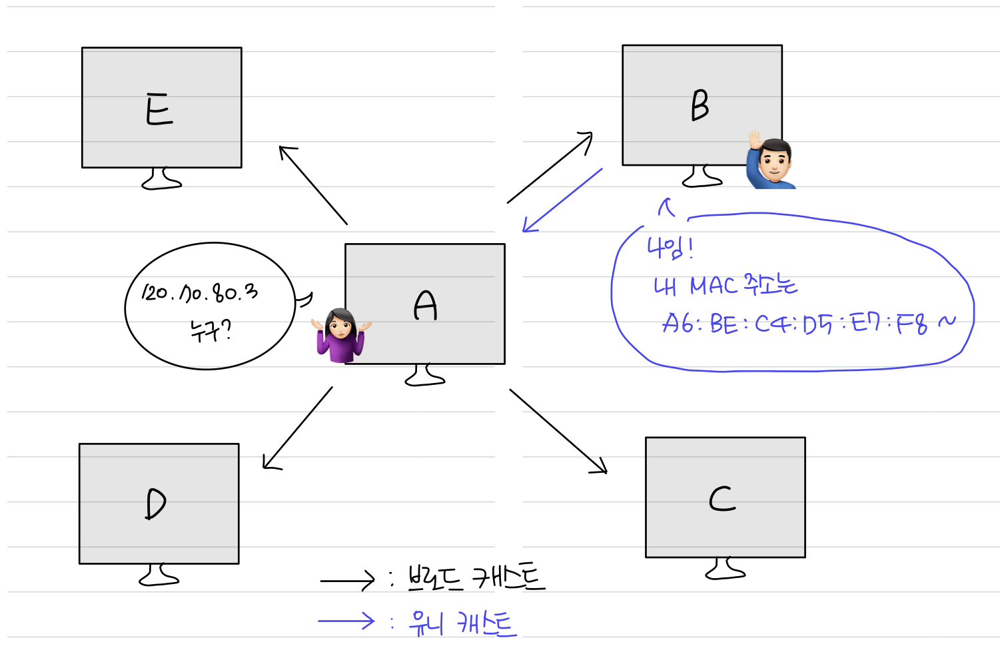

**컴퓨터와 컴퓨터 간의 통신**은 IP 주소를 기반으로 통신한다. 정확히 말하자면 **IP 주소**에서 **ARP**를 통해 **MAC 주소**를 찾아 **MAC 주소**를 기반으로 통신을 하게 된다.

# 🏓 ARP: Address Resolution Protocol

그렇다면 ARP란 무엇일까?

바로 IP 주소(논리적 주소)로부터 MAC 주소(물리적 주소)를 구하는 "다리 역할"을 하는 프로토콜을 말한다.

즉, ARP를 통해 **가상 주소인 IP 주소**를 **실제 주소인 MAC 주소**로 변환하게 되고, 이 변환 과정을 통해 LAN(Layer 2)에서 목적지를 제대로 찾아갈 수 있게 된다.

<br />

#### 📌 MacOS에서 터미널에 `arp -a` 명령어 실행

- 현재 ARP 캐시에 저장된 **IP-MAC 주소 쌍 목록**을 확인 가능하다.

```bash
? (192.168.1.1) at 00:11:22:33:44:55 on en0 ifscope [ethernet]
? (192.168.1.100) at aa:bb:cc:dd:ee:ff on en0 ifscope [ethernet]
```

1. **IP 주소**: `192.168.1.1`와 `192.168.1.100`

2\. IP 주소와 연결된 **MAC 주소**: 각각 `00:11:22:33:44:55`와 `aa:bb:cc:dd:ee:ff`, 이는 en0 인터페이스에 연결되어 있음

3\. **en0 인터페이스**: 색인 번호가 0인 이더넷 인터페이스를 나타내며, 일반적으로 유선 이더넷 연결에 사용

- 여러 이더넷 인터페이스 또는 기타 네트워크 인터페이스가 있는 경우 운영체제에서 감지한 순서에 따라 "en1", "en2"등의 레이블이 지정될 수 있다.

- **이더넷**은 장치가 근거리 통신망(LAN)을 통해 통신할 수 있도록 널리 사용되는 네트워킹 기술이다.

- **이더넷 인터페이스**: 장치를 이더넷 네트워크에 연결할 수 있게 해주는 하드웨어 구성 요소 혹은 네트워크 인터페이스 카드(NIC)

<br />

## ✔️ ARP의 주소를 찾는 과정



1. `장치 A`: 특정 IP 주소(예: 120.70.80.3)와 연결된 MAC 주소를 찾는 **ARP Request**를 **브로드캐스트**
2. `장치 B`: 해당 IP-MAC 매핑을 가지고 장치 A의 ARP 요청에 **유니캐스트** **ARP Response**로 응답
3. `장치 A`: ARP Response를 수신하고 Request한 IP 주소와 일치하는 **MAC 주소를 획득**

> \- 브로드캐스트: 송신 호스트가 전송한 데이터가 네트워크에 연결된 모든 호스트에게 전송되는 방식  
> \- 유니캐스트: 고유 주소로 식별된 하나의 네트워크 목적지에 1:1로 데이터를 전송하는 방식

\*이와 반대로 **RARP**를 통해 **실제 주소인 MAC 주소**를 **가상 주소인 IP 주소**로 변환하기도 한다.

<br />

### 예시를 통해 알아보자.

예를 들어, [www.google.com](http://www.google.com/)에 접속할 때,

1. 첫 번째 단계는 DNS 조회를 수행하는 것이다.

   - 이 조회는 DNS 서버에서 [www.google.com](http://www.google.com/) 도메인과 연결된 IP 주소를 검색한다.

2. IP 주소를 얻었으면 다음 단계는 라우터의 IP 주소와 연결된 MAC 주소를 결정하는 것이다.
   - 여기에서 **ARP(Address Resolution Protocol)** 가 작동한다.
   - 장치는 [www.google.com](http://www.google.com/)에 액세스하기 전에 로컬 네트워크 내에서 기본 게이트웨이 또는 라우터의 MAC 주소를 찾아야 한다.
   - 장치는 ARP를 사용하여 "누가 라우터의 IP 주소를 가지고 있습니까?"라고 묻는 **ARP Request 브로드캐스트**를 보낸다. 이 브로드캐스트는 라우터 자체를 포함하여 로컬 네트워크 내의 모든 장치에서 수신된다.
   - ARP Request를 받으면 해당 IP 주소를 가진 라우터는 요청을 인식하고 **ARP Response**을 사용하여 자신의 MAC 주소로 응답한다. 장치는 이 응답을 수신하고 라우터의 **MAC 주소를 얻는다.**
3. 이제 ARP 테이블을 통해 라우터의 MAC 주소를 얻었으므로 [www.google.com](http://www.google.com/)으로 향하는 IP 패킷을 이더넷 프레임 내에 캡슐화할 수 있다.
   - 이 프레임에는 소스 및 대상 장치의 MAC 주소가 포함된다.
   - 올바른 주소 지정 및 라우팅을 보장하기 위해 장치는 **이더넷 프레임의 대상 MAC 주소**를 ARP 테이블을 통해 얻은 라우터의 MAC 주소로 설정한다.

요약하면 [www.google.com](http://www.google.com/)에 접속할 때 1) DNS 조회를 통해 IP 주소를 얻은 다음 2) ARP를 사용하여 내 라우터의 MAC 주소를 결정한다. 로컬 네트워크. ARP는 이더넷 프레임이 올바르게 지정되고 라우팅되도록 하여 [www.google.com](http://www.google.com/)과의 성공적인 통신을 가능하게 한다. 이후의 동작과정은 추후에 더 자세히 알아보도록 하자.

<br />

### 그렇다면 왜 IP주소가 필요한가? MAC 주소만 있으면 되는건 아닐까?

- **IP 주소**는 인터넷과 같은 외부 네트워크에 연결할 때 필수적이다.
- 반면에 **MAC 주소**는 내부 네트워크 내의 통신에서 중요한 역할을 한다.
- **IP 주소**를 사용하면 로컬 네트워크 외부에서 통신할 수 있으며 **MAC 주소**는 로컬 네트워크 자체 내에서 통신을 용이하게 한다.

<br />

#### 그렇다면 사설망처럼 내부 네트워크 내에서도 IP주소를 쓰는 이유는 무엇일까?

1. 무엇보다도 내부 네트워크 통신에 IP 주소를 사용하면 **확장성**을 얻을 수 있다.

   - 네트워크가 확장되거나 변경됨에 따라 네트워크 리소스를 효율적으로 할당하고 관리할 수 있다.
   - IP 주소를 사용하면 진화하는 네트워크 요구 사항에 유연하게 적응할 수 있다.

2. 또 다른 이점은 **라우팅 효율성**이다.

   - IP 주소는 라우터가 지능적인 포워딩 결정을 내릴 수 있도록 하여 네트워크에서 가장 효율적인 통신 경로를 설정한다.
   - 라우팅 프로토콜은 대상 IP 주소를 기반으로 IP 패킷의 흐름을 최적화하여 최적의 전달을 보장한다.

3. 또한 IP 주소는 **광범위한 네트워크 서비스와 매우 호환**된다.

   - DHCP(Dynamic Host Configuration Protocol), DNS(Domain Name System) 등과 같은 서비스는 연결, 이름 확인 및 관리를 위해 IP 주소에 의존한다.
   - IP 주소는 이러한 서비스가 원활하게 작동할 수 있는 기반을 제공한다.

4. 마지막으로 IP 주소는 **내부 네트워크 주소 지정 및 관리에 더 적합하고 관리하기 쉬운 솔루션을 제공**한다.
   - MAC 주소는 데이터 링크 계층에서 중요하지만 IP 주소는 기본 물리적 네트워크 인프라와 독립적인 논리적 주소 지정 메커니즘을 제공한다.
   - 이는 네트워크 관리 및 재구성 작업을 단순화한다.

결론적으로 **IP 주소**는 외부 네트워크 연결에 중요한 역할을 하고 **MAC 주소**는 내부 네트워크 통신에 필수적이다. 그러나 **내부 네트워크 내에서 IP 주소를 사용**하면 확장성, 유연성, 라우팅 효율성 및 다양한 네트워크 서비스와의 호환성을 제공하기 때문에 사용한게 된다.

<br />
<br />

## Reference

- [ARP 쉽게 이해하기](https://aws-hyoh.tistory.com/entry/ARP-%EC%89%BD%EA%B2%8C-%EC%9D%B4%ED%95%B4%ED%95%98%EA%B8%B0)
