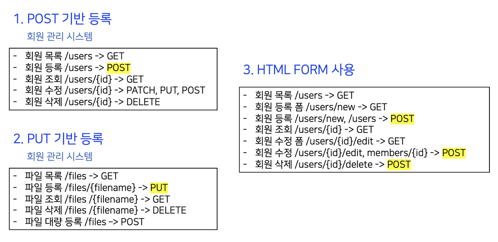

# 📌 클라이언트에서 서버로의 데이터 전송

## ✏️ 데이터 전달 방식 2가지

### 1. 쿼리 파라미터를 통한 데이터 전송

이 방식은 주로 GET 메서드에서 사용된다.

쿼리 파라미터는 URL에 추가되는 매개변수로, 주로 정렬 필터나 검색어와 같은 정보를 전달할 때 사용된다.

```
https://api.example.com/products?category=electronics&sort=price
```

### 2. 메시지 바디를 통한 데이터 전송

이 방식은 POST, PUT, PATCH 메서드에서 주로 사용된다.

회원 가입, 상품 주문, 리소스 등록, 리소스 변경과 같은 작업에서 사용된다. 이 방식은 데이터를 요청의 본문에 담아서 서버로 전송한다.

```
data = {
    "username": "john_doe",
    "email": "john@example.com",
    "password": "secret123"
}

POST("https://api.example.com/register", data)
```

<br />

데이터 전달 방식은 요청의 목적과 데이터의 크기, 보안 등을 고려하여 선택되어야 한다
각 방식의 특징을 이해하고 적절하게 활용하는 것이 중요하다.

<br />
<br />

## ✏️  4가지 상황

### 1. 정적 데이터 조회

- 정적 데이터는 이미지나 정적 텍스트 문서와 같은 형태로 존재한다.
- 이러한 데이터를 조회할 때에는 주로 GET 메서드를 사용한다.
- 일반적으로는 쿼리 파라미터 없이 리소스 경로를 통해 간단하게 조회할 수 있다.

### 2. 동적 데이터 조회

- 주로 검색 기능이나 게시판 목록에서 정렬 필터링과 같은 기능이 요구될 때 사용된다.
- 조회 조건을 줄여주는 필터나 조회 결과를 정렬하는 정렬 조건에 주로 활용된다.
- 이 역시 GET 메서드를 사용하여 데이터를 조회한다.
- GET 요청 시 쿼리 파라미터를 사용하여 데이터를 전달한다.

### 3. HTML Form을 통한 데이터 전송

- HTML Form을 제출(submit)할 때에는 주로 POST 방식을 사용한다.  
  주로 회원 가입, 상품 주문, 데이터 변경과 같은 작업에 활용된다.  
  Content-Type: application/x-www-form-urlencoded:
- HTML Form의 내용을 메시지 바디를 통해 전송할 때에는 "application/x-www-form-urlencoded"라는 Content-Type을 사용한다.  
  전송 데이터는 key=value 쌍의 형식으로 메시지 바디에 포함되며, 쿼리 파라미터와 유사한 형식이다.  
  전송 데이터는 URL 인코딩(encoding) 처리되어야 한다.  
  예를 들어, "abc김"은 "abc%EA%B9%80"으로 인코딩된다.
- HTML Form에서의 GET 전송  
  HTML Form은 GET 방식으로도 데이터를 전송할 수 있다.  
  GET 전송은 URL의 쿼리 파라미터를 통해 데이터를 전달한다.
- Content-Type: multipart/form-data:  
  파일 업로드와 같은 바이너리 데이터를 전송해야 할 때에는 "multipart/form-data"라는 Content-Type을 사용한다.  
  이 방식은 여러 종류의 파일과 폼의 내용을 함께 전송할 수 있도록 해준다. 따라서 "multipart"라는 이름이 붙었다.

참고로, HTML Form은 GET과 POST 방식만 지원한다.

### 4. HTTP API를 통한 데이터 전송

- 서버 간 통신이나 앱 클라이언트와의 통신에 활용된다.
- 웹 클라이언트에서도 HTML Form 전송 대신에 자바스크립트를 사용한 AJAX 통신으로 HTTP API를 호출할 수 있다. 이때에는 POST, PUT, PATCH 메서드를 사용하여 메시지 바디를 통해 데이터를 전송한다.
- 주로 Content-Type으로 application/json을 사용하며, 텍스트, XML, JSON 등 다양한 형식의 데이터 전송이 가능하다.

<br />
<br />

# 📌 HTTP API 설계 예시

## 1. HTTP API - 컬렉션

- 이 방식은 POST를 기반으로 한 리소스 등록을 의미한다.
- 예를 들어, 회원 관리 API가 있다고 가정해보자.  
  회원을 등록하기 위해 클라이언트는 등록될 리소스의 URI를 모른다.
  - 서버는 POST /members를 통해 회원을 등록하고, 새로 생성된 리소스 URI를 반환한다.  
    \=> HTTP/1.1 201 Created  
          Location: /members/100
- 이때, 서버는 /members와 같이 관리하는 리소스 디렉토리인 **컬렉션**을 가지고 있다.

## 2. HTTP API - 스토어

- 이 방식은 PUT을 기반으로 한 리소스 등록을 의미한다.
- 예를 들어, 정적 컨텐츠 관리나 원격 파일 관리와 같은 경우를 생각해보자.  
  클라이언트는 등록할 리소스의 URI를 직접 알고 있어야 한다.  
  클라이언트는 PUT /files/star.jpg와 같이 리소스의 URI를 지정하여 파일을 등록한다.
- 이때, 클라이언트가 직접 리소스를 관리하는 **스토어**를 가지고 있다.

## 3. HTML FORM 사용

- 웹 페이지에서 회원 관리와 같은 작업을 수행하는 경우 HTML FORM을 사용할 수 있다.
- HTML FORM은 GET과 POST만 지원한다.
- AJAX와 같은 기술을 사용하여 제약을 해결할 수 있지만, 여기서는 순수 HTML과 HTML FORM에 초점을 맞추겠다.
- GET과 POST만 지원되므로 일부 제약이 있을 수 있다.
- 이러한 제약을 해결하기 위해 동사로 된 리소스 경로를 사용할 수 있다.  
  예를 들어, /new, /edit, /delete와 같은 컨트롤 URI를 활용하여 HTTP 메서드로 해결하기 어려운 경우에 사용할 수 있다.

## ✏️ 정리



#### 1. HTTP API - 컬렉션

- POST 기반 등록
- 서버가 리소스 URI 결정

#### 2. HTTP API - 스토어

- PUT 기반 등록
- 클라이언트가 리소스 URI 결정

#### 3. HTML FORM 사용

- 순수 HTML + HTML form 사용
- GET, POST만 지원

## ✏️ 참고하면 좋은 URI 설계 개념

#### 1. 문서(document)

이는 단일한 개념을 나타내며, 파일이나 객체 인스턴스, 데이터베이스의 행(row) 등을 의미한다.
예를 들어, "/members/100"이나 "/files/star.jpg"와 같은 URI가 사용될 수 있다.

#### 2. 컬렉션(collection)

이는 서버가 관리하는 리소스의 집합을 나타내며, 리소스의 디렉터리 역할을 한다
서버가 리소스의 URI를 생성하고 관리한다. 예를 들어, "/members"와 같은 URI가 사용될 수 있다.

#### 3. 스토어(store)

이는 클라이언트가 관리하는 리소스 저장소를 나타냅니다. 클라이언트가 리소스의 URI를 알고 직접 관리한다.
예를 들어, "/files"와 같은 URI가 사용된다.

#### 4. 컨트롤러(controller), 컨트롤 URI

이는 문서, 컬렉션, 스토어로 해결하기 어려운 추가적인 프로세스 실행을 위해 동사 형태의 URI를 사용한다
예를 들어, "/members/{id}/delete"와 같은 URI가 사용될 수 있다.
