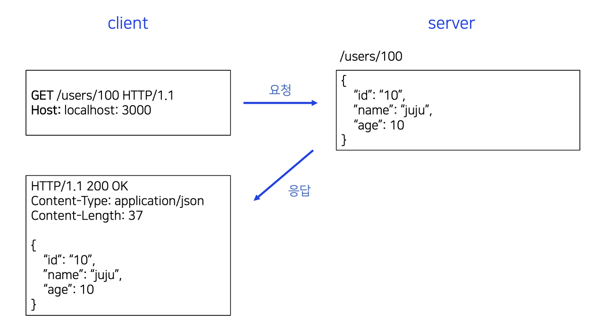
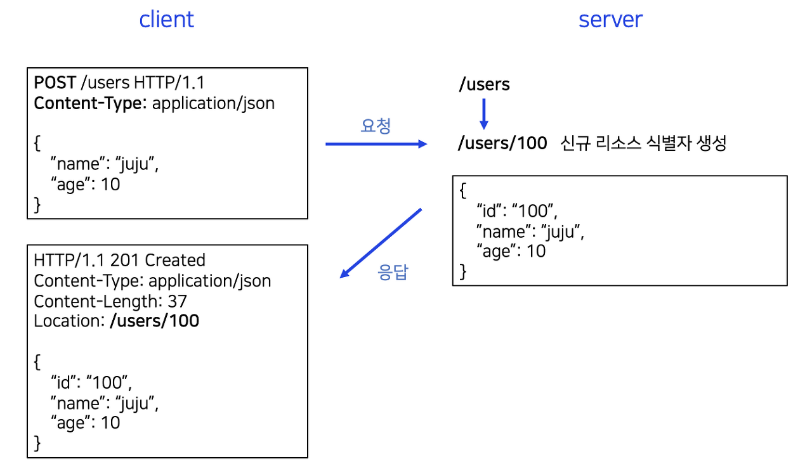
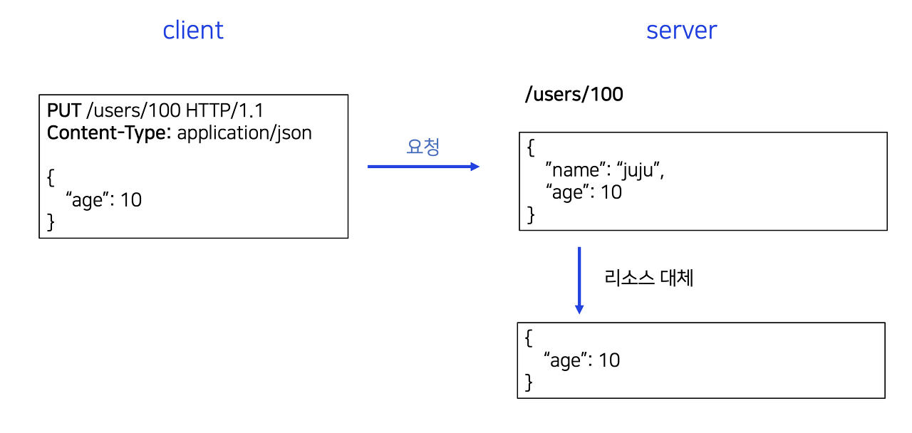
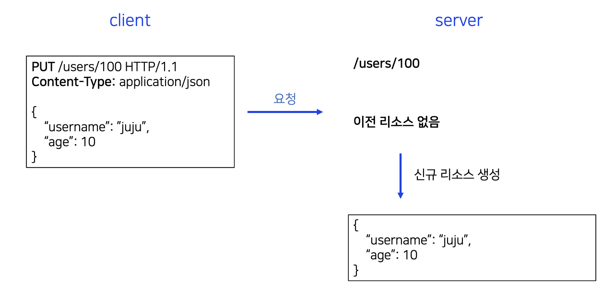
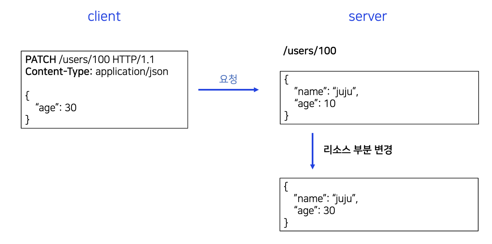
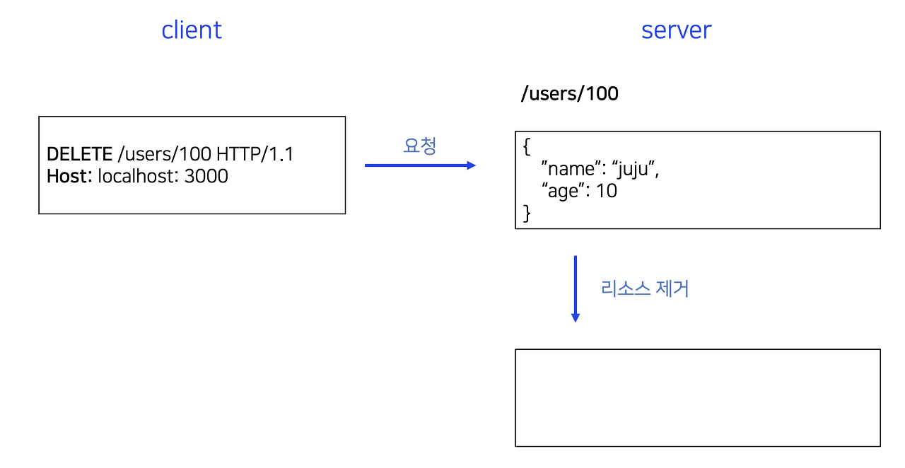
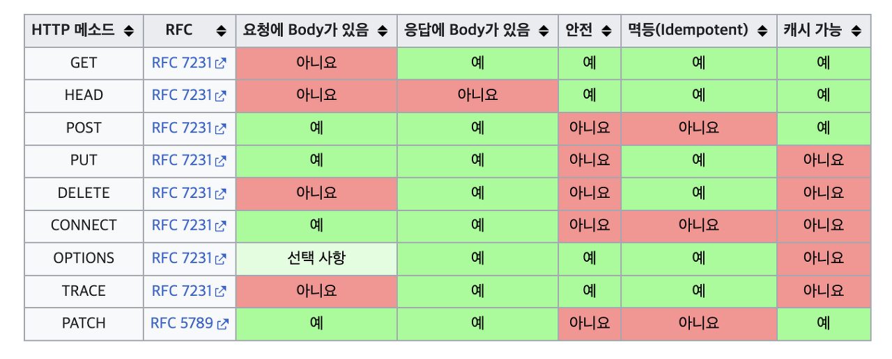

요구사항으로 회원 정보 테이블에 대한 API를 만들어야 한다고 가정해보자. 이를 위해 HTTP API를 설계해야 하는데, 이는 API URI를 설계하는 것이라고 볼 수 있다.

# 📌 API URI 설계

API URI를 설계하는 방법에 대해 생각해보자. **좋은 URI 설계**를 위해서는 리소스와 행위를 분리하는 것이 중요한 개념이다.

## ✏️ 리소스란 무엇일까요?

다음과 같은 것들을 리소스라고 볼 수 있다.

- URL를 검색해서 받아온 결과물
- TEXT, HTML, JSON, XML
- IMAGE, 음성, 영상, 파일
- 서버에서 전달 받은 데이터

즉, 회원 정보 테이블에서 리소스는 회원 그 자체를 의미한다. 즉, 명사 부분이다.

따라서, 회원 리소스를 식별하고 이를 URI에 매핑하면 된다.

"/users"와 같이 회원 리소스를 식별하는 URI를 사용할 수 있다.
상위를 컬렉션으로 보고 복수형 단어를 사용하는 것이 좋기 때문에, "user"가 아닌 "users"라는 단어를 사용하는 것이다.

예를 들면, "/users"는 회원 목록 조회를 의미하고, "/users/{id}"는 특정 회원 조회를 의미한다.

## ✏️ 행위

행위는 조회, 등록, 수정, 삭제와 같은 동사 부분을 의미한다.

행위는 HTTP 메서드를 이용하여 설계할 수 있다. 즉, **GET, POST, PATCH, DELETE**와 같은 HTTP 메서드를 사용한다.

<br />
<br />

# 📌 HTTP 메서드

HTTP 메서드에 대해 알아보자.
주요한 메서드로는 GET, POST, PUT, PATCH, DELETE가 있다. 그 외에도 HEAD, OPTIONS, CONNECT, TRACE 메서드가 있다.

간략히 설명하면 다음과 같다.

| 주요 메서드 | **GET**                                                               | 리소스 조회                                                    |
| ----------- | --------------------------------------------------------------------- | -------------------------------------------------------------- |
| **POST**    | 요청 데이터 처리, 주로 등록에 사용                                    |
| **PUT**     | 리소스를 대체, 해당 리소스가 없으면 생성                              |
| **PATCH**   | 리소스 부분 변경                                                      |
| **DELETE**  | 리소스 삭제                                                           |
| 기타 메서드 | **HEAD**                                                              | GET과 동일하지만 메세지 부분을 제외하고, 상태 줄과 헤더만 반환 |
| **OPTIONS** | 대상 리소스에 대한 통신 기능 옵션(메서드)을 설명 (주로 CORS에서 사용) |
| **CONNECT** | 대상 자원으로 식별되는 서버에 대한 터널을 설정                        |
| **TRACE**   | 대상 리소스에 대한 경로를 따라 메세지 루프백 테스트를 수행            |

<br />

이 중 5가지의 주요 메서드에 대해서 더 자세히 알아보겠다.

<br />

## ✏️ GET

**GET 메서드**는 리소스를 조회할 때 사용되며, 서버에 전달하고 싶은 데이터는 **쿼리 파라미터** 또는 **쿼리 스트링**을 통해 전달된다.

예를 들어, 아래와 같은 GET 요청 예시를 살펴보겠다.

```
/search?q=hello&hl=ko HTTP/1.1
Host: www.google.com
```

이 요청은 [www.google.com](http://www.google.com) 호스트에게 /search 리소스를 조회하라는 의미이다. q와 hl이라는 쿼리 파라미터를 통해 서버에 전달하고자 하는 데이터를 함께 전송하고 있다. 이 경우, q=hello는 검색어를, hl=ko는 언어 설정을 나타낸다.

- GET 요청은 일반적으로 쿼리 파라미터를 사용하여 데이터를 전달한다.
  메시지 바디를 사용해서 데이터를 전달할 수도 있지만, 많은 곳에서는 메시지 바디를 지원하지 않거나 제한적으로 지원하기 때문에, GET 요청에서는 쿼리 파라미터를 사용하여 데이터를 전달하는 것이 권장된다.

- GET 요청은 캐싱이 가능하고 북마크할 수 있으며, 브라우저 기록에 남게 된다.
- 또한, GET 요청은 보안적인 측면에서 데이터가 URL에 노출되기 때문에 중요한 정보를 전달하기에는 적합하지 않다.
  따라서, 민감한 데이터는 GET 요청을 통해 전송하는 것을 피하는 것이 좋다.



<br />

## ✏️ POST

POST 메서드는 요청 데이터를 처리하는 데 사용되며, 메시지 바디를 통해 서버로 요청 데이터를 전달한다. 이를 통해 서버는 요청 데이터를 처리하고 다양한 기능을 수행할 수 있다.



### 1\. 새 리소스를 생성

서버가 아직 식별하지 않은 새로운 리소스를 생성하는 경우에 사용된다.

예를 들어, 주문을 생성하는 API는 POST 메서드를 사용하여 새로운 주문 리소스를 생성할 수 있다.

### 2\. 요청 데이터 처리

단순히 데이터를 생성 또는 변경하는 것을 넘어서 프로세스를 처리해야 하는 경우에 사용된다.

예를 들어, 프로필 사진을 업로드하면 서버에서 이미지를 처리하여 썸네일을 생성하는 등의 추가 작업을 수행하는 경우 POST 메서드를 사용할 수 있다. 이때 컨트롤 URI를 조합하여 요청 데이터를 처리하고, 프로세스를 수행한 후 응답을 반환하는 방식으로 API를 설계할 수 있다.

즉, /users/upload-profile-image와 같은 컨트롤 URI를 조합하여 요청 데이터를 처리하고, 프로세스를 수행한 후 응답을 반환하는 방식으로 API를 설계할 수 있다.

POST의 결과로 새로운 리소스가 생성되지 않을 수도 있다.

### 3\. 다른 메서드로 처리하기 애매한 경우

클라이언트가 전송한 데이터를 서버에서 특정 방식으로 필터링하거나 가공해야 하는 경우에 POST 메서드를 사용할 수 있다.

예를 들어, 데이터 변환 작업이나 데이터베이스 필터링 작업을 수행해야 할 때 POST 메서드를 활용할 수 있다.

POST 메서드는 요청 데이터를 처리하고 다양한 기능을 수행하는 유연한 방법으로 사용된다.

<br />

## ✏️ PUT

리소스를 대체한다. 이미 해당 리소스가 존재하면 대체하고, 존재하지 않으면 새로 생성한다. 클라이언트는 리소스의 위치를 식별하고 URI를 지정하여 요청을 보낸다. PUT은 기존 데이터를 덮어쓰는 개념이다.

클라이언트가 리소스를 식별하고 URI를 사용하여 요청을 보내는 점이 POST와의 차이점이다.

- 리소스가 있는 경우
  
- 리소스가 없는 경우
  

<br />

## ✏️ PATCH

리소스의 일부분을 변경한다. 리소스의 일부를 수정하는 데 사용된다. PUT과는 달리 PATCH는 변경할 부분만 전송하고 나머지는 유지된다.

PATCH가 지원안되는 브라우저에서는 POST를 사용할 수 있다.



<br />

## ✏️ DELETE

리소스를 제거한다. 클라이언트는 제거할 리소스의 URI를 지정하여 요청을 보낸다. 서버에서는 해당 리소스를 삭제하고 삭제 결과에 대한 응답을 반환한다.



<br />
<br />

# HTTP 메서드의 속성

### 1. 안전 (Safe Methods)

안전한 메서드는 호출해도 리소스를 변경하지 않는다.

이는 해당 리소스만 고려하며, 계속 호출하여 장애 발생 시 로그 쌓임 등과 같은 부분을 고려하지 않는다.

### 2. 멱등(Idempotent Methods)

멱등한 메서드는 한 번 호출하든 100번 호출하든 결과가 동일하다.

GET, PUT, DELETE가 멱등 메서드에 해당하며, 자동 복구 메커니즘에 활용될 수 있다.
반면, POST는 멱등 메서드가 아니므로 중복 결제 등의 문제가 발생할 수 있다.

### 3. 캐시가능(Cacheable Methods)

캐시 가능한 메서드는 응답 결과 리소스를 캐시해도 되는지 여부를 나타낸다.

GET, HEAD, POST, PATCH가 캐시 가능하며, 실제로는 GET, HEAD 정도만 캐시로 사용된다.
POST와 PATCH는 본문 내용까지 캐시 키로 고려해야 하므로 구현이 어렵다.

<br />



<br>
<br>

---

# 결론

이러한 HTTP 메서드를 활용하여 리소스와 행위를 결합하여 API URI를 설계할 수 있다.

따라서 처음에 요청받았던 회원 정보 테이블에 대한 API를 다음과 같이 만들어 볼 수 있다.

<br />

| **회원** 목록 | /users      | **GET**              |
| ------------- | ----------- | -------------------- |
| **회원** 등록 | /users      | **POST**             |
| **회원** 조회 | /users/{id} | **GET**              |
| **회원** 수정 | /users/{id} | **PATCH, PUT, POST** |
| **회원** 삭제 | /users/{id} | **DELETE**           |
