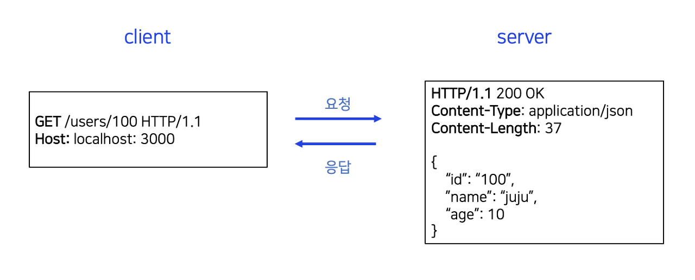
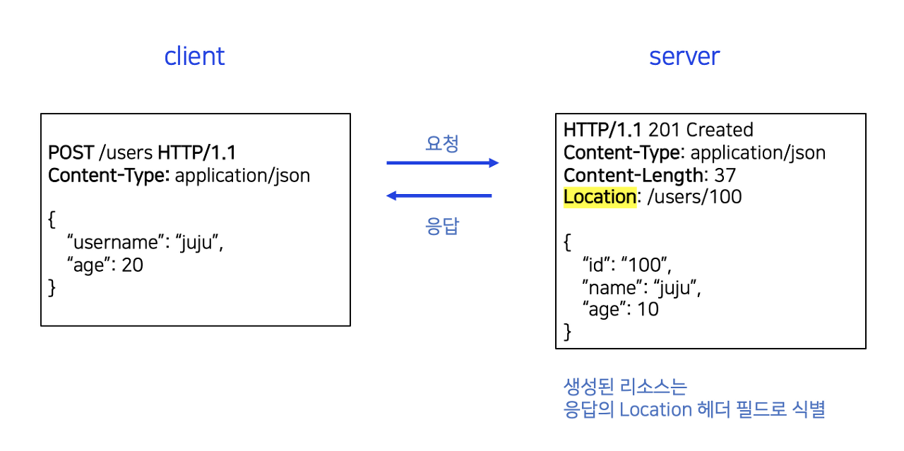
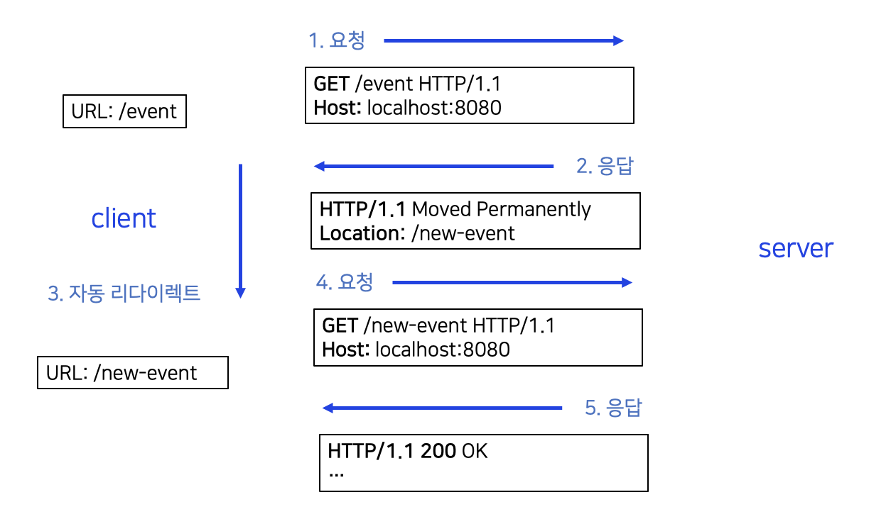
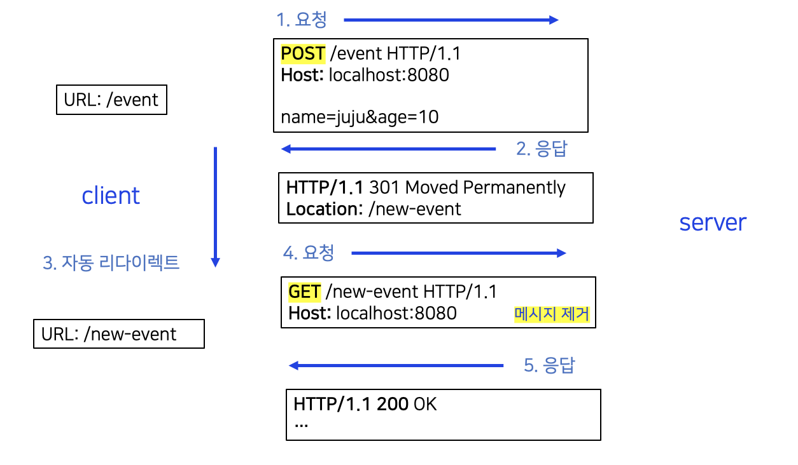
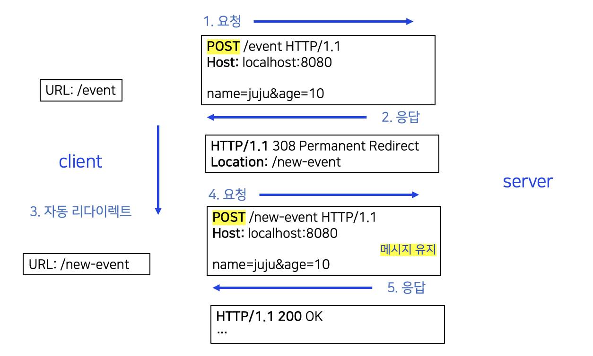

# 📌 HTTP 상태코드

HTTP 상태 코드는 **클라이언트가 보낸 요청의 처리 상태를 서버가 응답으로 알려주는 기능**이다.

- 1xx (Informational): 요청이 수신되어 처리중
- 2xx (Successful): 요청 정상 처리
- 3xx (Redirection): 요청을 완료하려면 추가 행동이 필요
- 4xx (Client Error): 클라이언트 오류, 잘못된 문법 등으로 서버가 요청을 수행할 수 없음
- 5xx (Server Error): 서버 오류, 서버가 정상 요청을 처리하지 못함

상태 코드는 다음과 같이 **100단위로 분**류된다.

따라서 모르는 상태가 나오더라도 상위 상태 코드를 기준으로 해석하면, 클라이언트는 **새로운 상태 코드를 이해하지 못해도** 상위 상태 코드로 처리할 수 있다. 이는 클라이언트가 상태 코드의 범위를 파악하고, 해당 범위에 따라 적절한 조치를 취할 수 있도록 돕는다.

또한, 미래에 새로운 상태 코드가 추가되더라도 클라이언트를 변경하지 않고도 상위 상태 코드로 처리할 수 있다.

🤔 예를들어, 598 Error가 발생하면 -> 이는 5xx 대 에러이기 때문에 -> Server Error 임을 알 수 있다.

 

## 1xx (Informational)

**요청이 수신되어 처리 중**임을 나타낸다.

이 상태 코드는 주로 프로토콜 수준의 처리 진행 상태를 클라이언트에 알려주기 위해 사용되며, 거의 사용되지는 않는다.

 

## 2xx (Successful)

**클라이언트의 요청이 정상적으로 처리**되었음을 나타낸다.

주로 사용되는 응답 코드인 200, 201을 사용하여 요청의 성공 여부를 전달할 수 있다. 다만, 너무 많은 2xx 응답 코드를 사용하는 것은 클라이언트가 모든 경우를 고려하기 어려워지므로 권장되지 않는다.

### ✏️ 200 OK

**요청이 성공**했음을 나타낸다.

### ✏️ 201 Created

요청 성공해서 **새로운 리소스가 생성**됐음을 나타낸다.

### ✏️ 202 Accepted

요청이 접수되었으나 **처리가 완료되지 않았음**을 나타낸다.

주로 `배치 처리`나 `비동기 작업`에서 사용된다. 예를 들어, 요청이 접수된 후 일정 시간이 지난 후에 처리가 완료되는 상황에서 사용될 수 있다.

### ✏️ 204 No content

서버가 요청을 성공적으로 수행했지만, **응답 페이로드 본문에 보낼 데이터가 없을 때 사용**된다.

주로 `웹 문서 편집기` 등에서 사용된다. 예를 들어, save 버튼을 눌렀을 때 결과 내용이 없어도 같은 화면을 유지해야 할 경우에 사용된다. 204 응답 코드만으로도 성공을 인식할 수 있다.

 

## 3xx (Rediretion)

요청을 완료하기 위해서는 **클라이언트가 추가 동작을 취해야 함**을 나타낸다. 주로 리소스의 위치가 변경되었거나 요청한 리소스가 다른 URL로 이동되었음을 알려주는 데 사용된다.

웹 브라우저는 3xx 응답의 결과에 `Location 헤더`가 있으면, 자동으로 해당 위치로 이동한다.

- 300 Multiple Choices
- 301 Moved Permanently
- 302 Found
- 303 See other
- 304 Not Modified
- 307 Temporary Redirect
- 308 Permanent Redirect

### 종류1) 영구 리다이렉션: 301, 308

**리소스의 URI가 영구적으로 이동**된다.

원래의 URL은 더 이상 사용되지 않으며, 검색 엔진 등에서도 변경 사항을 인지한다.

#### 1. 301 Moved Permanently

리다이렉트시 요청 메서드가 **GET으로 변하고**, **요청 본문이 제거**될 수 있다.

#### 2. 308 Permanent Redirect

301과 기능은 동일한다. 하지만 308 상태 코드는 **리다이렉트 시 요청 메서드와 본문을 유지**한다.

예를 들어, 처음에 `POST`를 보냈으면 리다이렉트도 `POST`로 **유지**된다.

### 종류2) 일시적인 리다이렉션: 302, 307, 303

일시적인 리다이렉션은 리소스의 URI가 **일시적으로 변경**되었음을 나타낸다.

이 경우 **검색 엔진 등에서는 URL을 변경해서는 안된다.**

#### 1. 302 Found

리다이렉트시 요청 메서드가 `GET`으로 변하고, 요청 본문이 제거될 수 있다.

#### 2. 307 Temporary Redirect

302와 기능은 동일한다. 리다이렉트 시 요청 메서드와 본문을 유지하며, 요청 메서드를 변경해서는 안된다.

#### 3. 303 See Other

302와 기능은 같는다. 리다이렉트 시 요청 메서드가 GET으로 변경된다.

#### 📍 PRG: Post/Redirect/Get

**PRG**는 **일시적인 리다이렉션의 예시**이다.

🤔 예를 들어, 주문을 POST로 한 후 웹 브라우저를 **새로고침**하면 **중복 주문**이 될 수 있다. 이를 방지하기 위해 주문 결과 화면을 `GET` 메서드로 리다이렉트해야 한다. 이후에는 리다이렉트 시 URL이 이미 `POST`에서 `GET`으로 변경되어 결과 화면을 조회한다.

요약하자면, `302 Found`는 GET으로 변할 수 있고, `307 Temporary Redirect`는 메서드가 변경되지 않아야 하며, `303 See Other`는 메서드가 GET으로 변경된다.

`초기`에는 302 스펙의 의도는 HTTP 메서드를 유지하는 것이었으나, 대부분의 웹 브라우저들이 GET으로 변경하여 혼란을 초래했다. 그래서 명확한 목적을 갖는 307와 303이 등장했다.

하지만 `현실적으로`는 많은 애플리케이션 라이브러리들이 302를 기본값으로 사용하고 있다. 자동 리다이렉션 시에 GET으로 변해도 되는 경우에는 302를 사용해도 큰 문제가 없다.

### 종류3) 기타 리다이렉션: 300, 304

#### 1. 300 Mutiple Choices

사용하지 않는다.

#### 2. 304 Not Modified

**캐시를 목적으로 사용**된다. 클라이언트에게 리소스가 수정되지 않았음을 알려준다. 따라서 클라이언트는 로컬 PC에 저장된 캐시를 재사용할 수 있다. 이는 리다이렉트를 통해 캐시로 전달된다.

304 응답은 응답에 **메시지 본문을 포함해서는 안된다**. 로컬 캐시를 사용해야 하기 때문이다. 주로 조건부 GET 또는 HEAD 요청에 사용된다.

 

## 4xx (Client Error)

**클라이언트의 오류로 인해 서버가 요청을 처리할 수 없음**을 나타낸다.

이러한 오류는 클라이언트 측의 문제로 인해 발생하며, 재시도를 해도 여전히 실패하게 된다.  
따라서 **클라이언트는 요청 내용을 검토하고 수정하여 다시 보내야 한다.**

### ✏️ 400 Bad Request

클라이언트가 **잘못된 요청**을 해서 서버가 요청을 처리할 수 없음을 나타낸다.

요청 구문이나 메시지 등에서 오류가 발생했을 때 이 오류가 발생한다. 클라이언트는 요청 내용을 다시 검토하고 올바르게 보내야 한다.

예를 들어, 잘못된 요청 파라미터나 API 스펙에 맞지 않는 요청이 있을 때 발생하는 오류이다.

### ✏️ 401 Unauthorized

클라이언트가 **해당 리소스에 대한 인증이 필요한 상태**이다.

클라이언트가 인증되지 않았을 때 발생하며, 401 오류 응답에는 WWW-Authenticate 헤더와 함께 인증 방법이 설명되어야 한다.

예를 들어, 1) `인증(Authentication)`은 본인이 누구인지 확인하는 것(로그인)이고, 2) `인가(Authorization)`는 특정 리소스에 접근할 수 있는 권한을 부여하는 것이다. 401 오류 메시지는 인증되지 않았지만 인증이 필요함을 의미한다.

### ✏️ 403 Forbidden

서버가 요청을 이해했지만 **승인을 거부**한 상태이다.

주로 클라이언트의 인증 자격 증명은 있지만, 요청한 리소스에 대한 접근 권한이 부족한 경우에 발생한다.

예를 들어, 어드민 등급이 아닌 사용자가 로그인은 했지만 어드민 등급의 리소스에 접근하는 경우를 의미한다.

### ✏️ 404 Not Found

**요청한 리소스를 찾을 수 없는 상태**이다.

요청한 리소스가 서버에 존재하지 않거나 클라이언트가 권한이 부족한 리소스에 접근하려고 할 때 발생한다. 이 오류가 발생할 때 서버는 요청한 리소스를 숨기고 싶을 때 사용될 수도 있다.

 

## 5xx (Server Error)

**서버에 문제가 있기 때문에 클라이언트의 요청을 처리할 수 없는 상태**를 나타낸다.

서버에 문제가 있기 대문에 재시도 하면 성공할 수도 있다.

### ✏️ 500 Internal Server Error

**서버의 내부 문제로 발생**하며, 정확한 오류 원인을 클라이언트에 제공하기 어려울 때 사용한다.

### ✏️ 503 Service Unavailable

서버가 **일시적인 과부하, 예정된 작업** 등으로 **잠시 요청을 처리할 수 없는 상태**를 의미한다.

서버는 Retry-After 헤더 필드를 사용하여 클라이언트에게 복구 예상 시간을 알려줄 수도 있다.

클라이언트는 서버 오류로 인한 5xx 상태 코드를 받으면 재시도를 시도할 수 있다. 재시도에 따라 성공할 수도 있다.

그러나 5xx 상태 코드는 주의해서 사용해야 한다. 즉, 서버에 진짜 문제가 발생했을 때에만 5xx 상태 코드를 반환하는 것이 좋는다. 이렇게 함으로써 서버 문제를 신속하게 대응하고 해결할 수 있다.
