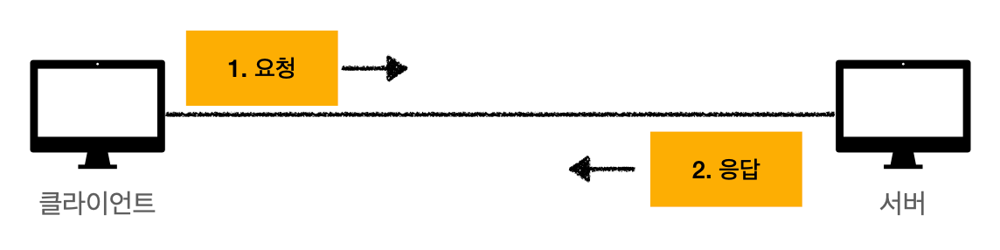
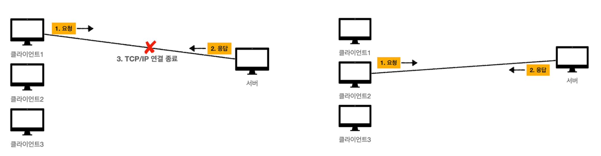
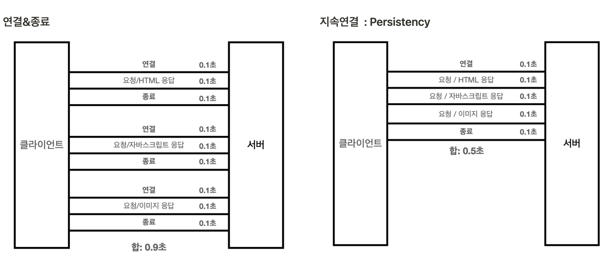
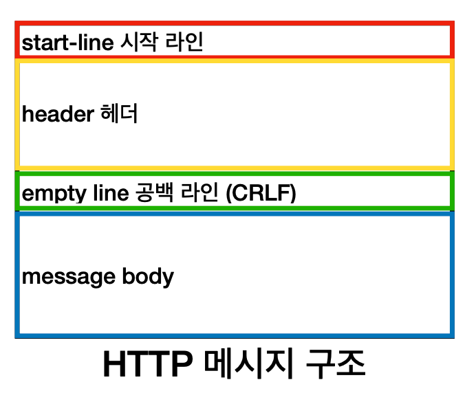
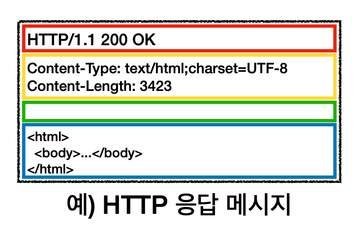
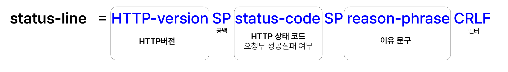
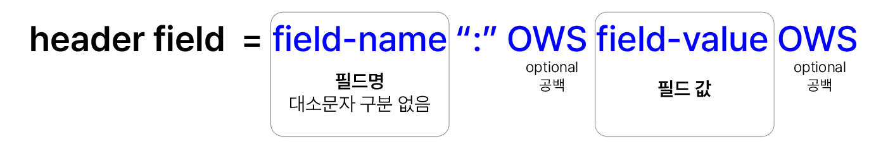

HyperText Transfer Protocol
: 거의 모든 것을 HTML 메세지에 담아 전송하는 프로토콜
HTML, 텍스트, 이미지, 음성, 영상, 파일, JSON, XML 등
서버간 데이터를 주고받을 때도 사용
 

## 👼🏻 HTML의 역사
- **HTTP/0.9** (1991) : GET 메서드만 지원, HTTP 헤더 없음
- **HTTP/1.0** (1996) : 메서드, 헤더 추가
- 🌟 **HTTP/1.1** (1997) : 가장 많이 사용, 우리에게 가장 중요, **TCP 기반**
    - 개정 버전: RFC2068(1997) → RFC2616(1999) → RFC7230~7235(2014)
- **HTTP/2** (2015) : 성능개선, **TCP 기반**
- **HTTP/3** (진행중) : TCP 대신 UDP 사용, 성능개선, **UDP 기반**

 

# 👾 HTTP의 구조

### 클라이언트와 서버의 분리

 
- 클라이언트의 요청 후 응답 대기, 서버의 응답
- 클라이언트와 서버를 분리함으로써 각각 UI와 비즈니스로직&데이터를 분담해 집중적으로 진화할 수 있었음

 

### 무상태 프로토콜 지향: Stateless
- 서버는 클라이언트의 상태를 보존하지 않음
- 클라이언트가 매번 자기 상태정보를 누적해 보내줘야함
- 서버가 바뀌어도 영향을 받지 않는 특징
- 응답 서버를 쉽게 바꿀 수 있다 → 필요에 따라 서버 대거 투입 가능 → 무한한 서버 증설 가능
- **한계**: 모든 것을 무상태로 구현할 수 없음 (ex. 로그인)
    - 브라우저 쿠키, 서버 세션 등을 사용해서 상태를 유지
    - 상태 유지(stateful)는 최소한으로 구현 & 최대한 무상태로 설계

 

### 비연결성: Connectionless

 
- 웹: 수천명이 사용해도 서버에서 실제로 동시에 처리하는 요청은 수십개 이하로 매우 작음 → 서버 자원 효율적으로 사용할 수 있음
- TCP/IP 3 way handshake 연결을 매번 새로 구축 & 사이트 요청시 HTML뿐만 아니라 JS등 여러 리소스가 필요해 그에 따라 매번 연결 
⇒ HTTP 지속 연결 (Persistent Connections)로 해결
 
- HTML/3에서는 UDP 프로토콜을 사용해 연결 속도 자체도 줄여냄

 
 
# ✉️ HTTP 메세지
공식스펙: https://tools.ietf.org/html/rfc7230#section-3
 

### 1-1. 시작라인 of REQUEST: request line
 
- HTTP 메서드
    - 서버가 수행해야할 동작 지정 : GET, POST, PUT, DELETE
- 요청대상
    - `절대경로[?쿼리]`
    - 절대경로: `/`로 시작하는 경로
    - 쿼리는 선택
- HTTP Version
 

### 1-2. 시작라인 of RESPONSE: status line
 
- HTTP Version
- HTTP 상태코드: 클라이언트의 요청 성공/실패 여부
    - 200:성공 / 400: 클라이언트 요청 오류 / 500: 서버 내부 오류
- 이유 문구: 상태코드에 대한 짧은 설명
 

### 2. HTTP 헤더
 
- HTTP 전송에 필요한 모든 부가 정보 = 메타데이터
- 표준 헤더가 많음 : https://en.wikipedia.org/wiki/List_of_HTTP_header_fields
    - `Content-Type`: message body의 내용
    - `Content-Type`: message body의 크기
- 사용자 정의 헤더 추가 가능
 

### 3. CR
공백 라인으로, 필수로 포함
 

### 4. HTTP message body
- Byte로 표현할 수 있는 모든 실제 전송 데이터
    - HTML문서, 이미지, 영상, JSON 등

 
## 👍 HTTP의 단순함 = 확장 가능

- 스펙 읽어볼만 할 만큼 단순하다: 1.1을 기준으로 학습
- 메세지 구조마저 단순
- 크게 성공하는 기술은 단순 & 확장 가능 = HTTP가 그러하다!