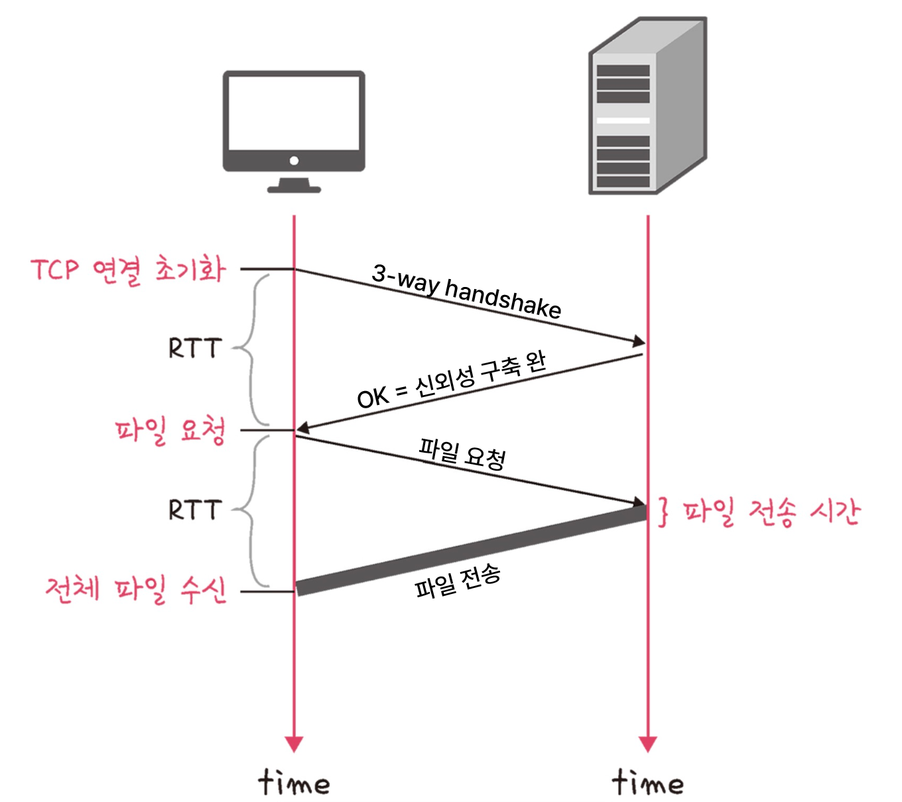
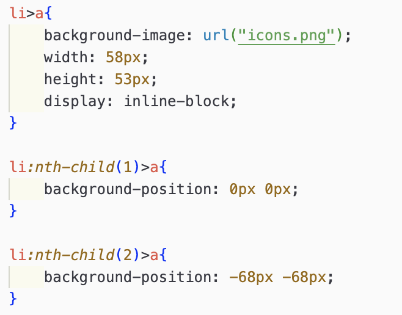
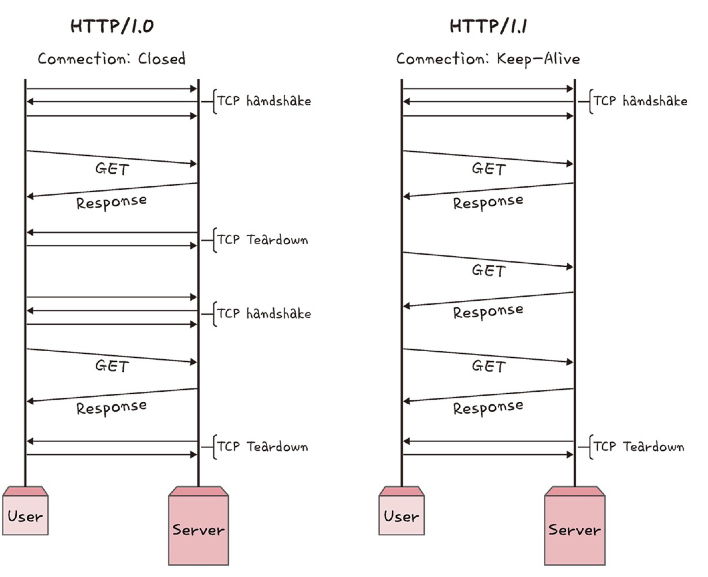
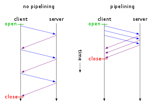
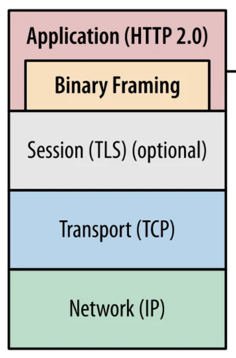
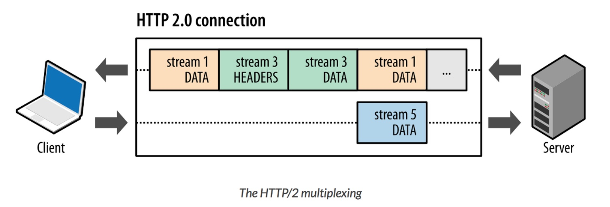
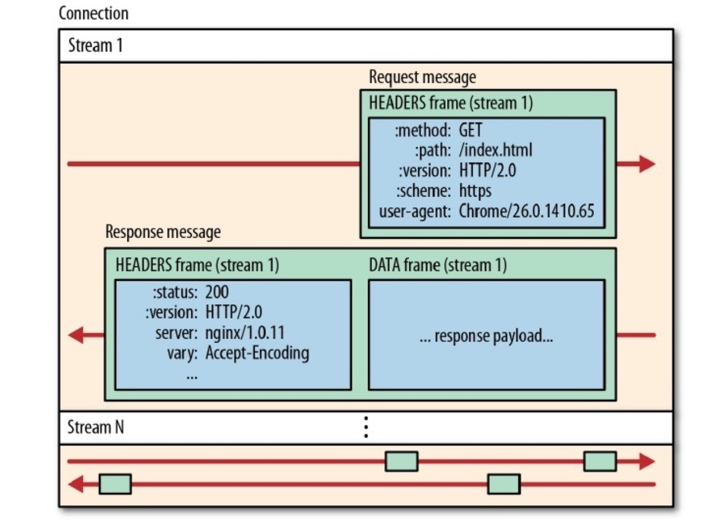
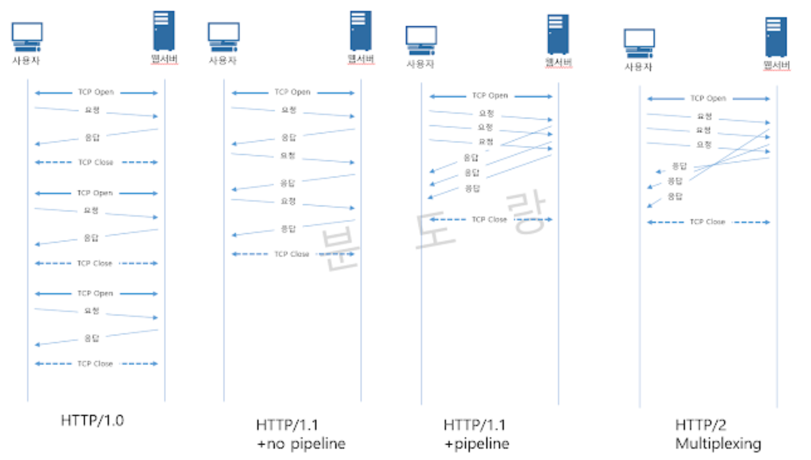
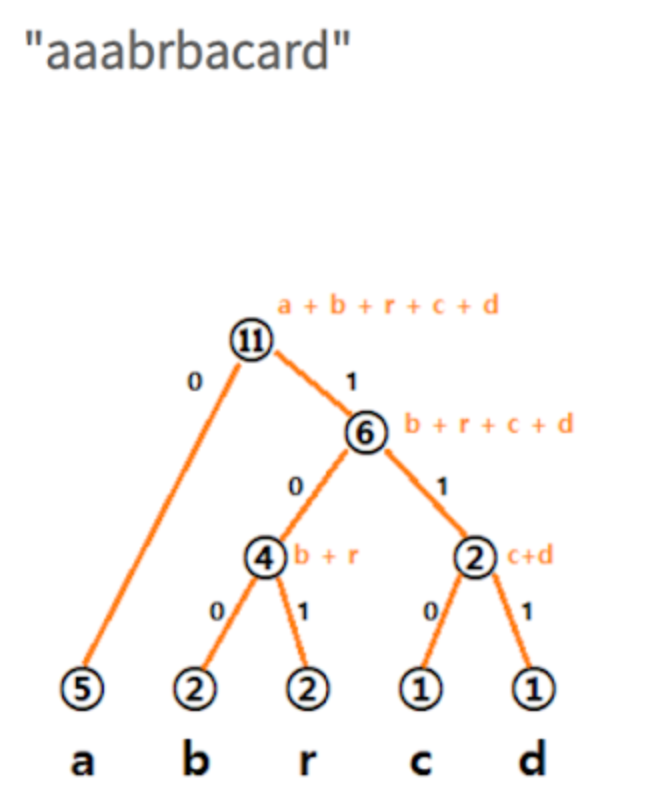
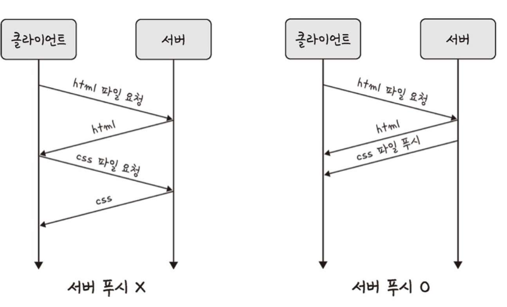

# 🔄 HTTP
TCP/IP 4계층 모델의 최상위 계층인 애플리케이션 계층에 속한 프로토콜로, 웹 통신에 이용한다.
HTTP 프로토콜의 발전 과정을 버전별로 비교한다.

## 0️⃣  HTTP/1.0
하나의 TCP 연결에서는 하나의 리소스에 대한 응답과 요청이 가능하다.
이 때 RTT가 증가하는 문제가 발생한다.

### RTT 증가

- RTT | 한 쪽에서 상대에게 패킷을 보내고 돌아오는 데에 소요되는 왕복 시간
    - 즉 단위 패킷당 네트워크 왕복 시간으로 지연시간의 기준시간처럼 해석

 

 

파일 하나를 가져올 때마다 TCP 연결을 위한 3-way handshake를 진행하기 때문에
**TCP 연결을 위한 요청과 응답에 1 RTT + 리소스 요청과 응답에 1 RTT + a(파일 전송시간)**
파일 하나당 2 RTT가 소요되어, 필요한 소스가 많아질 수록 소요시간은 두배로 늘어난다.
서버에 부담이 커지고, 사용자 응답 시간이 길어지는 단점이 있다.

### sol1) 이미지 스플리팅 = image sprite
n개의 이미지를 그냥 요청하면 총 2n RTT가 소요된다. 
그러나 n개의 이미지를 합쳐 하나의 큰 이미지로 만들고, 큰 이미지 한개만 요청한다면 이미지의 개수와 무관하게 2RTT가 소요된다.
이렇게 받아온 하나의 큰 이미지는 CSS로 각 이미지의 좌표값을 지정해서 화면에 표시한다.

 

  

- 첫 블록에서 큰 이미지를 포함 시킴
- 2, 3번째 블록에서 각 이미지의 좌표 설정

### sol2) 코드 압축
개행문자, (생략 가능한) 빈칸 생략 등으로 파일의 용량을 감소시킨다

### sol3) 이미지 Base64 인코딩
이미지 파일을 문자열로 인코딩하면 HTML/JS/CSS문서에 inline으로 작성할 수 있다.
그러면 이미지는 문자열로 이미 문서에 포함되어 있기 때문에 이미지에 대한 요청을 생략할 수 있다.
그러나 문자열로 인코딩된 이미지는 용량이 37%정도 커지는 단점이 있다.

  

## 1️⃣ HTTP/1.1

### Persistent Connection
각 통신마다 TCP연결을 열어야했던 HTTP/1.0과 달리 1.1에서는 keep-alive 옵션을 사용한 Persistent Connection기술을 통해 한 번 열어둔 TCP연결로 다수의 통신이 가능하다.
이 기술을 지원하는 클라이언트와 이 기술을 약속하는 서버는 요청과 응답을 보낼 때 헤더에 `connection:keep-alive`헤더를 추가해야하지만 HTTP1.1은 keep-alive옵션이 표준화되어 있기 때문에 생략 가능하다.
단 TCP 연결을 종료할 때는 `connection:close`헤더를 포함시켜야 한다.
 

 

### Pipelining
한번의 TCP연결 중에 다수의 통신이 가능한데, 요청에 대한 응답이 와야만 다음 요청을 보낼 수 있는 것은 비효율적이다. 
파이프라이닝을 각 요청에 대한 응답을 기다리지 않고 여러개의 요청을 연속적으로 보내 이 점을 개선했다.
하지만 서버는 요청순서에 맞추어 응답을 해야하기 때문에 하나의 큐에서 응답을 미루는 수준이다.
앞선 요청의 응답이 지연되면 뒤에 있는 요청까지 지연되는 HOL(Head of Line)Blocking 문제가 발생할 수 있어 웹페이지 접속 지연된다.
 

 

## 2️⃣HTTP/2.0

### 멀티플렉싱
📍 요청 순서에 맞게 응답을 처리하며 발생하는 HOL Blocking문제를 해결

하나의 메세지가 리소스 한 개의 요청과 응답을 담당했던 HTTP/1.1과 달리 HTTP/2.0에서는 스트림이라는 단위 하나에 다수의 요청을 포함시켜 송수신한다.

🌟 **HTTP/2.0에서 새로 생긴 용어(데이터 단위)**
- **스트림(stream)** : 
    -  한 연결 내에서 데이터의 양방향 흐름으로, 1개 이상의 메세지(요청과 응답)를 가지고 있다. 
    - 스트림이라는 단위를 통해 여러 개의 요청과 응답이 그룹지어진다고 볼 수 있다.
- 메시지(message) : 
    - 요청+응답의 단위로, 다수의 frame으로 구성된 시퀀스
- **프레임(frame)** : 
    - HTTP/2에서 사용되는 최소 통신 단위로, 스트림을 여러 프레임으로 나누어 통신한다.
    - 데이터와, 데이터의 소속 스트림 정보를 담은 헤더가 있음

 
 
HTTP/2.0에서는 **Binary Framing**계층을 만들어 HTTP 메세지의 캡슐화, 전송 과정을 다룬다.
여기서 여러 메세지를 가진 스트림은 여러개의 프레임으로 나뉘어 전송된 뒤, 도착하면 재조립된다.

  
  
이 때 각 스트림은 서로 독립적이라 특정 스트림에서의 문제상황이 다른 스트림에 영향을 주지 않는다.
스트림의 전송 순서와 무관하게 병렬로 응답이 처리되기 때문에 응답 순서에 무관하게 데이터를 처리해서 HOL Blocking문제가 해소된다. 
 
또한 이 모든 과정이 하나의 TCP연결 안에서 가능해, 하나의 TCP 연결만으로 웹페이지의 모든 통신이 가능하다.

📌 Q. 책에서의 “여러 개의 스트림을 사용하여 송수신한다”
✏️ A. “**하나의 연결 내에서** 여러 개의 스트림을 **프레임으로 조각내고 재조합해서** 송수신한다.”
📌 Q. Multiplexing의 뜻
✏️ A. plex: 여러개가 관여하고 있는 모양 (ex. complex)

### 헤더 압축
헤더에 포함된 메타 데이터는 plain text형태다. 
허프만 코딩 알고리즘을 사용한 HPACK 압축 형식으로 헤더의 용량을 줄일 수 있다.
문자열에서 많이 중복되는 문자일수록 비트를 적게 사용하기 때문에 반복 비율이 높을수록 압축 효율이 크다.
  
ex) 등장 빈도: a(0) > b(100) >= r(101) > c(110) >= d(111)

### 서버푸시
이전에는 클라이언트의 요청이 있어야만 서버가 리소스를 전달하거나 응답할 수 있었는데, 
HTTP/2.0부터는 클라이언트로부터 받은 요청 내에 다른 소스가 필요하면 
해당하는 파일에 대한 요청 없이도 서버 측에서 전달해줄 수 있다.
  
클라이언트의 요청 없이 서버에서 리소스를 전달하는 것을 서버 푸시라고 한다.

# 1.0 vs 1.1 vs 2.0

###HTTP/1.0

- TCP 연결 하나에 리소스 요청 한번만 가능
    - 👎 여러번의 TCP 연결로 인한 RTT증가

###HTTP/1.1

- Persistency: TCP 연결 한번을 지속하면서 keep-alive옵션을 통해 여러번의 요청
    - 👍 연결 반복으로 인한 RTT 방지
    - 👎 헤더 용량이 큰 편
- Pipelining: 먼저 보낸 요청에 대한 응답이 오지 않아도 다음 요청을 보낼 수 있음
    - 👍 통신 효율 증가
    - 👎 여전히 응답 처리에 순서가 있어 먼저 보낸 패킷이 지연되면 후순위가 모두 영향을 받는 HOL Blocking으로 인한 지연문제

###HTTP/2.0
- 멀티플렉싱: 바이너리 프레임 계층을 추가해 스트림에서 다수의 리소스에 대한 요청/응답을 동시에(병렬로) 처리 가능
    - 👍 응답을 병렬로 처리해 HOL Blocking 해결
- 헤더 압축: 허프만 코딩 알고리즘을 사용한 HPACK 압축방식
- 서버 푸시: 클라이언트의 요청이 없어도 응답을 보낼 수 있음 = 푸시

<a href="https://freecontent.manning.com/animation-http-1-1-vs-http-2-vs-http-2-with-push/">
🔗 버전 비교 애니메이션</a>

  
-----

### References
- https://seo-tory.tistory.com/82