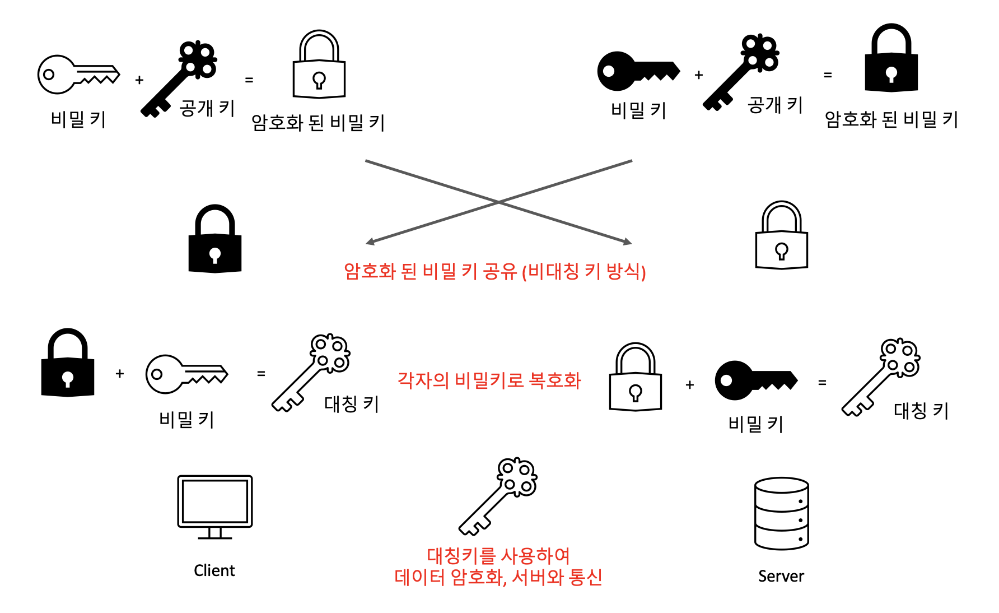
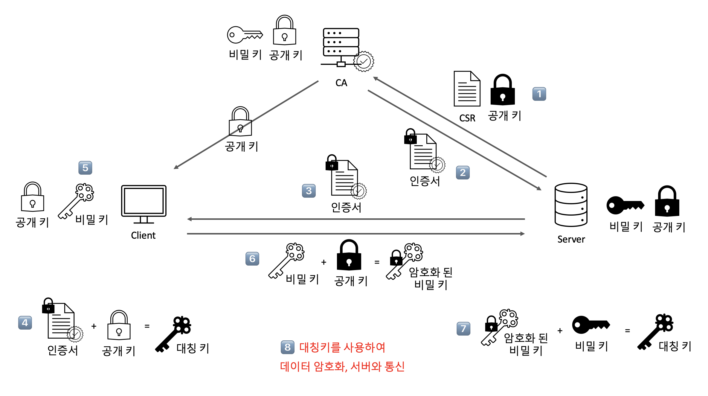

# 🛡️ HTTPS
HTTPS는 Hyper Text Transfer Protocol Secure Socket layer의 약자로,      
`HTTP over SSL(TLS)`, `HTTP over Secure`라고 부르기도 한다.

기존의 HTTP는 데이터를 텍스트 형태로 송수신하기 때문에 중간에 신호를 인터셉트하면 데이터 유출이 될 수 있는 위험이 있었다.     

이러한 취약점을 보완하기 위해 HTTPS가 등장하게 되었으며, HTTP의 버전 중 HTTP/2가 바로 HTTPS 위에서 동작하게 된다.     

HTTPS는 HTTP 요청을 `SSL(Secure Socket Layer)` 혹은 `TLS` 프로토콜을 이용해, HTTP 통신을 하는 과정에서 
데이터를 `암호화`하여 전송하는 방법을 말한다.
> SSL이 표준화되며 바뀐 이름이 TLS인데, 보편적으로 SSL이라 불린다.

## 암호화
HTTPS를 이용하는 첫 번째 목적은 서버와 클라이언트가 주고받는 정보를 탈취할 수 없도록 데이터를 암호화하는 것이다.       

HTTPS를 사용하여 데이터를 암호화하여 전송하면, 정확한 키로 복호화하기 전까지 내용을 알 수 없기 때문에
비밀번호나 개인정보 등 중요한 데이터가 유출될 가능성이 줄어든다.

### 📍 HTTPS 암호화 방식
- `대칭 키 방식`     
양쪽이 공통의 비밀 키를 공유하여 데이터를 암호화∙복호하 하는 것

- `비대칭 키 방식`      
각각 공개키와 비밀키를 가지고 상대가 나의 공개키로 암호화한 데이터를 개인이 가진 비밀키로 복호화하는 것          
A키로 암호화하면 B키로만 복호화할 수 있고 B키로 암호화하면 A키로만 복호화할 수 있다.

 

HTTPS에서는 클라이언트와 서버가 데이터를 암호화하여 주고받기 위해 `비대칭 키 방식`과 `대칭 키 방식`을 섞어서 사용하게 된다.        

비대칭키 알고리즘이 대칭키 방식에 비해 훨씬 복잡하기 때문에 서버와 클라이언트가 데이터를 주고받을 때는 `대칭키 방식`을 사용하고,
대칭키를 주고받을 때는 `비대칭 키 방식` 사용

### 📍 HTTPS 암호화 알고리즘

1. 서버에서 공개키와 비밀키를 생성
2. 서버에서 클라이언트로 공개키를 복사
3. 클라이언트의 비밀키 생성
4. 클라이언트에서 공개키로 비밀키를 암호화 하여 서버에 전달
5. 각 암호화된 비밀키를 전달
6. 서버와 클라이언트 각자의 비밀키로 복호화하여 대칭키 생성
7. 생성된 대칭키를 사용하여 데이터를 암호화하고 서버와 통신

## 인증 매커니즘
HTTPS를 사용하는 또다른 목적 중 하나는 브라우저가 서버의 응답과 함께 전달된 인증서를 확인할 수 있다는 점이다.

HTTPS 통신은 바로 이 `SSL 인증서`를 통해 데이터의 신뢰성을 보장하게 된다.     
인증서는 서버의 신원을 보증하며, 인증서를 발급해주는 공인된 기관을 `CA(Certificate Authority)`라고 한다.

CA는 신뢰성이 엄격히 공인된 기업들만 참여할 수 있다. (대표적인 기업은 Comodo, 아마존,GlobalSign 등이 있다.)

CA는 서버의 공개키와 `CSR`을 CA의 비밀키로 암호화하여 인증서를 발급한다.
> CSR(Certification Signing Request): SSL 인증서 발행을 위한 서명 요청서

### 📍 SSL 프로토콜

1. 서버: 공개키와 비밀키를 만들고, [CSR + 공개키]를 CA에 전달
2. CA: 전달받은 것을 CA의 비밀키로 암호화하여 [인증서]를 발급하여 서버에 제공
3. 서버: 클라이언트가 브라우저에 접속하면, 암호화된 인증서를 클라이언트로 전달
4. 클라이언트: 전달받은 것 브라우저에서 제공된 CA의 공개키로 복호화함 (인증서가 CA의 비밀키로 암호화되어 있으므로 CA의 공개키로 복호화할 수 있다.)
5. 클라이언트: 클라이언트의 비밀키 생성
6. 클라이언트: 클라이언트의 비밀키를 서버의 공개키로 암호화하여 서버로 전달
7. 서버: 전달받은 키를 서버의 비밀키로 복호화하여 대칭키를 얻음 
8. 이제 대칭키를 활용하여 클라이언트는 서버를 신뢰하고 안전하게 통신할 수 있게 된다.       

이 대칭키는 `세선`이 종료되면 폐기된다.

### 📍 세션(Session)
세션은 실제로 서버와 클라이언트가 데이터 정보를 주고받는 단계를 말한다.        
정보를 전달하기 전에 세션키 값을 이용해 대칭키 방식으로 암호화 하게 된다.

대표적으로 로그인을 통해 인증 정보가 저장되고 클라이언트가 인증에 성공한 상태를 세션이라고 한다.      
서버는 `인메모리(in-memory)`나 `redis` 등의 트랜잭션이 빠른 DB에 세션을 저장한다.

인증에 성공하면 클라이언트는 일정 시간 동안 데이터를 송수신할 수 있게 된다.

이때 웹사이트에서 로그인을 유지하기 위한 수단으로 `쿠키`를 사용하며, 
이 쿠키에는 서버에서 발급한 세션 아이디를 저장한다.

### 📍 해싱(Hashing) 알고리즘
해싱 알고리즘은 해시 함수를 사용하여, 데이터를 더 작고 섞여 있는 조각으로 만들어서 데이터를 추정하기 힘들게 만드는 암호화 방식이다.       

암호화 방식 중 가장 많이 쓰이며, 복호화가 가능한 다른 암호화 방식들과 달리 `암호화만 가능`하다는 특징이 있다.

복호화가 불가능한 암호화 방식인 해싱을 많이 사용하는 이유는 해싱의 목적이 데이터 자체를 사용하는 것이
아니라 동일한 데이터를 사용하고 있는지 여부만 확인하는 것이기 때문이다.

해싱이 주로 사용되는 예시는 로그인 요청 처리다.     
사이트 관리자가 사용자의 비밀번호를 알면 안 되기 때문에 비밀번호를 DB에 저장할 때 복호화가 불가능하도록
해싱하여 저장한다. 그러면 로그인 요청 시 정확한 값을 몰라도 해싱된 값을 비교해서 일치하는지만 확인하면 되기 때문에
로그인 요청을 처리하는 데에 전혀 문제가 없다.

따라서 해싱은 민감한 데이터를 다루어야하는 상황에서, 데이터 유출의 위험성은 줄이면서
데이터의 `유효성을 검증`하기 위해 사용되는 단방향 암호화 방식이다.

> 많이 사용되는 해싱 알고리즘은 `SHA-256 알고리즘`이 있다.        
> SHA-256 알고리즘은 해시 함수의 결과값이 256비트인 알고리즘이며, 해싱을 해야 할 메시지에 1을 추가하는 등의 전처리를 한 후,
> 전처리된 메시지를 기반으로 해시를 반환한다.

### 📍 검색 엔진 최적화 (SEO, Search Engine Optimization) 방법 
HTTPS 서비스를 하는 사이트는 검색엔진으로 웹 사이트를 검색했을 때, 결과를 페이지 상단에 노출시켜 최적화를 할 수 있다.

- 사이트 link에 캐노니컬 설정
- html 파일의 메타 잘 설정
- 페이지 속도 개선
- 사이트맵(sitemap.xml) 정기적으로 관리

### 📍 HTTPS 구축 방법
1. CA에서 구매한 인증키를 기반으로 구축
2. 서버 앞단의 HTTPS를 제공하는 로드밸런서를 두어 구축
3. 서버 앞단에 HTTPS를 제공하는 CDN을 두어 구축

-------------------------------------------------

### References
- https://kim-dragon.tistory.com/68