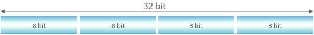
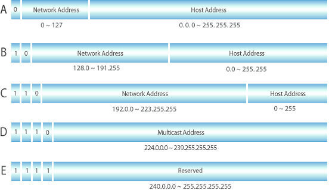
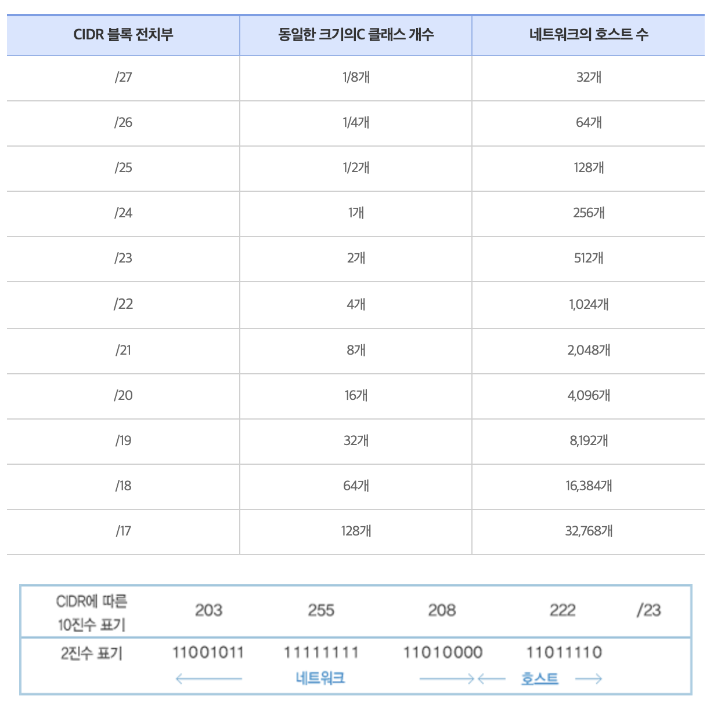
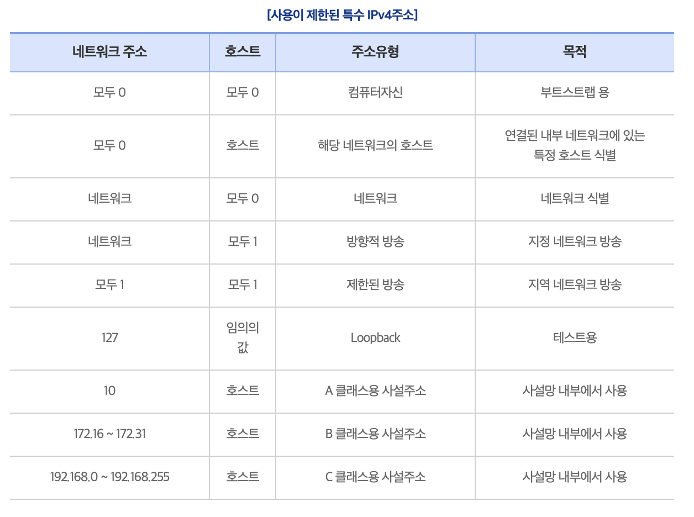
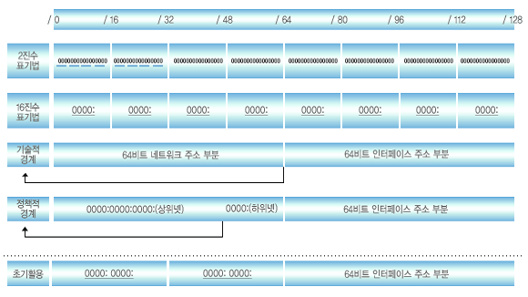
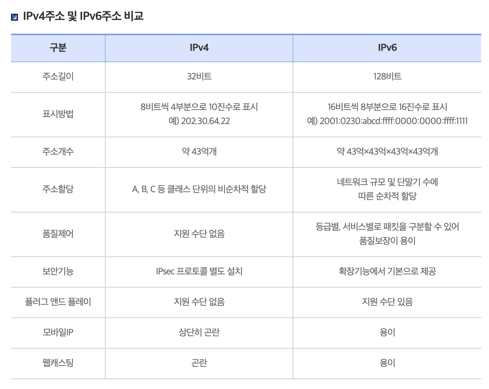
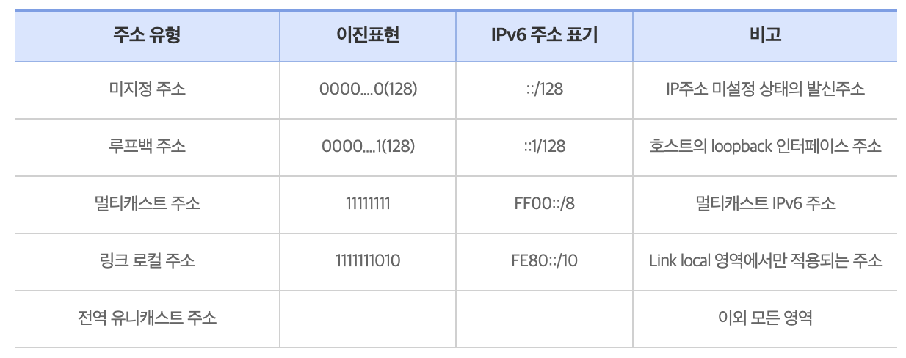
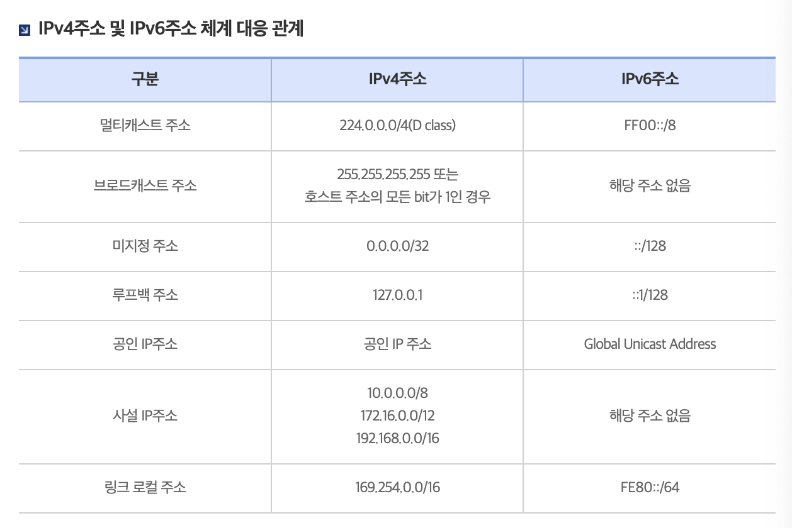

# 🏠 IP주소란? 

- 인터넷 프로토콜 주소의 줄임말로 컴퓨터 간의 통신을 가능하게 하기 위해 네트워크에 연결된 **각 장치에 할당된 고유한 숫자 식별자**
- 인터넷을 통한 정보 전송을 용이하게 하는 데 기본적인 역할을 함
- IPv4와 IPv6의 두 가지 버전 존재

 

## 📌 IPv4 주소란?

- 192.168.0.1과 같이 `8비트` 단위로 점을 찍어, `4개`의 숫자 집합으로 표시되는 `32비트` 주소
- **IPv4 주소**는 전화번호와 같이 국내에서 표준을 정하고 정책을 수립함
- 즉, 이용자에게 무한히 할당할 수 있는 자원이 아니라, 전세계적으로 관리되는 유한한 자원

- 사용 가능한 IPv4 주소의 수는 제한되어 있기 때문에 인터넷에 연결된 장치의 증가를 수용할 수 있는 훨씬 더 큰 주소 공간을 제공하는 IPv6을 채택하는 방향으로 전환되고 있음
- 그러나 현재 가장 많이 쓰이는 주소 체계는 IPv4이며, 따라서 이후에 설명할 때도 IPv4를 기준으로 설명함

 

### 1\. 클래스 기반 할당 방식

- IP 주소 체계는 과거를 거쳐 발전해오고 있으며, 초기에는 A, B, C, D, E 다섯 개의 클래스로 구분하는 **클래스 기반 할당** 방식을 사용
- **클래스 A, B, C**는 일반 사용자에게 부여하는 네트워크 구성용, **클래스 D**는 멀티캐스트용, **클래스 E**는 향후 사용을 위해 예약된 주소

- **두 부분으로 구성**: 앞에 있는 부분은 `네트워크 주소`, 그 뒤에 있는 부분은 컴퓨터에 부여하는 주소인 `호스트 주소`

- **맨 왼쪽에 있는 비트**: '구분 비트'

  - 클래스 A의 경우 0, 클래스 B는 10, 클래스 C는 110, 클래스 D는 1110, 클래스 E는 1111

- 네트워크의 첫번째 주소는 `네트워크 주소`로 사용, 가장 마지막 주소는 `브로트캐스트용 주`소`로 네트워크에 속해 있는 모든 컴퓨터에 데이터를 보낼 때 사용됨

 

#### 💭 예시

- 클래스 A에서 가질 수 있는 IP 범위는 00000000.00000000.00000000.00000000~01111111.11111111.11111111.11111111

  - 십진수로 표현하면 0.0.0.0~127.255.255.255의 범위

- 예를 들어, 클래스 A로 `12.0.0.0`이란 네트워크를 부여받은 상황?
  - `12.0.0.1`~`12.255.255.254`의 호스트 주소를 부여받은 것
  - 이때 첫 번째 주소인 `12.0.0.0`은 네트워크 구별주소로 사용하면 안 되고, 가장 마지막 주소인 `12.255.255.255`의 경우 브로드캐스트용으로 남겨두어야 하니 이 또한 사용하면 안됨
  - 그러면 `12.0.0.1`~`12.255.255.254`를 컴퓨터에 부여할 수 있는 호스트 주소로 사용할 수 있음

 

하지만 이 방식은 사용하는 주소보다 버리는 주소가 많은 단점이 있었고, 이를 해소하기 위해 `DHCP`와 `IPv6`, `NAT`가 등장

 

### 2\. CIDR 기반 할당 방식: Classless Inter-Domain Routing

다른 방식에 대해 알아보기 전에 CIDR 기반 할당 방식을 먼저 알아보자.

- `클래스 기반 할당 방식`은 실제 호스트 수에 관계없이 각 클래스가 고정된 주소 범위를 갖기 때문에 **상당한 주소 낭비가 발생**함
- 그러나 `CIDR 할당 방식`은 **다양한 길이의 전치부를 이용**한 할당 방법을 사용

  - 실제 네트워크 요구 사항에 따라 **가변 크기 블록을 할당**함
  - IP 주소를 보다 효율적으로 할당할 수 있어 주소 낭비를 방지할 수 있음

- 클래스 기반 주소 방식에서는 8, 16, 24로 한정된 전치부를 갖는 반면, CIDR에서는 다양한 전치부의 길이를 지원함
  - 이에 따라 적게는 32개의 호스트를 갖는 네트워크부터 50,000여개의 호스트를 갖는 다양한 네트워크를 할당할 수 있게 됨

- 예를 들어, “203.255.208.222/23”과 같은 CIDR에 의한 IPv4주소표기 방식은 IP주소를 2진수 표기법으로 변환하였을 때
  - 처음 나타나는 23비트(11001011 1111111 1101000)가 네트워크 주소로 사용
  - 나머지 비트(0 11011110)가 /23 네트워크가 가지는 512개의 호스트 중 자신의 호스트를 식별하는 숫자

 

### ✏️ IPv4 주소의 유한성

- IPv4주소는 앞서 말했듯이 전화번호와 같이 국내에서 표준을 정하고 정책을 수립하여 이용자에게 무한히 할당할 수 있는 자원이 아니라 전 세계적으로 관리되는 **유한한 자원**임.
- **일부는 특수한 목적으로 예약**되었으며, 주소 규정에 의하여 사용이 제한적이기 때문에 IP주소 할당 정책에 따라 부여하여 사용함

### ✏️ IPv4의 한계

IPv4 주소의 한계는 주소 공간의 고갈, 최소 지연과 자원의 예약 불가, 암호화 인증기능 미제공이 있음

 

## 📌 IPv6 주소란?

- **IPv4의 주소 고갈 문제를 해결**하기 위하여 등장한 차세대 인터넷 프로포콜 주소
- `64비트`를 `16비트` 단위로 점을 찍어 표기

  - ex. `2001:db8::ff00:42:8329`

- RFC 2373에 의거한 기술적 경계인 64비트를 기준으로

  - 앞 64비트를 `네트워크 주소`
    - 네트워크 주소 부분인 64비트 내에서 RIP(Regional Internet Registry)간 협의에 기초하여 정책적 경계를 나누었으며, 앞 48비트는 상위 네트워크 주소로 뒤 16비트는 하위 네트워크 주소로 활용
  - 뒤 64비트를 `네트워크에 연결된 랜카드 장비 등에 할당하는 인터페이스 주소`로 활용

### ✏️ IPv4 주소 및 IPv6 주소 비교

### ✏️ IPv6 주소 구분

### ✏️ IPv4주소 및 IPv6주소 체계 대응 관계

 

## 🛞 DHCP: Dynamic Host Configuration Protocol

- IP 주소 및 기타 통신 매개변수를 **자동으로 할당**하기 위한 네트워크 관리 프로토콜
- 이 기술을 통해 네트워크 장치의 IP 주소를 수동으로 설정할 필요 없이 **인터넷에 접속할 때마다 자동으로 IP 주소를 할당할 수 있음**
- 많은 `라우터`와 `게이트웨이` 장비에 DHCP 기능이 있으며 **이를 통해 대부분의 가정용 네트워크에서 IP 주소를 할당**함
- DHCP는 **네트워크 관리자가 해야 할 작업을 간소화**해주며, DHCP 사용 없이는 수동으로 IP 주소를 할당해야 함

 

## ⛺️ NAT: Network Address Translation

- 네트워크 주소 변환(NAT)은 컴퓨터 네트워킹에서 사용되는 기술로, 패킷이 라우팅 장치를 통해 전송될 때 패킷의 IP 주소 정보를 수정하여 IP 주소를 다른 주소로 매핑하는 방법
- 이를 통해 IP 패킷의 출발지 및 목적지 IP 주소와 TCP/UDP 포트 숫자 등을 변경하면서 네트워크 트래픽을 전달할 수 있음

- IPv4 주소 체계의 한계로 인해 많은 주소들을 처리할 수 없는 문제가 있음
  - 이를 해결하기 위해 NAT는 공인 IP와 사설 IP를 사용하여 많은 주소를 관리함
  - NAT를 가능하게 하는 소프트웨어로는 ICS, RRAS, Netfilter 등이 있음
- NAT를 통해 사설 IP를 공인 IP로 변환하거나 공인 IP를 사설 IP로 변환할 수 있음

### 장점1. IP 주소 절약

- NAT의 첫 번째 장점은 IP 주소의 절약
- 주로 사설 네트워크에 속한 여러 호스트가 하나의 공인 IP 주소를 사용하여 인터넷에 접속할 수 있음
- 예를 들어, 인터넷 공유기를 사용하여 여러 컴퓨터를 연결할 수 있는 것은 인터넷 공유기에 NAT 기능이 있기 때문

### 장점2. 보안

- 두 번째 장점은 보안성
- NAT를 사용하면 내부 네트워크에서 사용하는 IP 주소와 외부에 공개되는 IP 주소를 다르게 유지할 수 있으므로 내부 네트워크의 보안을 어느 정도 유지할 수 있음
- NAT의 작동 방식으로 인해 IP를 숨길 수 있으며, 외부로 나가는 트래픽은 사설 IP가 공인 IP로 변경되기 때문에 공격자는 내부 네트워크에 있는 사설 IP를 알 수 없어 내부 네트워크와 호스트를 보호할 수 있음

### ✏️ NAT의 단점

- 여러 사용자가 동시에 인터넷에 접속하기 때문에 접속 속도가 느려질 수 있다는 점

 

## 🗺️ IP 주소를 이용한 위치 정보

IP 주소는 인터넷에서 사용하는 네트워크 주소이기 때문에 이를 통해 동 또는 구까지 위치 추적이 가능

 

## References

- [IP주소란?](https://xn--3e0bx5euxnjje69i70af08bea817g.xn--3e0b707e/jsp/resources/ipv4Info.jsp)
- [DHCP의 정의와 DHCP를 이용해야 하는 이유](https://nordvpn.com/ko/blog/what-is-dhcp/)
