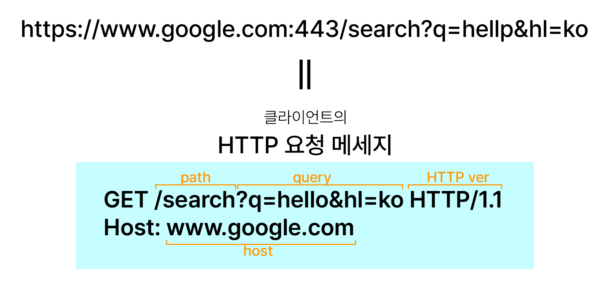
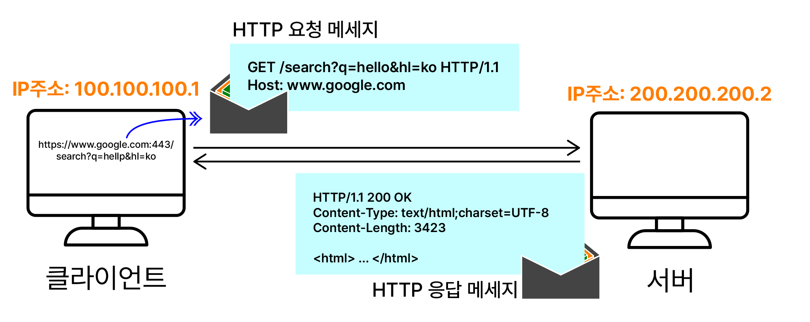

# 🔁 웹 브라우저 요청 흐름

기본 흐름
: 1. 클라이언트의 HTTP 요청 메세지 작성, 전송
: 2. 서버의 HTTP 응답 메세지, 리소스 전송
: 3. 클라이언트의 렌더링

 

### 1. 클라이언트의 HTTP 요청 메세지 작성, 전송

 
- 클라이언트의 어플리케이션계층(이 경우 웹브라우저)에서 HTTP 메세지 작성
- 메세지는 이후 소켓 라이브러리, TCP/IP계층, 네트워크 인터페이스 계층을 거쳐 서버로 전달

 

### 2. 서버의 HTTP 응답 메세지, 리소스 전송

 
- HTTP버전과 전송상태, 리소스 타입과 길이 등을 포함해 전송

 

### 3. 클라이언트의 렌더링
전달 받은 리소스를 렌더링해 브라우저에 띄움