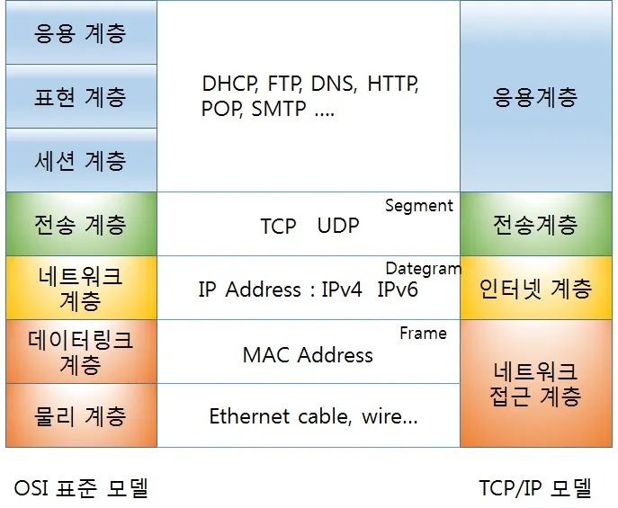
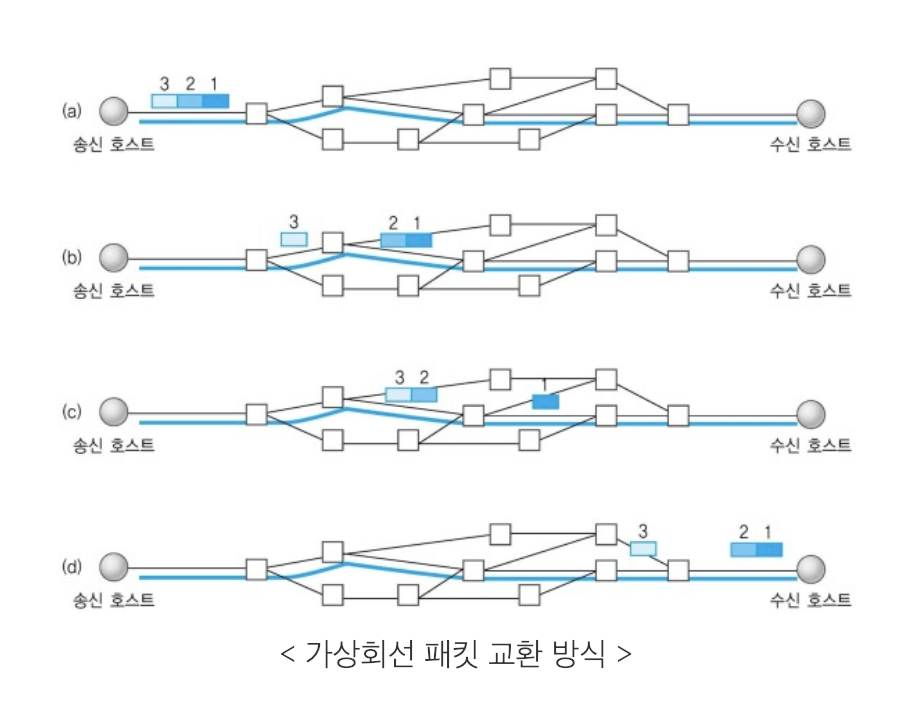
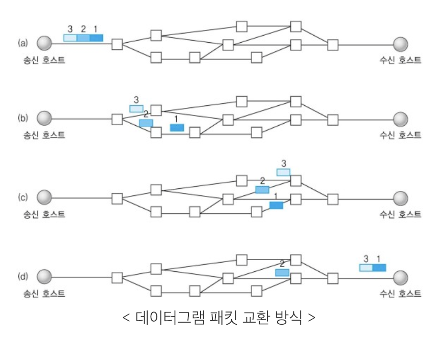
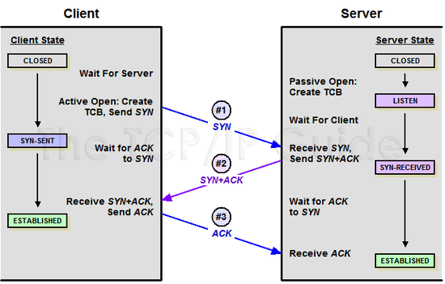
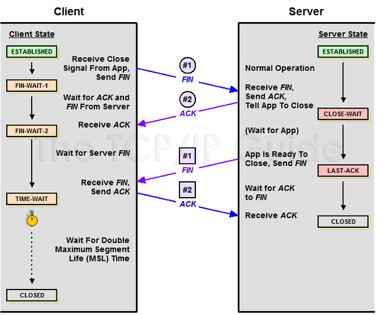
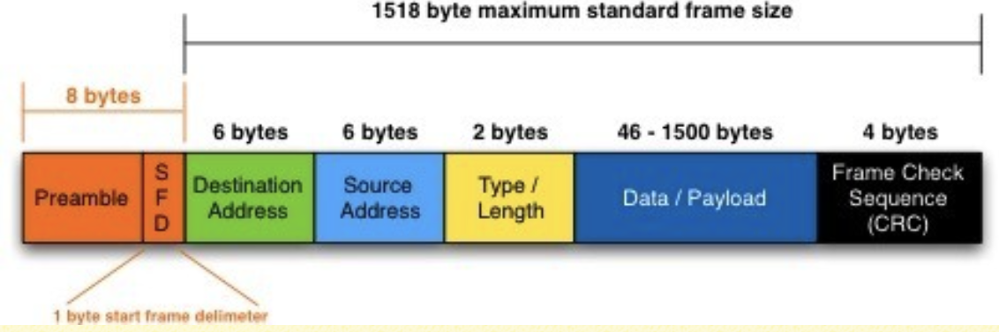
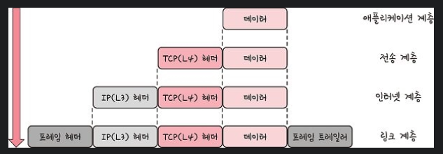

## 📑 인터넷 프로토콜 스위트

- 인터넷에서 컴퓨터들이 서로 정보를 주고받는 데 쓰이는 프로토콜의 집합
- `TCP/IP 4계층 모델`, `OSI 7계층 모델`

## 📑 계층 구조

- 특정 계층이 변경되었을 때 다른 계층이 영향을 받지 않도록 설계되었음

## 1. 애플리케이션 계층

- **웹 서비스, 이메일 등 서비스를 실질적으로 사람들에게 제공**하는 층
- FTP, HTTP, SSH, SMTP, DNS 등 응용 프로그램이 사용하는 프로토콜 계층

- `FTP`: 장치와 장치 간의 파일을 전송하는 데 사용되는 표준 통신 프로토콜
- `SSH`: 보안되지 않은 네트워크에서 네트워크 서비스를 안전하게 운영하기 위한 암호화 네트워크 프로토콜
- `HTTP`: 웹 사이트를 이용하는 데 쓰는 프로토콜
- `SMTP`: 전자 메일 전송을 위한 인터넷 표준 통신 프로토콜
- `DNS`: 도메인 이름을 IP 주소로 변환

## 2. 전송 계층

- **데이터의 실제 송수신**이 일어나는 계층
- 송신자와 수신자를 연결하는 통신 서비스를 제공
- 연결 지향 데이터 스트림 지원, 신뢰성, 흐름 제어를 제공할 수 있음
- 애플리케이션과 인터넷 계층 사이의 데이터가 전달될 때, 중계 역할을 함
- TCP와 UDP가 있음

<table>
	<th>프로토콜 종류</th>
	<th>TCP</th>
	<th>UDP</th>
	<tr>
	    <td>연결 방식</td>
	    <td>연결형 서비스</td>
	    <td>비연결형 서비스</td>
	</tr>
	<tr>
	    <td>패킷 교환 방식</td>
	    <td>가상 회선 방식</td>
	    <td>데이터그램 방식</td>
  </tr>
  <tr>
	    <td>전송 순서</td>
	    <td>전송 순서 보장</td>
	    <td>전송 순서가 바뀔 수 있음</td>
  </tr>
    <tr>
	    <td>수신 여부 확인</td>
	    <td>수신 여부를 확인함</td>
	    <td>수신 여부를 확인하지 않음</td>
  </tr>
    <tr>
	    <td>통신 방식</td>
	    <td>1:1통신</td>
	    <td>1:1 or 1:N or N:N 통신</td>
  </tr>
    <tr>
	    <td>신뢰성</td>
	    <td>높다</td>
	    <td>낮다</td>
  </tr>
    <tr>
	    <td>속도</td>
	    <td>느리다</td>
	    <td>빠르다</td>
  </tr>
    <tr>
	    <td>EX.</td>
	    <td>파일 전송, 메일 전송</td>
	    <td>실시간 스트리밍 서비스, 전화</td>
  </tr>
    </table>

### 1) 가상회선 패킷 교환 방식

- 패킷들이 전송된 **순서대로** 도착하는 방식
- 각 패킷에 가상회선 식별자가 포함됨
- 모든 패킷을 전송하면 가상회선이 해제됨
- 경로를 설정할 때 한 번만 수행하기 때문에, 네트워크 내의 한 노드가 다운되면, 그 노드를 지나는 모든 가상회선을 잃게됨

### 2) 데이터그램 패킷 교환 방식

- 패킷이 **독립적**으로 이동
- 최적의 경로를 선택하여 감
- 하나의 메시지에서 분할된 여러 패킷이 서로 다른 경로로 전송될 수 있음
- 도착한 **순서가 다를 수** 있는 방식
- 네트워크 내의 한 노드가 다운되면, 다른 경로를 새로 설정함

### ✔️ handshake

#### 📌 포트(PORT)의 상태정보

- `LISTEN`: 서비스 대기중
- `ESTABLISHED`: 다른 PC와 연결된 상태
- `SYN_SENT`: 클라이언트가 SYN패킷을 전송해 연결 요청한 상태
- `SYN_RECV`: 서버가 요청 수신 후, ACK패킷 전송해 수신 대기 중
- `TIME_WAIT`: 연결 종료 && 소켓 열린 상태
- `CLOSE_WAIT`: 원격 연결 요청 받은 상태 && 연결 종료 대기
- `LAST_ACK`: 연결 종료 && 승인 대기
- `CLOSED`: 연결 종료

#### 📌 플래그 정보

- `SYN`: 연결 요청 플래그
- `ACK`: 응답 플래그
- `FIN`: 연결 해제

### ✔️ TCP 연결 성립 과정: 3-way handshake

- TCP가 **연결**을 설정하는 과정
- 양쪽 모두 데이터를 전송할 준비가 되었다는 것을 보장함 = 신뢰성

### ✔️ TCP 연결 해제 과정: 4-way handshake

- TCP가 연결을 **해제**하는 과정

#### 🕵️ 일정 시간 뒤에 연결을 닫는 이유?

Client가 데이터 전송을 마쳤다고 하더라도 Server는 아직 보낼 데이터가 남아있을 수 있기 때문에 일단 FIN에 대한 ACK만 보내고, 데이터를 모두 전송한 후에 자신도 FIN 메시지를 보냄

## 3. 인터넷 계층

- `IP`를 지정하고 라우터로 `경로를 선택`해 네트워크를 통해 패킷을 전달하는 계층
- IP, ARP, ICMP 등이 있음
- 패킷을 수신해야 할 상대의 주소를 지정하여 데이터를 전달함
- `비연결형`: 상대방이 제대로 받았는지에 대해 보장하지 않음

## 4. 링크 계층

- 물리적인 연결과 전기 신호를 처리하는 계층
- 전선, 광섬유, 무선 등으로 실질적으로 데이터를 전달하며 장치 간에 신호를 주고받는 '규칙'을 정하는 계층

- 물리 계층과 데이터 링크 계층으로 나누기도 함
- `물리 계층`: 무선 LAN과 유선 LAN을 통해 0과 1로 이루어진 데이터를 보내는 계층
- `데이터 링크 계층`: '이더넷 프레임'을 통해 에러 확인, 흐름 제어, 접근 제어를 담당하는 계층

### ✔️ 유선 LAN(IEEE802.3)

- 유선 LAN을 이루는 이더넷은 IEEE802.3이라는 프로토콜을 따르며 전이중화 통신을 씀

#### 🪜 전이중화 통신 (full duplex)

- 양쪽 장치가 동시에 송수신할 수 있는 방식
- 송신로와 수신로로 나눠서 데이터를 주고받음 (같은 시간에 데이터를 주고받을 수 있음)
- 현대의 고속 이더넷은 이 방식을 기반으로 통신하고 있음

#### 🪜 CSMA/CD

- 전이중화 통신 이전에 사용하던 방식 -> 반이중화 통신
- 수신로와 송신로를 각각 둔 것이 아니고 한 경로를 기반으로 데이터를 보냄 -> 충돌에 대비해야 함
- 데이터를 보낸 이후 충돌이 발생한다면 일정 시간 이후 재전송하는 방식

### 📌 유선 LAN을 이루는 케이블

#### 🪜 트위스트 페어 케이블

- 하나의 케이블처럼 보이지만 실제로는 여덟 개의 구리선을 두개씩 꼬아서 묶은 케이블을 지칭함
- 여러개의 구리선으로 이루어져 있음

#### 🪜 광섬유 케이블

- 광섬유로 만든 케이블
- 레이저를 이용해서 통신
- 구리선과 비교할 수 없을 만큼의 장거리 및 고속 통신이 가능

### ✔️ 무선 LAN(IEEE802.11)

- 수신과 송신에 같은 채널을 사용함 = 반이중화 통신

#### 🪜 반이중화 통신

- 한 번에 한 방향만 통신할 수 있는 방식
- 데이터를 보낸 이후 충돌이 발생한다면 일정 시간 이후 재전송하는 방식
- 장치가 신호를 수신하기 시작하면, 응답하기 전에 전송이 완료될 때까지 기다려야 함

#### 🪜 CSMA/CA

- 반이중화 통신 중 하나
- 데이터를 보내기 전에 캐리어 감지 등으로 사전에 가능한 한 충돌을 방지하는 방식 사용

### 📌 무선 LAN을 이루는 주파수

- 무선 신호 전달 방식을 이용하여 2대 이상의 장치를 연결하는 기술
- `와이파이`: 전자기기들이 무선 LAN 신호에 연결할 수 있게 하는 기술, 공유기 이용
- `BSS`: 단순 공유기를 통해 네트워크에 접근하는 것이 아닌 동일 BSS 내에 있는 AP들과 장치들이 서로 통신 가능한 구조
- `ESS`: 하나 이상의 연결된 BSS 그룹, BSS보다 더 많은 가용성과 이동성을 지원함

 

## 📑 이더넷 프레임

- 데이터 링크 계층은 이더넷 프레임을 통해 전달받은 데이터의 에러를 검출하고 캡슐함

1. `Preamble`: 프레임 시작을 알리는 동기화 비트 패턴
2. `SFD(Start Frame Delimiter)`: 다음 바이트로부터 MAC 주소 필드가 시작됨을 알림
3. `DMAC`, `SMAC`: 수신, 송신 MAC 주소를 말함 (MAC주소: LAN 카드를 구별하기 위한 식별번호)
4. `EtherType`: 데이터 계층 위의 계층인 IP 프로토콜을 정의함 (ex. IPv4, IPv6)
5. `Payload`: 전달받은 데이터
6. `CRC`: 에러 확인 비트

### ✔️ 작동원리

1. 소스 장치에서 목적지 장치로 전송되는 과정에서 스위치와 라우터 등의 네트워크 장비를 거침
2. 각 네트워크 장비는 프레임의 **목적지 MAC주소를 확인**하여 해당 프레임을 **올바른 방향으로 전달**
3. 도착한 수신 장치는 **CRC**를 통해 프레임의 **무결성 검증**
4. 이**더타입 필드**를 참조하여 페이로드의 데이터를 **적절한 상위 계층 프로토콜로 전달**

### ✔️ 중요성

1. 서로 다른 제조사의 장치 간에도 호환성 보장 -> 다양한 네트워크 장비와 컴퓨터가 함께 작동할 수 있음
2. 프레임의 출처와 목적지를 명확하게 구분하고, 오류 검출 기능을 통해 신뢰성 있는 데이터 전송을 지원함

## 계층 간 데이터 송수신 과정

### 1) 캡슐화

- 상위 계층의 헤더와 데이터를 하위 계층의 데이터 부분에 포함시키고 **해당 계층의 헤더를 삽입**하는 과정

### 2) 비캡슐화

- 하위 계층에서 상위 계층으로 가며 **각 계층의 헤더 부분을 제거**하는 과정

 

## 📑PDU: Protocol Data Unit

- 네트워크의 어떠한 계층에서 계층으로 데이터가 전달될 때 한 덩어리의 단위

- `애플리케이션 계층`: 메시지
- `전송 계층`: 세그먼트(TCP), 데이터그램(UDP)
- `인터넷 계층`: 패킷
- `링크 계층`: 프레임(데이터 링크 계층), 비트(물리 계층)

- 비트로 송수신하는 것이 모든 PDU 중 가장 빠르고 효율성이 높음
- 그러나 다른 값들을 넣는 확장이 쉽기 때문에, 애플리케이션 계층에서는 문자열을 기반으로 송수신을 함

 
 

### Reference

- [TCP와 UDP의 특징과 차이](https://mangkyu.tistory.com/15)
