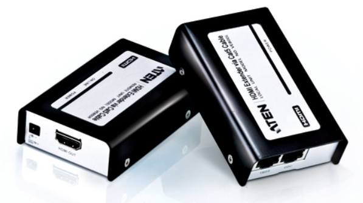

# 🌐 네트워크 기기
## 네트워크 기기의 처리 범위
네트워크 기기는 계층별로 처리 범위를 나눌 수 있다.

상위 계층을 처리하는 기기는 하위 계층을 처리할 수 있지만 그 반대는 불가하다.

## [Layer 7] 애플리케이션 계층
### 📍  L7 스위치 (로드 밸런서)
클라이언트로부터 오는 요청을 여러 서버로 분산시키는 역할을 함
URL, HTTP 헤더, 서버, 캐시, 쿠키 등을 기반으로 트래픽을 분산함
외부 데이터를 걸러내는 필터링 기능
응용 프로그램 수준의 트래픽 모니터링도 가능
로드 밸런서 -> ALB(Application Load Balancer) 컴포넌트로

#### 헬스 체크 (Health Check)
전송 주기와 재전송 횟수 등을 설정한 이후 반복적으로 서버에 요청을 보내는 것
 - 서버에 부하가 되지 않을 만큼 요청 횟수가 적절해야 함
 - TCP, HTTP 등 다양한 방법으로 요청을 보냄
 - 요청이 정상적으로 이루어졌다면  정상적인 서버로 판별
   - ex) TCP 요청을 보냈는데 3way handshake 가 일어나지 않았다면 비정상 서버
L4, L7모두 헬스 체크를 통해 정상/비정상 섭저를 판별

## [Layer 4] 전송 계층
### 📍 L4 스위치
로드 밸런서 -> NLB(Network Load Balancer) 컴포넌트로
전송 계층을 처리하는 기기
스트리밍 관련 서비스에서는 사용할 수 없음
메시지를 기반으로 인식하지 못함
IP와 포트를 기반으로 트래픽을 분산

외부에서 들어오는 모든 요청을 서버가 아닌 L4 스위치를 거치게 해서 
서버에 적절히 나누어줌

네트워크 주소 변환을 위한 기능, TCP 세션 기반의 부하 분산 기능
기업에서 가장 널리 사용하는 네트워크 장비

#### 로드 밸런서 (Load Balancer)
서버 부하 분산
2대 이상의 서버를 기반으로 가상 IP를 제공하고 이를 기반으로 안정적인 서비스르 제공함
-> 한 서버에 문제가 발생해도 다른 서버를 기반으로 서비스를 운용

## [Layer 3] 네트워크 계층
### 📍 라우터 (Router) == L3 스위치
L2 스위치의 기능에 더해서 라우터의 기능을 갖춘 장비
L3 스위치를 라우터라고 해도 무방함

*라우팅: IP 프로토콜에 헤더를 붙여, 패킷의 경로를 결정하고 데이터를 전달하는 것
-> 서로 다른 네트워크 간에 통신하려면 라우터가 필요함

IP 멀티 캐스트 기능을 지원함
-> 네트워크 총단에서 패킷을 받기 원하는 디바이스에게 패킷을 복사할 수 있음 
-> 트래픽 효율성 높일 수 있음
독립적인 네트워크들을 연결, 분할, 구분시켜주는 역할
다른 네트워크에 존재하는 장치끼리 서로 데이터를 주고받을 때 패킷 소모를 최소화, 경로 최적화
최소 경로로 패킷을 포워딩 하는 라우팅 하는 장비

## [Layer 2] 데이터 링크 계층
Layer 1에서 데이터 충돌이 발생할 수 있다는 단점이 있었음
-> 스위치 탄생
스위치: 여러 장비를 연결하고 데이터 통신을 중재하며
목적지가 연결된 포트로만 전기 신호를 보내 데이터를 전송하는 통신 네트워크 장비
-> 충돌이 발생하지 않음

### 📍 L2 스위치
장치들의 MAC 주소를 테이블을 통해 관리
연결된 장치로부터 패킷이 왔을 때, 패킷 전송을 담당함
IP 주소를 이해하지 못하므로 IP 주소 기반 라우팅은 불가능
-> 단순히 패킷의 MAC 주소를 읽어 스위칭하는 역할
목적지가 MAC 주소 테이블에 없다면 전체 포트에 전달하고 MAC 주소 테이블의 주소는 일정 시간 이후 삭제하는 기능도 있음

### 📍 브리지 (Bridge)
소규모에서 디바이스를 연결하기 위해 사용
두 개의 근거리 통신망(LAN)을 상호 접속할 수 있도록 연결하는 통신망 연결 장치

장치에서 받아온 MAC 주소를 저장하고 MAC 주소 테이블로 관리
-> 이 MAC 정보를 이용해서 포트를 스위칭 함
통신망 범위를 확장하고 서로 다른 LAN 등으로 이루어진 하나의 통신망을 구축할 때 쓰임

## [Layer 1] 물리 계층
간단한 네트워크 장비 -> 컴퓨터와 네트워크 장비 간 전송되는 데이터를 아날로그/디지털 신호로 변환하는 계층
패킷을 관리하지 않음
단순히 수신한 패킷을 복사해서 다른 포트로 전송하는 역할을 한다.
패킷이 반복적으로 복제되어 패킷 충돌이 증가할 수 있고, 이는 네트워크 스위칭의 성능을 제한하는 원인이 될 수 있다.

### 📍 NIC (Network Interface Card)
LAN 카드 라고도 함
2대 이상의 컴퓨터 네트워크를 구성하는 데 사용
네트워크와 빠른 속도로 데이터를 송수신할 수 있도록 컴퓨터 내에 설치하는 확장 카드
각 LAN에는 고유 식별번호인 MAC주소가 있다.

### 📍 리피터 (Repeater)
약해진 신호 정보를 증폭하여 다른 쪽으로 전달하는 장치
패킷을 더 멀리 보낼 수 있음
광케이블이 보급됨에 따라 현재는 잘 쓰이지 않음

HDMI 리피터
### 📍 AP (Access Point)
건물의 각 층과 사무실별로 설치할 경우 내부에서 자유롭게 네트워크를 사용할 수 있다.
유선랜의 유선 신호를 무선으로 변경해줌
DHCP 서버에서 IP를 할당해줘야 하며 공유기와 라우터 등에서 IP를 가져와야 함
AP에 유선 LAN을 연결한 후 다른 장치에서 와이파이 등을 사용하여 무선 네트워크 연결을 할 수 있음
NAT 기능이 없기 때문에 라우터가 필요함

무선 네트워크에 연결된 기기들이 인터넷에 접속할 수 있도록 무선 신호를 발생시키는 역할
라우터나 스위치 등의 네트워크에 연결되려면 유선 LAN에 연결되어야한다.

*공유기(wi-fi) 
하나의 공인 IP 주소를 여러 대의 컴퓨터가 공유
NAT, 허브, 스위칭 기능이 추가된 라우터라고 보면 된다.  -> Layer 3 네트워크 계층의 기기
NAT 기능이 있어서 사설 IP 를 각 연결된 디바이스들에게 할당할 수 있다.

*NAT(Network Address Translation)
사설 IP 주소를 공인 IP 주소로 변환하여 외부 네트워크와 통신 가능하게 하는 기술

### 📍 허브 (Hub)
저렴한 비용으로 여러 대의 컴퓨터를 연결하는 장치
오직 비트 단위의 전기 신호를 증폭하는 기능
데이터를 전송할 때 연결되어있는 모든 포트에 데이터가 전송되는 단점

-------------------------------------------------

### References
- https://www.joinc.co.kr/w/man/12/switch
- https://handreamnet.tistory.com/501