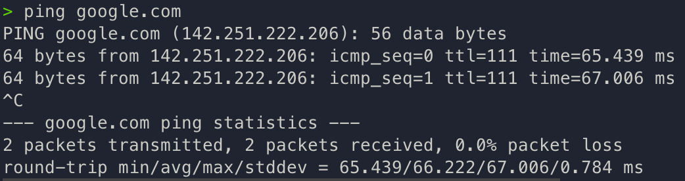
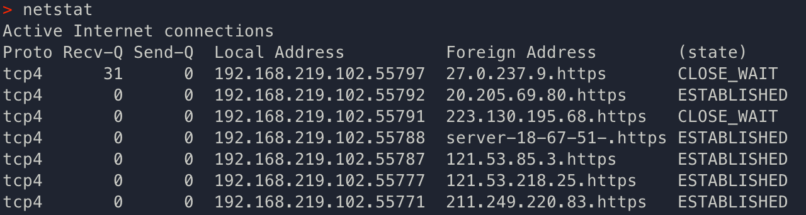
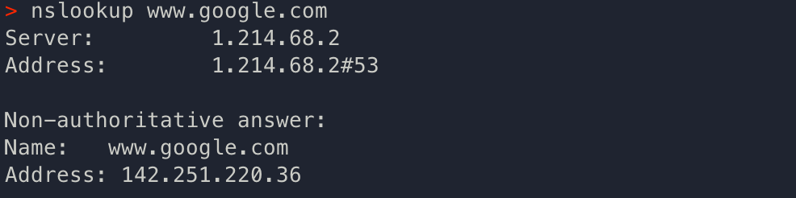
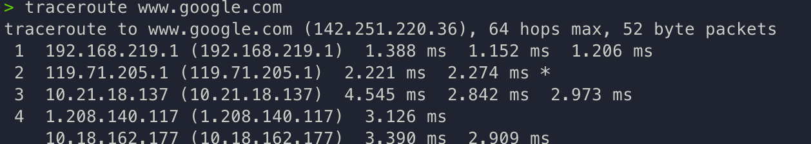

# 🛠 네트워크 성능 분석 명령어
사용자가 서비스로부터 데이터를 가져올 수 없을 때는 네트워크 관련 테스트와 네트워크와 무관한 테스트를 진행해 **네트워크에서 문제가 발생했는지를 먼저 판단한 후** 네트워크 성능 분석을 진행한다.

네트워크 병목현상의 원인으로는 네트워크 대역폭, 네트워크 토폴로지, 서버 CPU/메모리 사용량, 비효율적 네트워크 구성이 있다.

 

##  🔩 `ping [domain]`
📍 특정 노드의 **네트워크 연결상태**(패킷 수신 상태 & 도달 시간 등)를 확인하기 위해 대상 노드로 일정 크기의 패킷을 전송

  

ICMP프로토콜을 이용하기 때문에 대상 노드가 ICMP 프로토콜을 지원하지 않거나 ICMP 또는 traceroute를 차단한 경우 ping테스팅 불가

### options
- `-c [count]` : 패킷의 횟수 지정 (책에서는 윈도우기준이라 -n)
- `-D` : 타임스탬프 출력
- `-f` : 패킷 응답 기록을 `.`로 대체해서 빠르게 많은 패킷을 보내는 옵션(관리자 전용)
- `-h` : help
- `-i [interval]` : 요청간 간격 조정, default = 약 1초 (관리자 전용)

 

## 🔩 `netstat`
📍 현재 연결된 네트워크 상태(네트워크 접속, 라우팅 테이블, 네트워크 프로토콜 등) 표시하는 명령어로, 주로 서비스의 포트가 열려있는지 확인할 때 사용

### (state) 연결상태

- `LISTEN`: 서비스 대기중
- `ESTABLISHED`: 다른 PC와 연결된 상태
- `SYN_SENT`: 클라이언트가 SYN패킷을 전송해 연결 요청한 상태
- `SYN_RECV`: 서버가 요청 수신 후, ACK패킷 전송해 수신 대기 중
- `TIME_WAIT`: 연결 종료 && 소켓 열린 상태
- `CLOSE_WAIT`: 원격 연결 요청 받은 상태 && 연결 종료 대기
- `LAST_ACK`: 연결 종료 && 승인 대기
- `CLOSED`: 연결 종료

 

## 🔩 `nslookup`
📍 도메인에 매핑된 IP를 확인하는 등 DNS 관련 내용을 확인하는 명령어

  

## 🔩 `tracert`/`traceroute`
📍 대상 노드까지의 네트워크 경로를 확인하는 명령어로, 어느 구간에서 지연되는지 확인

  
ping에서 응답이 도달하지 못한 때를 대비한 패킷의 수명인 ttl값을 1부터 하나씩 늘리는 방식

  

## 🔩 기타
- FTP로 대형 파일을 전송해 테스팅
- tcpdump로 노드에 송수신되는 패킷 캡쳐
- 네트워크 분석 프로그램 : wireshark, netmon

  

-------------------------------------------------

### References
- https://soyammou.tistory.com/6#recentEntries
- https://run-it.tistory.com/33