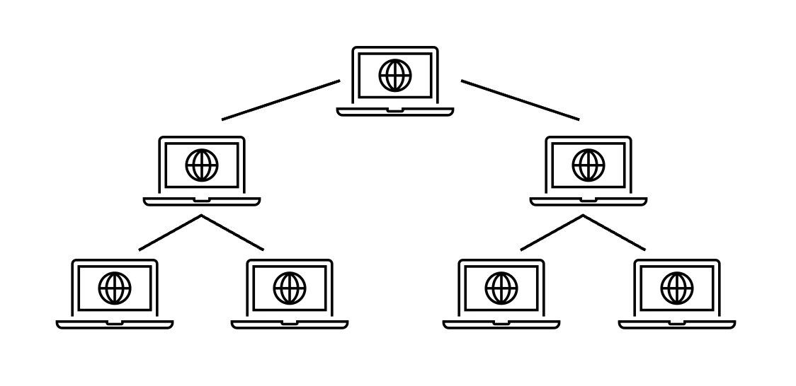
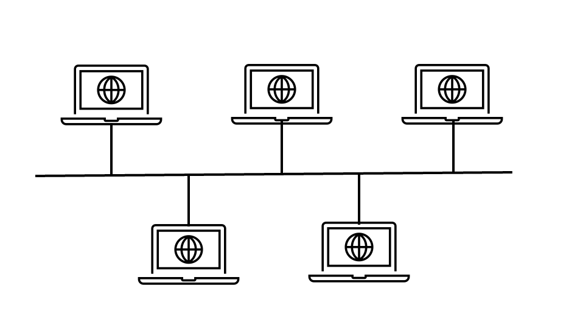
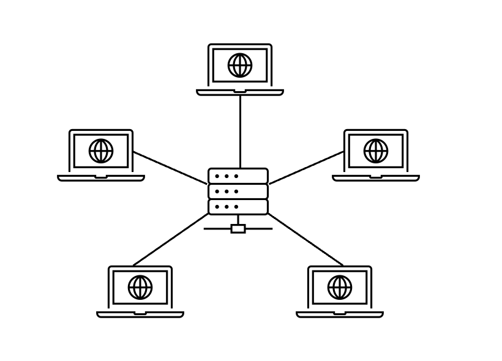
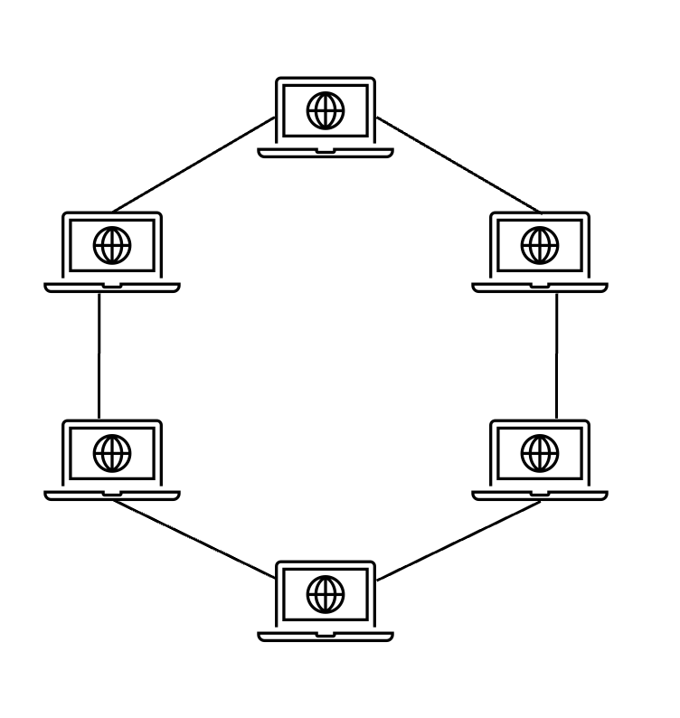
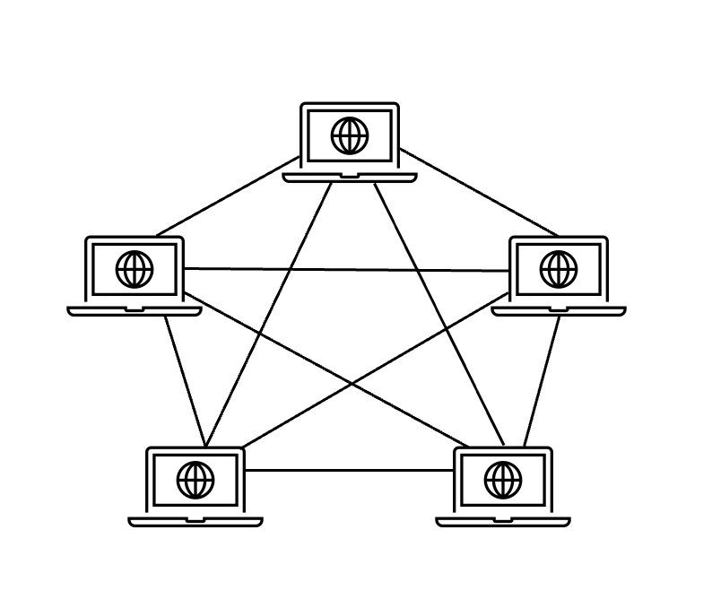

# 🕸️ 네트워크 토폴로지와 병목 현상
네트워크를 설계할 때 고려하는 네트워크 토폴로지와, 네트워크 토폴로지로 병목 현상을 해결하는 방법 대해 알아본다.

## 네트워크 토폴로지 (Network Topology)
네트워크 토폴로지는 노드와 링크가 어떻게 배치되어 있는지에 대한 `망 구성 방식`이자 연결 형태를 의미한다.

### 📍 트리(tree)형 토폴로지

계층형 토폴로지라고 하며, 트리 형태로 배치한 네트워크 구성을 말한다.
지역과 거리에 따라 연결하므로 통신 선로의 총 경로가 가장 짧다.
접속되는 단말기의 숫자에 맞는 통신장비를 이용할 수 있다.

#### 특징
- 노드의 추가, 삭제가 쉬움
- 특정 노드에 트래픽이 집중될 때 하위 노드에 영향을 끼칠 수 있음

### 📍 버스(bus)형 토폴로지

중앙 통신 회선 하나를 공유하며, 여러 개의 노드가 연결되어 공유하는 네트워크 구성을 말한다.  
간선과 각 단말 장치의 접속은 간단한 접속 장치를 붙이는 것으로 가능하다.
주로 LAN(근거리 통신망)에서 사용된다.
#### 특징
- 설치 비용이 적음
- 신뢰성이 우수함
- 중앙 통신 회선에 노드를 추가하거나 삭제하기 쉬움
- [스푸핑](#스푸핑)이 가능하다는 문제점이 있음

#### 스푸핑
스푸핑은 공격자가 네트워크 시스템의 IP 주소,DNS(Domain Name System) 등을 위∙변조하여 공격 대상 시스템이 정상 시스템인 것처럼 가장하여 접근하거나
사용자가 의도하지 않게 특정 시스템으로 접근하도록 유도하는 해킹 기법을 의미한다.

### 📍 스타(star)형 토폴로지

중앙에 있는 교환 장비가 데이터 경로를 개설하고 유도하는 중앙집중식 네트워크 구성을 말한다.
#### 특징
- 노드를 추가하기 쉬움
- 패킷의 충돌 발생 가능성이 적음
- 어떠한 노드에 장애가 발생해도 쉽게 에러를 발견할 수 있음
- 중앙 노드에 발생한 장애가 아닌 경우, 다른 노드에 끼치는 영향이 적음
- 중앙 노드에 장애가 발생하는 경우, 전체 네트워크를 사용할 수 없음
- 설치 비용이 고가임

### 📍 링(ring)형 토폴로지

각각의 노드가 양 옆의 두 노드와 연결하여 전체적으로 고리처럼 하나의 연속된 길을 통해 통신하는 구성을 말한다.  
각 링크가 단방향이어서 데이터는 한 방향으로 이동하며, 각각의 노드는 링 모양의 길을 통해 패킷을 처리한다.
#### 특징
- 노드 수가 증가되어도 네트워크 상의 손실이 거의 없음
- 충돌이 발생되는 가능성이 적음
- 노드의 고장 발견을 쉽게 탐지할 수 있음
- 네트워크 구성 변경이 어려움
- 회선에 장애가 발생하면 전체 네트워크에 큰 영향을 끼침

### 📍 망(mesh)형 토폴로지

네트워크상의 모든 노드를 상호 연결하여 그물망처럼 연결되어있는 구조이다.
초기 데이터 통신 네트워크의 전형적인 형태로 통신선로의 총 길이가 가장 긴 네트워크 구조이다.
#### 특징
- 한 단말 장치에 장애가 발생해도, 여러 개의 경로가 존재하므로 네트워크를 계속사용할 수 있음
- 트래픽 분산 처리 가능
- 노드의 추가가 어려움
- 구축 비용과 운용 비용이 고가임

## 병목 현상
네트워크의 구조라고도 말할 수 있는 토폴로지가 중요한 이유는 병목 현상을 찾을 때 중요한 기준이 되기 때문이다.

### 병목 현상이란?
병목(bottleneck) 현상은 전체 시스템의 성능이나 용량이 하나의 구성 요소로 인해 제한을 받는 현상을 말한다.   
병의 몸통보다 목 내부 지름이 좁아서 물이 상대적으로 천천히 쏟아지는 것 처럼,    
서비스에서 이벤트를 열었을 때 트래픽이 많이 생기고 그 트래픽을 잘 관리하지 못하면 병목 현상이 발생한다.

### 네트워크 토폴로지를 이용하여 병목 현상을 해결하는 방법
예를 들어 병목 현상이 일어나서 사용자가 서비스를 이용할 때 지연 시간이 길게 발생하고 있는 경우, 
관리자가 네트워크 토폴로지를 확인하여 서버와 서버 간의 회선, 게이트웨이로 이어지는 회선 등을 추가해서 병목 현상을 해결할 수 있다.

이처럼 네트워크가 어떤 토폴로지를 갖는지, 어떠한 경로로 이루어져 있는지 파악하면 병목 현상을 올바르게 해결할 수 있다.

-------------------------------------------------

### References
- http://www.ktword.co.kr/test/view/view.php?m_temp1=356
- http://terms.tta.or.kr/dictionary/dictionaryView.do?word_seq=056506-4