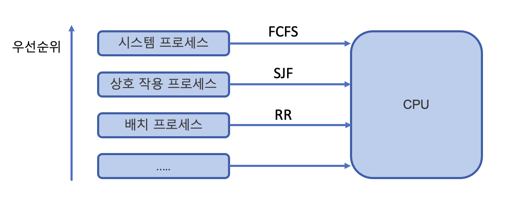

# ⏰ CPU 스케줄링 알고리즘
CPU 이용률을 극대화하여 최적의 효율로 사용하기 위해 탄생한 알고리즘에 대해 알아본다.       

먼저 `CPU 스케줄러`는 프로그램이 실행될 때, CPU 스케줄링 알고리즘에 따라 프로세스에서 해야 하는 일을 스레드 단위로 CPU에 할당하는 역할을 한다.

CPU 스케줄러가 **스케줄링을 결정하는 상황**들은 다음과 같다.
1. 실행 상테에서 대기 상태로 전환될 때 (I/O wait 등)
2. 실행 상태에서 준비 상태로 전환될 때 (interrupt 발생 등)
3. 대기 상태에서 준비 상태로 전환될 때 (I/O 완료 등)
4. 종료될 때 (Terminate)

이와 같은 상황들에서 1, 4번의 경우는 선택의 여지 없이 반드시 스케줄링이 발생하여 새로운 프로세스를 선택해야 하는 상황이다.
이때 발생하는 것을 `비선점형 스케줄링`이라고 한다.       
반면, `선점형 스케줄링`은 CPU 독점을 방지하거나, 프로세스의 우선순위를 반영하는 등의 모든 경우(1 ~ 4번)에 발생될 수 있다. 
현대 OS의 대부분은 **선점형 스케줄링**을 사용하고 있다.

## CPU 스케줄링 평가 기준(CPU Scheduling Criteria)
1. CPU 이용률(CPU Utilization)
   - 시간 당 CPU를 사용한 시간의 비율
   - 프로세서를 항상 실행 상태로 유지하려고 해야한다.
2. 처리율(Throughput)
   - 시간 당 처리한 작업의 비율
   - 단위 시간당 완료되는 작업 수가 많도록 해야한다.
3. 반환 시간(Turnaround Time)
   - 프로세스가 생성되고 종료되어 사용하던 자원을 모두 반환하는 데 걸리는 시간
   - 작업이 준비 큐(ready queue)에서 기다린 시간, CPU에서 실행된 시간, I/O 작업 시간을 모두 더한 시간을 말한다.
4. 대기 시간(Waiting Time)
   - 대기열에 들어와 CPU를 할당 받기까지 기다린 시간(= 준비 큐에서 기다린 모든 시간의 총합)
   - 준비 큐에 있는 프로세스를 적게 해서 대기 시간을 줄여야한다.
5. 반응 시간(Response Time)
   - 대기열에서 처음으로 CPU를 할당받을 때까지 걸린 시간
   - 반응 시간은 CPU를 할당받은 최초의 순간까지 기다린 시간 한 번만을 측정한다.

이러한 평가 기준에 따라, CPU 이용률과 처리율을 극대화하고,
반환, 대기, 반응 시간은 줄여서 CPU를 최적화한 알고리즘이 좋은 알고리즘이라고 할 수 있다.

## 비선점형(non-preemptive) 방식
비선점형 방식은 프로세스가 스스로 CPU 소유권을 포기하는 방식이다.      
강제로 프로세스를 중지하지 않기 때문에 `컨텍스트 스위칭`으로 인한 부하가 적다.   
하지만 프로세스의 배치에 따라 효율성 차이가 커질 수 있다.

### 📍 FCFS(First Come, First Served)
가장 먼저 요청한 프로세스에 가장 먼저 CPU를 할당하는 알고리즘      
처리 시간이 긴 프로세스가 있으면 나머지 프로세스가 준비 큐에서 오래 기다리게 되므로, 평균 대기시간과 응답시간이 길어질 수 있다.

### 📍 SJF(Shortest Job First)
실행 시간이 가장 짧은 프로세스를 가장 먼저 실행하는 알고리즘      
낮은 우선순위(여기서는 실행시간이 긴)의 프로세스가 절대 실행되지 않는 문제를 일컫는 `starvation`이 일어나며, 평균 대기 시간이 가장 짧다.     
하지만 실제로는 실행 시간을 알 수 없기 때문에 예측이 어렵다는 문제가 있다. 그래서 과거의 실행했던 시간을 토대로 추측해서 사용한다.

### 📍 우선순위 스케줄링(priority scheduling)
각각의 프로세스에 우선순위를 넘버링한다.
`SJF 스케줄링`도 우선순위 스케줄링이라고 할 수 있는데, 기존 `SJF 스케줄링`의 경우 긴 시간을 가진 프로세스가 실행되지 않는 문제(starvation)가 있었다.       
이러한 문제를 `aging 기법`(오래된 작업일수록 우선순위를 높이는 방법)을 통해 보완한 알고리즘이다.

## 선점형(preemptive) 방식
선점형 방식은 현대 운영체제가 쓰는 방식으로, 
프로세스가 CPU를 할당받아 실행중이더라도 알고리즘에 의해 중단시켜버리고 강제로 다른 프로세스에 CPU 소유권을 할당할 수 있는 방식을 말한다.

이는 CPU처리 시간이 매우 긴 프로세스의 CPU 사용 독점을 막을 수 있어 효율적인 운영이 가능하다는 장점이 있다.
하지만 잦은 문맥 교환(컨텍스트 스위칭)으로 오버헤드가 커질 수 있다는 단점이 있다.

### 📍 라운드 로빈(RR, Round Robin)
현대 컴퓨터가 쓰는 스케줄링 알고리즘의 일종으로, 각 프로세스는 동일한 시간 할당을 주고
그 시간 안에 끝나지 않으면 다음 프로세스로 넘어가고, 기존 프로세스는 다시 준비 큐의 뒤로 가는 알고리즘이다.

예를 들어 **N**개의 프로세스에 각각 **q**만큼의 시간이 할당되었다면, 어떤 프로세스도 
`(N-1)*q`시간 이상을 기다리지 않아도 된다. 
따라서 전체 작업 시간은 길어지지만 평균 응답 시간은 짧아진다.     
할당 시간(q)이 너무 크면 [FCFS](#-fcfsfirst-come-first-served)처럼 작동하게 되고,
짧으면 컨텍스트 스위칭이 잦아져서 오버헤드, 즉 비용이 커진다.
이 알고리즘은 로드밸런서에서 트래픽 분산 알고리즘으로도 쓰인다.

### 📍 SRF(Shortest Remaining Time First)
[SJF](#-sjfshortest-job-first)는 중간에 실행 시간이 더 짧은 작업이 들어와도 기존의 짧은 작업을 모두 수행하고 그다음 짧은 작업을 수행하는 반면,
SRF는 중간에 더 짧은 작업이 들어오면 **수행하던 프로세스를 중지하고** 해당 프로세스를 수행하는 알고리즘이다.

### 📍 다단계 큐(Multilevel Queue)

우선순위에 따른 준비 큐를 여러 개로 나눠서 사용하고, 큐마다 라운드 로빈이나 FCFS 등 다른 스케줄링 알고리즘을 적용한 것을 말한다.    
큐 간의 프로세스가 이동할 수 없으므로 스케줄링 부담이 적지만 유연성이 떨어지며 starvation이 발생할 수 있다.

-------------------------------------------------

### References
- http://csys.yonsei.ac.kr/lect/os/o6-19.pdf
- https://code-lab1.tistory.com/45