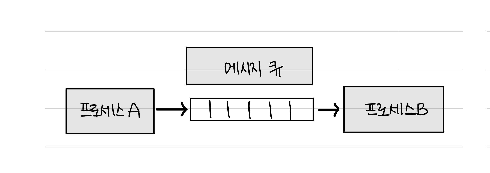

# 📑 IPC

> **I**nter **P**rocess **C**ommunication: 프로세스 간 통신

앞서 프로세스는 각자의 주소 공간을 가지고 있다고 했다. 서로 독립되어있기에 다른 프로세스의 영향을 받지 않는다는 장점이 존재하지만, 독립되어 있으므로 서로 간의 통신이 어렵다는 문제점 또한 가지게 된다.

이를 해결하기 위해, 커널 영역에서 **IPC**라는 프로세스 간 협력 메커니즘을 제공한다. 이를 이용해 프로세스 간에도 통신을 할 수 있게 된다.

## 📌 IPC란?

- **프로세스 간에 서로 데이터를 주고받는 통신 방법**을 말한다.
- 즉, 멀티프로세스는 IPC가 가능하다.
- 같은 컴퓨터에서 실행 중인지 또는 네트워크에 연결된 다른 컴퓨터에서 실행 중인지와 관계없이 가능하다.
- 예시
  - `클라이언트`는 데이터를 요청하고 `서버`는 `클라이언트` 요청에 응답하는 것도 IPC의 예이다.

 

## 📌 종류

IPC의 종류로는 공유 메모리, 파일, 소켓, 익명 파이프, 명명 파이프, 메시지 큐가 있다.

이들은 모두 메모리가 완전히 공유되는 스레드보다는 속도가 떨어진다.

### ✔️ 공유 메모리

- 서로 다른 프로세스 간에도 **공유할 수 있는 주소 공간**을 말한다.
  = 여러 프로세스에 **동일한 메모리 블록에 대한 접근 권한이 부여**되는 것을 말한다.
- 서로 신뢰할 수 있다는 전제하에 공유 메모리를 만든다.
- IPC 방식 중 어떠한 매개체를 통해 데이터를 주고받는 것이 아닌, **메모리 자체를 공유하는 방식**이다.
  - 불필요한 데이터 복사의 오버헤드가 발생하지 않아 **가장 빠르다.**
  - 같은 메모리 영역을 여러 프로세스가 공유하기 때문에 **동기화**가 필요하다.

> 참고로 `소프트웨어` 관점이 아닌, `하드웨어` 관점에서 공유 메모리는 CPU가 접근할 수 있는 큰 랜덤 접근 메모리인 RAM을 가리킨다.

### ✔️ **파일**

- 파일은 디스크에 저장된 데이터 또는 파일 서버에서 제공한 데이터를 말한다. 이를 기반으로 프로세스 간 통신을 한다.

### ✔️ **소켓**

- `동일한 컴퓨터의 다른 프로세스`나, `서로 다른 컴퓨터에서 실행 중인 프로세스`가 **네트워크**를 통해 통신할 수 있는 메커니즘이다.
- IP 주소와 포트 번호로 식별된다.
- TCP와 UDP가 있다.

### ✔️ **익명 파이프 (unnamed pipe)**

- 프로세스 간에 데이터를 주고받기 위해 사용되는 FIFO 방식의 임시 공간인 파이프를 기반으로 한다.
- **단방향** 방식으로 작동하며, **읽기 전용**과 **쓰기 전용** 파이프를 만들어서 사용한다.
- **부모-자식 프로세스 간의 통신에만** 사용할 수 있으며, 다른 네트워크상에서는 사용할 수 없다.

### ✔️ **명명된 파이프 (named pipe)**

- 익명 파이프의 확장된 상태로 **부모 프로세스와 무관한 다른 프로세스도 통신 가능**하다.
  = 컴퓨터의 프로세스끼리 또는 다른 네트워크상의 컴퓨터와도 통신할 수 있다.
- **파이프 서버**와 **하나 이상의 파이프 클라이언트** 간의 통신을 위한 명명된 단방향 또는 양방향 파이프를 말한다.
- 클라이언트/서버 통신을 위한 별도의 파이프를 제공하며, 여러 파이프를 동시에 사용할 수 있다.
- 보통 서버용 파이프와 클라이언트용 파이프로 구분해서 작동하며, 하나의 인스턴스를 열거나 여러 개의 인스턴스를 기반으로 통신한다.

### ✔️ **메시지 큐**

- **정의**
  - 메시지를 큐(queue) 데이터 구조 형태로 관리하는 것을 의미한다.
  - **여러 프로세스가 서로 메시지를 교환할 수 있는 양방향 통신 메커니즘**이다.
    - 보내는 프로세스가 메시지를 큐에 넣고, 받는 프로세스가 이를 검색한다.
- **특징**
  - `공유 메모리`를 통해 IPC를 구현할 때 쓰기 및 읽기 빈도가 높으면 **동기화** 때문에 기능을 구현하는 것이 매우 복잡해지는데, 이때 대안으로 `메시지 큐`를 사용하기도 한다.
  - 다른 IPC 방식에 비해서 사용 방법이 **매우 직관적**이고 **간단**하며, 다른 코드의 수정 없이 단지 몇 줄의 코드를 추가시켜 간단하게 메시지 큐에 접근할 수 있는 장점이 있다.
  - 커널에서 전역적으로 관리된다.

 

### 🌈 비교

| IPC 종류    | 공유 메모리 | 소켓   | 익명 파이프 | 명명된 파이프  | 메시지 큐     |
| ----------- | ----------- | ------ | ----------- | -------------- | ------------- |
| 공유 매개체 | 메모리      | 소켓   | 파일        | 파일           | 메모리        |
| 통신단위    | 구조체      | stream | stream      | stream         | 구조체        |
| 통신방향    | 양방향      | 양방향 | 단방향      | 단방향, 양방향 | 단방향,양방향 |

 
 

---

### Reference

- [[KOCW] 반효경 교수님 - 운영체제](https://core.ewha.ac.kr/publicview/C0101020170327144547225686)
- [[OS] 프로세스 간 통신 방법(Inter Process Communication, IPC)](https://dar0m.tistory.com/233)
