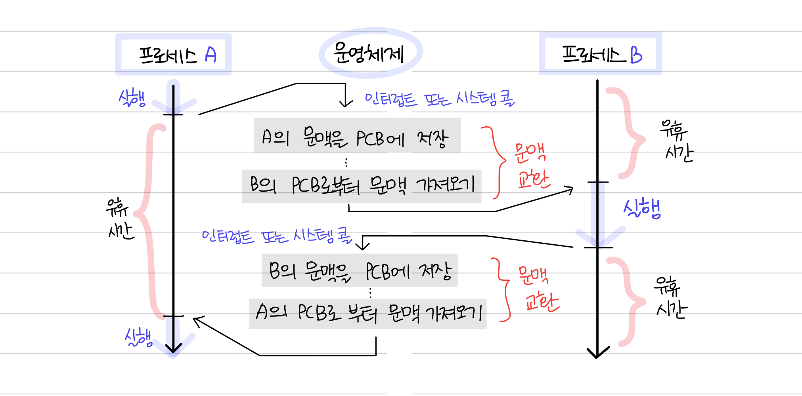

# 📑 PCB: Process Control Block

모든 프로세스는 실행을 위해 CPU가 필요하다. 그러나 CPU의 자원은 한정되어 있다.

따라서 프로세스들은 돌아가면서 자신의 차례에 한정된 시간만큼만 CPU를 이용하다가 타이머 인터럽트가 발생하면 차례를 양보하게 된다. 이러한 과정을 거치며 **빠르게 번갈아 수행되는 프로세스들을 관리**하기 위해 사용하는 자료구조가 바로 프로세스 제어 블록인 `PCB`이다.

 

## ✔️ PCB 란?

- **프로세스 제어 블록**이라고도 한다.
- 운영체제가 **프로세스에 대한 중요한 정보들을 저장해놓은 저장 장소**이다.
- 프로세스가 생성되면 운영체제는 해당 PCB를 생성한다.
- 프로세스 생성 시 `커널 영역`에 생성되고 종료시 폐기된다.
  - 프로세스의 중요한 정보를 포함하고 있기 때문에 일반 사용자가 접근하지 못하도록 커널 스택의 가장 앞부분에서 관리되는 것이다

 

### 📌 PCB의 구조

PCB의 구조는 운영체제마다 차이가 있지만 대표적인 구조는 다음과 같다.

- **프로세스 ID (=PID)**
  - 특정 프로세스를 식별하기 위해 부여하는 고유한 번호를 뜻함
  - 프로세스 ID, 해당 프로세스의 자식 프로세스 ID가 존재
- **프로세스 스케줄링 상태**
  - ‘준비’, ‘일시중단’ 등 프로세스가 CPU에 대한 소유권을 얻은 이후의 상태
- **프로세스 권한**
  - 컴퓨터 자원 또는 I/O 디바이스에 대한 권한 정보
- **프로그램 카운터**
  - 프로세스에서 실행해야 할 `다음 명령어의 주소에 대한 포인터`
- **CPU 레지스터**
  - 프로세스를 실행하기 위해 저장해야 할 레지스터에 대한 정보
- **CPU 스케줄링 정보**
  - CPU 스케줄러에 의해 중단된 시간, 우선 순위, CPU 점유시간 등
- **계정 정보**
  - 프로세스 실행에 사용된 CPU 사용량, 실행한 유저의 정보
- **I/O 상태 정보**
  - 프로세스에 할당된 입출력 장치 목록, 열린 팔린 목록 등

### 📌 PCB의 필요성

CPU는 프로세스의 상태에 따라서 교체 작업이 이루어진다. 이 때 **교체되는 프로세스의 상태 값을 PCB에 저장해두었다가 앞으로 다시 사용**할 때 필요로 하게 된다.

### 📌 PCB의 관리 방법

**연결 리스트 방식**으로 관리된다. 따라서 삽입 삭제가 용이하며 프로세스가 생성 되면 해당 PCB가 생성되고, 프로세스가 완료되면 제거된다.

 
 

## ✔️ 컨텍스트 스위칭: Context Switching

`프로세스 A`에서 `프로세스 B`로 실행 순서가 넘어가야 한다면, 기존에 실행되던 `프로세스 A`는 지금까지의 **중간 정보(각종 레지스터 값, 메모리 정보, 사용한 I/O장치 등)**를 백업해야 할 필요가 있다. 이러한 중간 정보를 **문맥 (context)**라고 한다. 즉, 다음 차례가 왔을 때 실행을 재개하기 위한 정보를 말한다.

이렇게 실행 문맥을 백업해두면 **언제든 해당 프로세스의 실행을 재개**할 수 있다.

 

### 📌 컨텍스트 스위칭이란?

이처럼 기존의 **실행 중인 프로세스 문맥을 백업**하고 **새로운 프로세스 실행을 위해 문맥을 복구**하는 과정을 `컨텍스트 스위칭(context switching)`이라 한다.

- PCB를 교환하는 과정이라고도 한다.
- 한 프로세스에 할당된 시간이 끝나거나 인터럽트에 의해 발생한다.
- 여러 프로세스가 끊임없이 빠르게 번갈아 가며 실행되는 원리이다.
  - 컴퓨터는 많은 프로그램을 동시에 실행하는 것처럼 보이지만 어떠한 시점에서 실행되고 있는 프로세스는 단 한 개이며, 많은 프로세스가 동시에 구동되는 것처럼 보이는 것은 **다른 프로세스와의 컨텍스트 스위칭이 아주 빠른 속도로 실행**되기 때문이다.
  - 참고로 사실 현대 컴퓨터는 멀티코어의 CPU를 가지기 때문에 한 시점에 한 개의 프로그램이라는 설명은 틀린 설명이지만, 컨텍스트 스위칭을 설명할 때는 싱글코어를 기준으로 설명한다.

 

### 📌 컨텍스트 스위칭에 드는 비용

- **유휴시간**
- **캐시미스**: 컨텍스트 스위칭이 일어날 때 프로세스가 가지고 있는 메모리 주소가 그대로 있으면 잘못된 주소 변환이 생기므로 캐시클리어 과정을 겪게 되고 이 때문에 캐시미스가 발생한다.

 

**\*스레드에서의 컨텍스트 스위칭?**

참고로 이 컨텍스트 스위칭은 **스레드**에서도 일어난다. 스레드는 **스택 영역을 제외한 모든 메모리를 공유**하기 때문에 `스레드 컨텍스트 스위칭`의 경우 **비용이 더 적고 시간도 더 적게** 걸린다.

 
 

---

### Reference

- [[혼자 공부하는 컴퓨터 구조 + 운영체제] 26강 프로세스 개요](https://youtu.be/Jjfah3t_xWk?t=177)
- [[운영체제] PCB와 Context Switching](https://velog.io/@klloo/%EC%9A%B4%EC%98%81%EC%B2%B4%EC%A0%9C-PCB%EC%99%80-Context-Switching)
