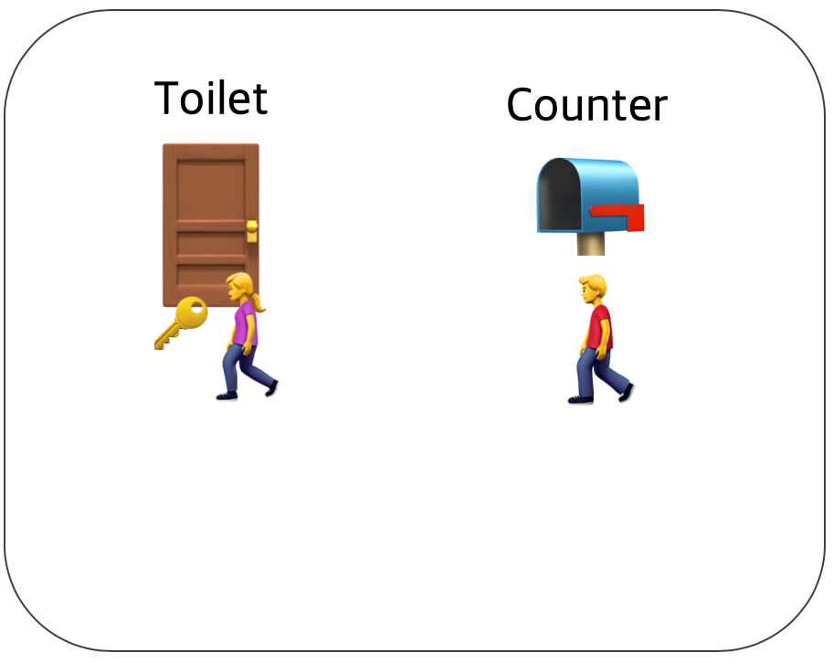
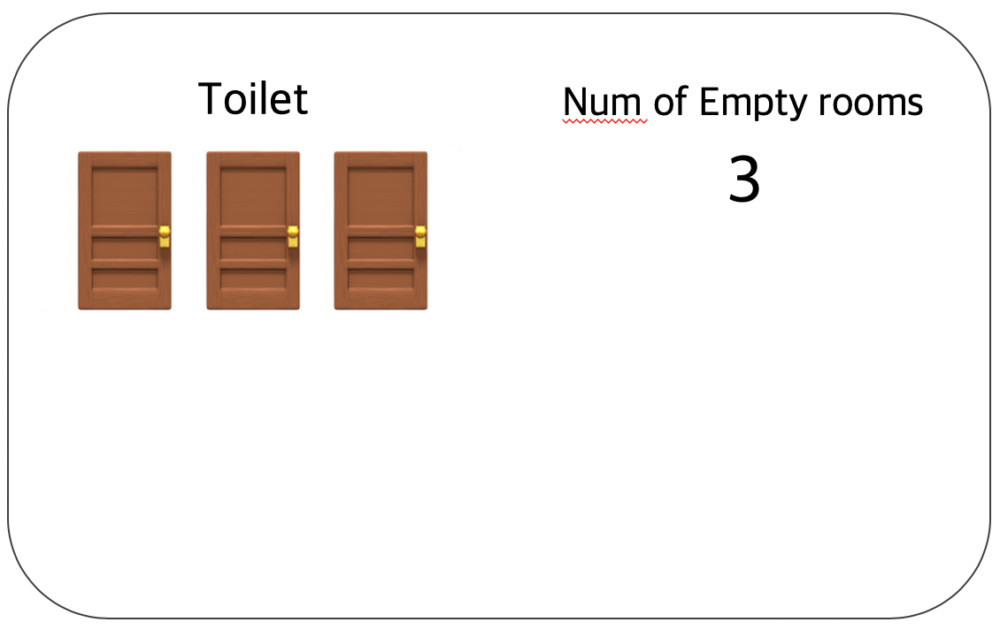
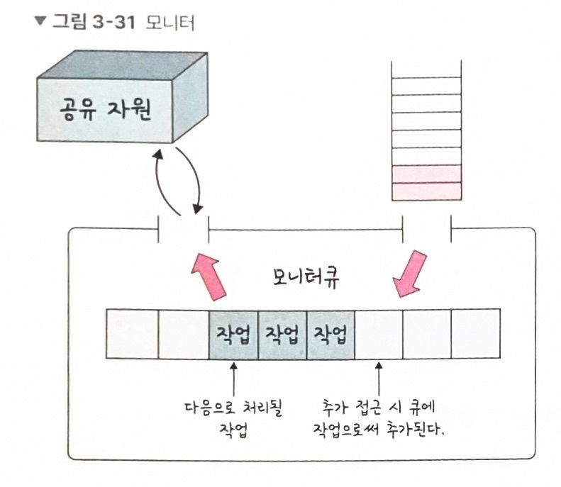

##  **공유 자원(Shared Resource)**

> 공유자원(shared resource)은 _**여러 프로세스가 공동으로 이용하는 변수, 메모리, 파일**_ 등을 말한다.  
> 공유자원은 공동으로 이용되기 때문에 누가 어떻게 데이터를 읽거나 쓰느냐에 따라 결과가 달라질 수 있다.  
> _(프로세스 : 실행중에 있는 프로그램을 의미)_

#### **경쟁 상태(Race Condition)**

> 2개 이상의 프로세스가 공유자원을 병행적으로 읽거나 쓰는 상황, 타이밍이나 순서등이 결과 값에 영향을 줄 수 있다.(동시성 문제)

Ex) 프로세스 a와 b가 전역 변수 예금을 읽는다. 둘 다 1000원을 읽었다. 그 후 a가 500원을 더한 후 저장했고, b가 뒤이어 500원을 뺀 후 저장한다. 결과값은 1000원이 저장돼야 하지만, b가 나중에 저장했으므로 500원이 저장된다.

#### **임계 구역(Critical Section)**

> _**공유 자원 접근 순서에 따라 실행 결과가 달라지는 프로그램의 코드 영역**_(즉, 임계 구역 안에서 race condition 발생)

#### **임계 구역 해결 조건** 

1.  상호 배제(Mutual Exclusion)  
    \-한 프로세스가 임계구역에 들어가면 다른 프로세스는 임계구역에 들어갈 수 없다.
2.  한정 대기(Bounded Waiting)  
    \-어떤 프로세스도 무한대기(infinite Postpone)하지 않아야한다. 특정 프로세스가 임계구역에 진입하지 못하면 안된다.
3.  진행의 융통성(Progress Flexibility)  
    \-한 프로세스가 다른 프로세스의 진행을 방해해서는 안된다.

위 3가지 방법의 토대가 되는 메커니즘은 **잠금(lock)**이다.

예를들어 임계구역이 화장실이라면, 화장실에 어떤 사람이 들어가고 문을 잠근 후 다른 사람이 이 사람이 나오기를 기다리다가 나오면 화장실을 쓰는 것과 같다.

---

## **임계 구역 해결 방법**

> 가장 단순한 방법은 **잠금(lock)**을 이용하는 것이다.  
> 즉, 임계구역에 들어갈 때 잠금을 걸고, 나올때 잠금 해제와 동시에 **동기화 신호**를 보낸다.

### **뮤텍스(mutex)**

> 프로세스 혹은 스레드(손님)가 공유자원(화장실)을 lock을 통해 잠금 설정하고, 사용한 후에는 unlock을 통해 잠금 해제하는 객체를 말한다. 잠금이 설정되면 다른 프로세스나 스레드는 잠긴 코드영역에 접근할 수 없고 해제는 그와 반대다.  
> 뮤텍스는 ***잠금 or 잠금 해제***라는 상태만 가진다. 즉, Key에 해당하는 어떤 오브젝트가 있으며 이 오브젝트를 소유한(쓰레드, 프로세스)만이 공유자원에 접근할 수 있다. _(화장실이 하나뿐인 식당)_

### **세마포어(semaphore)**

> 일반화된 뮤텍스를 말한다. 손님이 화장실을 좀 더 쉽게 이용할 수 있는 레스토랑이라고 생각하자.  
> 화장실에는 여러개의 칸이 있고 화장실 입구에는 현재 화장실의 빈 칸 개수를 보여주는 전광판이 있다고 가정하자.  
> 만약 당신이 화장실을 가고싶다면 입구에서 빈칸의 개수를 확인하고 빈칸이 1개 이상이라면 빈칸의 개수를 하나 뺀 다음에  
> 화장실로 입장해야 하며 나올 때 빈칸의 개수를 하나 더해준다.

### **모니터**

둘 이상의 스레드나 프로세스가 공유자원에 안전하게 접근할 수 있도록 공유자원을 숨기고 해당 접근에 대해 인터페이스만 제공한다.

모니터는 모니터 큐를 통해 공유 자원에 대한 작업을 순차적으로 처리한다.

#### 정리

- 뮤텍스 : 한 쓰레드, 프로세스에 의해 소유될 수 있는 Key를 기반으로 한 상호배제기법
- 세마포어 : 현재 공유자원에 접근할 수 있는 쓰레드, 프로세스의 수를 나타내는 값을 두어 상호배제를 달성하는 기법
- 모니터 : 둘 이상의 스레드나 프로세스가 공유 자원에 안전하게 접근 할 수 있도록 공유자원을 숨기고 해당접근에 대해 인터페이스만 제공하는 기법 -> **상호배제가 자동**임

---

참조

[https://worthpreading.tistory.com/90](https://worthpreading.tistory.com/90)

[뮤텍스(Mutex)와 세마포어(Semaphore)의 차이worthpreading.tistory.com](https://worthpreading.tistory.com/90)

[https://heeonii.tistory.com/14](https://heeonii.tistory.com/14)

[\[운영체제\] Mutex 뮤텍스와 Semaphore 세마포어의 차이heeonii.tistory.com](https://heeonii.tistory.com/14)

[https://hyeonukdev.tistory.com/27](https://hyeonukdev.tistory.com/27)
