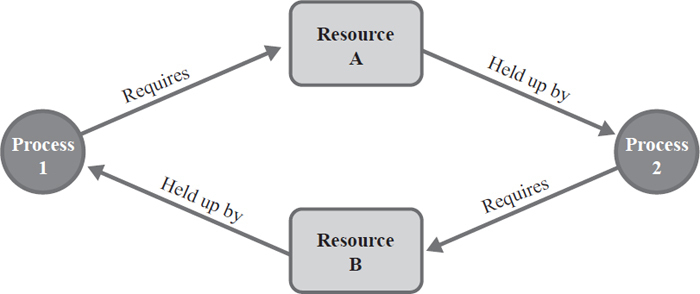

## **데드락(Deadlock)**

운영체제에서 데드락(교착상태)이란, 시스템 자원에 대한 요구가 뒤엉킨 상태이다.

즉, **_둘 이상의 프로세스가 다른 프로세스가 점유하고 있는 자원을 서로 기다릴 때 무한 대기에 빠지는 상황_**을 일컫는다.

**프로세스1은 자원 A가 필요하다. 자원 A는 프로세스2에 의해 잠겨있다.**

**프로세스2는 자원 B가 필요하다. 자원 B는 프로세스1에 의해 잠겨있다.**

**어느 한 프로세스를 강제적으로 종료하지 않으면 컴퓨터가 정지된 것처럼 어떤 작업도 수행할 수 없다.**

---

### **데드락(Deadlock)의 발생조건**

데드락이 발생하기 위해선 아래 **4가지 조건이 모두 충족**해야 한다. **하나라도 만족하지 않는다면 "절대" 데드락이 발생 하지 않는다.**

- **상호 배제(Mutual exclusion)**  
  **한 리소스는 한번에 한 프로세스만 사용할 수 있다**. 사용중인 자원을 다른 프로세스가 사용하려면 요청한 자원이 해제될 때까지 기다려야 한다.
- **점유와 대기(Hold and wait)**  
  자원을 최소한 하나 보유하고, 다른 프로세스에 할당된 자원을 점유하기 위해 대기하는 프로세스가 존재해야 한다.
- **비선점(No preemption)**  
  프로세스가 태스크를 마친 후 리소스를 자발적으로 반환할 때까지 기다린다. **즉, 이미 할당된 자원을 강제로 빼앗을 수 없다.**
- **환형 대기(Circular wait)**  
  공유자원과 공유자원을 사용하기 위해 대기하는 프로세스들이 원형으로 구성되어 있어 자신에게 할당된 자원을 점유하면서 앞이나 뒤에 있는 프로세스의 자원을 요구해야 한다. **즉, Hold and wait 관계의 프로세스들이 서로 기다린다.**

---

### **데드락(Deadlock)의 해결법**

데드락의 해결법을 크게 3가지로 분류할 수 있다.

1.  데드락이 발생하지 않도록 **예방**(prevention)하기
2.  데드락 발생 가능성을 인정하면서도 적절하게 **회피**(avoidance)하기
3.  데드락 발생을 허용하지만 데드락을 **탐지**(detection)하여, **데드락에서 회복**하기

---

#### **1\. 데드락 예방(prevention)**

**데드락의 발생조건 4가지 중 하나라도 발생하지 않게 하는 것**. 즉, 각각의 조건을 방지(부정)하여 데드락 발생 가능성을 차단한다.  
하지만 **상호 배제, 점유와 대기, 비선점, 환형 대기 중 1가지 조건을 깨는 것은 쉽지 않다.** 따라서 아래와 같은 조건을 방지해서 데드락을 예방하는 방법은 **_시스템의 처리량이나 효율성을 떨어트리는 단점_**이 발생할 수 있다.

- **자원의 상호 배제 조건 방지**  
  한번에 여러 프로세스가 공유 자원을 사용할 수 있게 한다.  
  _그러나 상호 배제를 깨면 여러 프로세스가 자원을 공유하게 되면서 의도치 않은 결과를 얻을 수 있다._
- **점유 대기 조건 방지**  
  프로세스가 실행에 필요한 모든 자원을 한꺼번에 요구하고 허용할 때까지 작업을 보류해서,  
  나중에 또 다른 자원을 점유하기 위한 대기 조건을 성립하지 않도록 한다.  
  _그러나 점유와 대기를 깨면 자원이 오랫동안 할당되고 사용되지 않으면서 낭비될 수 있다_
- **비선점 조건 방지**  
  이미 다른 프로세스에게 할당된 자원이 선점권이 없다고 가정할 떄, 높은 우선순위의 프로세스가 해당 자원을 선점할 수 있도록 한다.  
  _그러나 비선점을 깨면 공유 자원에 대한 동기화(상호 배제)의미가 없어진다._
- **환형 대기 조건 방지**  
  자원을 순환 형태로 대기하지 않도록 일정한 한 쪽 방향으로만 자원을 요구할 수 있도록 한다.  
  **그나마 환형대기가 방지 가능하다.**

---

#### **2\. 데드락 회피(avoidance)**

이 기법은 **교착상태를 피해가는 기법**이다.  
주로 은행원 알고리즘(Banker's Algorithm)이 사용된다.

#### \*\*은행원 알고리즘

\*\*

다익스트라가 제안한 기법으로, 은행에서 모든 고객의 요구가 충족되도록 현금을 할당하는데서 유래한 기법이다.  
은행원 알고리즘은 **"최소한 하나의 프로세스에게 할당해 줄 만큼의 자원은 CPU가 보유하고 있어야 한다."**의 개념이다.

- 교착상태를 피하기 위해 시스템은 자원에 대한 2가지 상태를 가진다.  
  **안전 상태** - 시스템이 교착상태를 일으키지 않으면서 모든 프로세스들이 완료될 수 있는 상태를 의미한다.  
  **불안전 상태** - 교착상태가 발생할 수 있는 상태를 의미한다.
- 은행원 알고리즘을 적용하기 위해서는 자원의 양과 사용자(프로세스)수가 일정해야 한다.
- 은행원 알고리즘은 프로세스의 모든 요구를 유한한 시간안에 할당하는 것을 보장한다.

#### **단점**

1.  자원 사용률이 굉장히 낮다. (안전상태를 유지해야 하므로)
2.  프로세스는 최대 자원 요구량을 미리 파악해야 한다.
3.  프로세스들은 자원을 반드시 순환시켜야 한다.
4.  할당할 수 있는 자원의 수가 일정해야 한다.

---

#### **3\. 데드락 탐지(detection) 및 회복(recovery)**

먼저 시스템이 데드락 예방이나 회피법을 사용하지 않았을 때, 데드락이 발생한 경우 회복하기 위해 **데드락을 탐지하고, 회복하는 알고리즘**을 사용한다.

**3-1. 탐지 기법**

> Allocation, Request, Available 등으로 시스템에 데드락이 발생했는지 여부를 탐색한다.  
> 즉, 자원 할당 상태를 갖고 파악한다.

**3-2. 회복 기법**

> 데드락을 탐지기법을 통해 발견했다면, 환형 대기에서 벗어나 데드락으로부터 회복하기 위한 방법을 사용한다.

**3-2-1. 단순히 프로세스를 1개 이상 중단시키기**

**\-** 교착 상태에 빠진 모든 프로세스를 중단시키는 방법  
계속 연산중이던 프로세스들도 모두 일시에 중단되어 부분 결과가 폐기될 수 있는 부작용이 있다.

\- 프로세스를 하나씩 중단 시킬때마다 탐지 알고리즘으로 데드락을 탐지하면서 회복시키는 방법  
매번 탐지 알고리즘을 호출 및 수행해야 하므로 부담이 되는 직업일 수 있음

**3-2-2. 자원 선점하기**

\- 프로세스에 할당된 자원을 선점해서, 교착 상태를 해결할 때까지 그 자원을 다른 프로세스에 할당해 주는 방법

> **※ 자원 선점시 고려사항 ※  
> **  
> **1\. 자원을 선점할 프로세스 선택 문제** : 최소의 피해를 줄 수 있는 프로세스를 선택한다.  
> **2\. 자원을 선점한 프로세스의 복귀 문제** : 자원이 부족한 상태이므로 대부분 일시 중지시키고 다시 시작하는 방법을 사용한다.  
> **3\. 기아 현상 문제** : 한 프로세스가 계속하여 자원 선점 대상이 되지 못하도록 고려해야 한다.

---

참조

[https://coding-factory.tistory.com/311](https://coding-factory.tistory.com/311)

[https://jaehoney.tistory.com/161](https://jaehoney.tistory.com/161)

[https://chanhuiseok.github.io/posts/cs-2/](https://chanhuiseok.github.io/posts/cs-2/)
