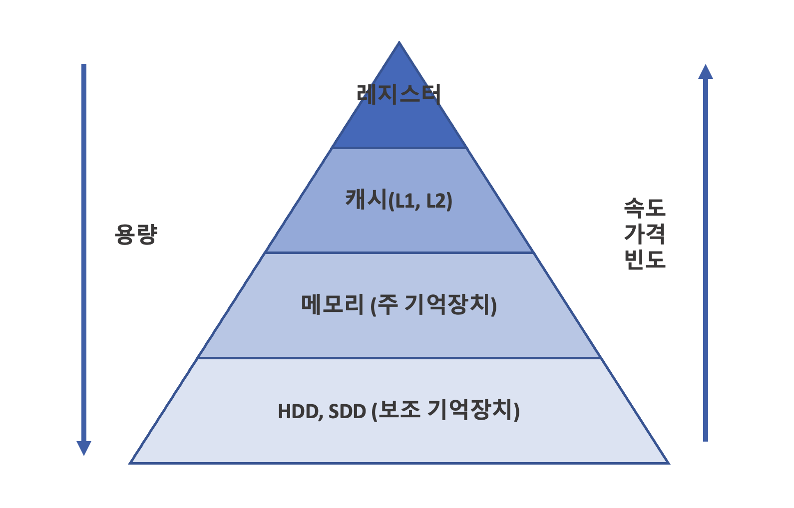

# 💾 메모리
메모리란 프로세스 실행 시에 CPU가 필요한 주소나 정보를 저장하고 액세스하여 사용할 수 있도록 하는 공간을 의미한다.

## 메모리 계층
메모리 계층 구조란 메모리를 필요에 따라 단계적으로 나누어 둔 것을 의미한다.     
메모리의 종류는 [레지스터](#1-레지스터), [캐시](#2-캐시-메모리), [메모리(RAM)](#3-주-기억장치), [저장장치](#4-보조-기억장치)가 있으며,
메모리들은 아래 그림과 같이 피라미드처럼 계층적인 구조를 가진다.

이러한 계층적인 구조를 가지는 이유는 결론적으로 CPU와 메모리의 성능 차이를 보완하기 위함이다.   
CPU가 빠르게 연산을 수행해도, 데이터에 접근하는 과정의 속도가 느리면 전체적인 처리 속도가 느려진다.
이를 개선하기 위해 메모리들에 계층을 두는 것이며, 이를 통해 프로그램을 효율적으로 실행할 수 있다.

### 1. 레지스터
- CPU 내의 메모리
- 휘발성
- 속도 가장 빠름 / 기억 용량 가장 적음

### 2. 캐시 메모리
- 데이터를 미리 복사해놓는 임시 저장소
- 캐시는 SRAM으로 이루어진다.
  - `SRAM(Static RAM)`: 가장 빠르고 비싼 메모리. 전기가 들어오는 동안에는 기록한 비트값이 안정적으로 유지됨
- L1, L2, L3 캐시로 나누어 사용하며, 레벨이 커질수록 속도는 느려지고 용량은 커진다.
  - 데이터를 찾지 못할 경우 순차적으로(L1 -> L2 -> L3 -> DRAM) 탐색하여 데이터를 가져온다.
- 빠른 장치(CPU)와 느린 장치(메모리)에서 속도 차이에 따른 병목 현상을 줄이기 위한 메모리

> 💡 캐시에 대해 더 자세히 알고 싶다면?  ➡️ [캐시와 캐시메모리](%EC%BA%90%EC%8B%9C%EC%99%80_%EC%BA%90%EC%8B%9C%EB%A9%94%EB%AA%A8%EB%A6%AC.md)

### 3. 주 기억장치
- 하드디스크로부터 데이터를 복사해서 임시저장하고, 이를 필요시마다 CPU에 빠르게 전달한다.
- 주로 DRAM을 가리킴
  - `DRAM(Dynamic RAM)`: 보통 컴퓨터 램을 말함. SRAM보다 저렴하고, 방전되면 데이터가 사라지기 때문에 충전을 해 주어야 함

### 4. 보조 기억장치
- `HDD(Hard Disk Drive)`, `SSD(Solid State Disk)`를 일컫는다.
- 비휘발성
- 속도가 가장 낮지만 저장 용량이 가장 크다.
  - DRAM은 최대 수십GB 이지만, Disk는 수천GB

-------------------------------------------------

### References
- https://joooing.tistory.com/entry/cs3
- https://m.blog.naver.com/cih468/221734632375