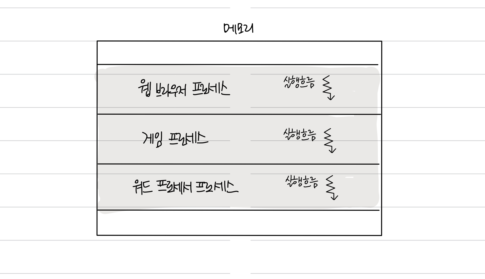
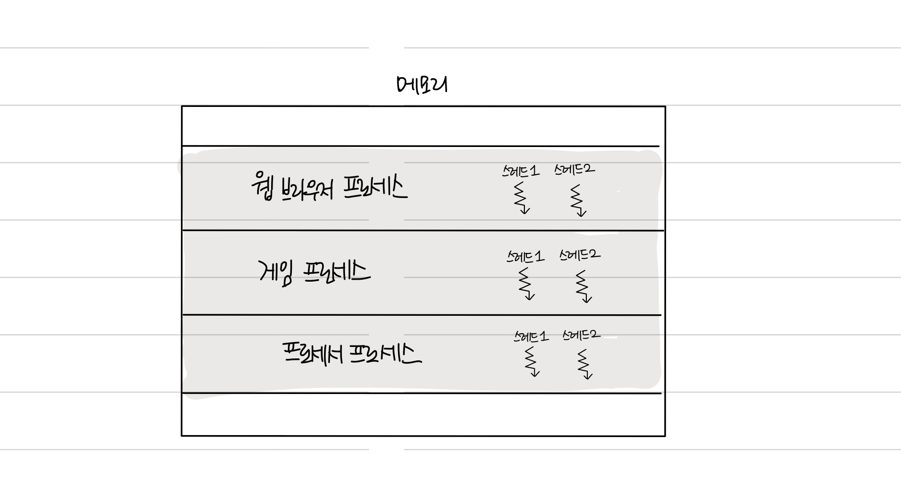
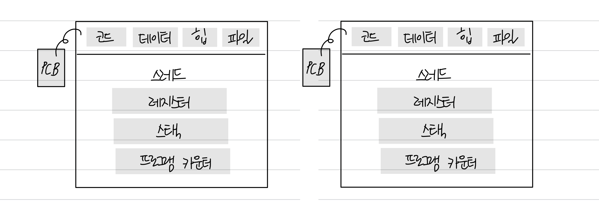
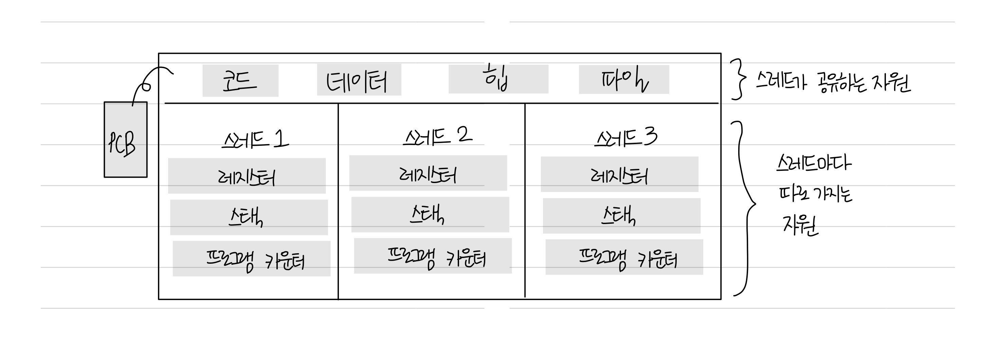

## 📑 스레드

### 📌 스레드란?

- **프로세스**의 실행 가능한 **가장 작은 단위**를 말한다.
- **프로세스**는 **여러 스레드**를 가질 수 있다.
  - ex. 웹 브라우저의 프로세스 ⇒ 화면 출력 스레드 + 입력 스레드 + 검색 스레드
- `코드`, `데이터`, `힙`, `스택`을 각각 생성하는 **프로세스**와는 달리
  - **스레드**는 `코드`, `데이터`, `힙`은 스레드끼리 서로 공유하고, 그 외 영역은 각각 생성된다.

> 현재는 CPU에게 전달할 때 프로세스 단위가 아니라 스레드 단위로 처리할 작업을 보내는 경우가 많다고 한다.

### 📌 스레드의 구성요소

실행에 필요한 최소한의 정보를 가지고 있다.

- 스레드 ID / 프로그램 카운터를 비롯한 레지스터 값 / 스택 등

### 📌 종류

1. **단일 스레드 프로세스**
   **실행 흐름이 하나**인 프로세스를 말한다.
   

        
    

2. **멀티 스레드 프로세스**

   프로세스를 이루는 **여러 명령어를 동시에 실행**할 수 있다.
    

        
    

 
 

## 📑 멀티 프로세스와 멀티 스레드

### 📌 멀티프로세싱

    

- **여러 개의 ‘프로세스’**, 즉 멀티프로세스를 통해 동시에 두 가지 이상의 일을 수행할 수 있는 것을 말한다.
- **장점**
  - 하나 이상의 일을 **병렬**로 처리할 수 있다.
  - 특정 프로세스의 메모리, 프로세스 중 일부에 문제가 발생되더라도 다른 프로세스를 이용해서 처리할 수 있으므로 **신뢰성이 높다.**
- **단점**
  - 멀티 스레드보다 많은 메모리 공간과 CPU 시간을 차지한다
- **예시**
  - **웹 브라우저**는 멀티프로세스 구조를 가지고 있다.
    1. **브라우저 프로세스:** 주소 표시줄, 북마크 막대, 뒤로 가기 버튼, 앞으로 가기 버튼 등을 담당하며 네트워크 요청이나 파일 접근 같은 권한을 담당한다.
    2. **렌더러 프로세스**: 웹 사이트에서 사용하는 플러그인을 제어합니다.
    3. **GPU 프로세스**: GPU를 이용해서 화면을 그리는 부분을 제어합니다.

 

### 📌 멀티스레딩

    

- 프로세스 내 작업을 **여러 개의 ‘스레드’**, 멀티스레드로 처리하는 기법이다.
- **장점**
  - 스택 영역만 독립된 공간을 할당받고 Code, Data, Heap 영역은 서로 공유하고 있기 때문에 멀티 프로세스보다 적은 메모리 공간을 차지하고 문맥교환이 빠르다.
  - 동시성에도 큰 장점이 있다.
    **\*동시성?**
    서로 독립적인 작업들을 작은 단위로 나누고 동시에 실행되는 것처럼 보여주는 것을 말한다.
- **단점**
  - 한 스레드에 문제가 생기면 다른 스레드에도 영향을 끼쳐 스레드로 이루어져 있는 프로세스에 영향을 줄 수 있다.
- **예시**
  - 웹 브라우저의 렌더러 프로세스
    - 메인 스레드, 워커 스레드, 컴포지터 스레드, 레스트 스레드가 존재

 

### 📌 멀티 프로세스와 멀티 스레드의 차이점

- **프로세스**끼리는 자원을 공유하지 않는다 → 남남처럼 독립적으로 실행된다
  - 프로세스 간에도 자원을 주고받을 수 있다: 프로세스 간 통신 (IPC)
- **스레드**는 프로세스의 자원을 공유한다 → 협력과 통신에 유리하다
  - 단점: 하나의 스레드가 문제가 생기면 전체 프로세스에 영향을 끼친다.

 
 
 

---

### Reference

- [[혼자 공부하는 컴퓨터 구조 + 운영체제] 28강. 스레드](https://www.youtube.com/watch?v=zUGvpUtNlwI&list=PLVsNizTWUw7FCS83JhC1vflK8OcLRG0Hl&index=30)
