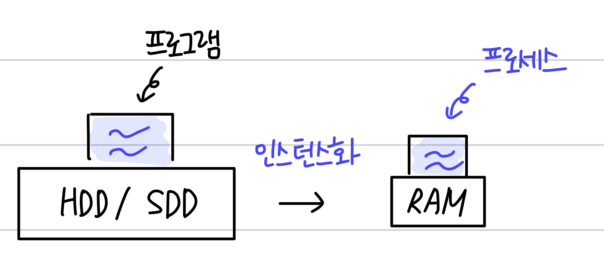
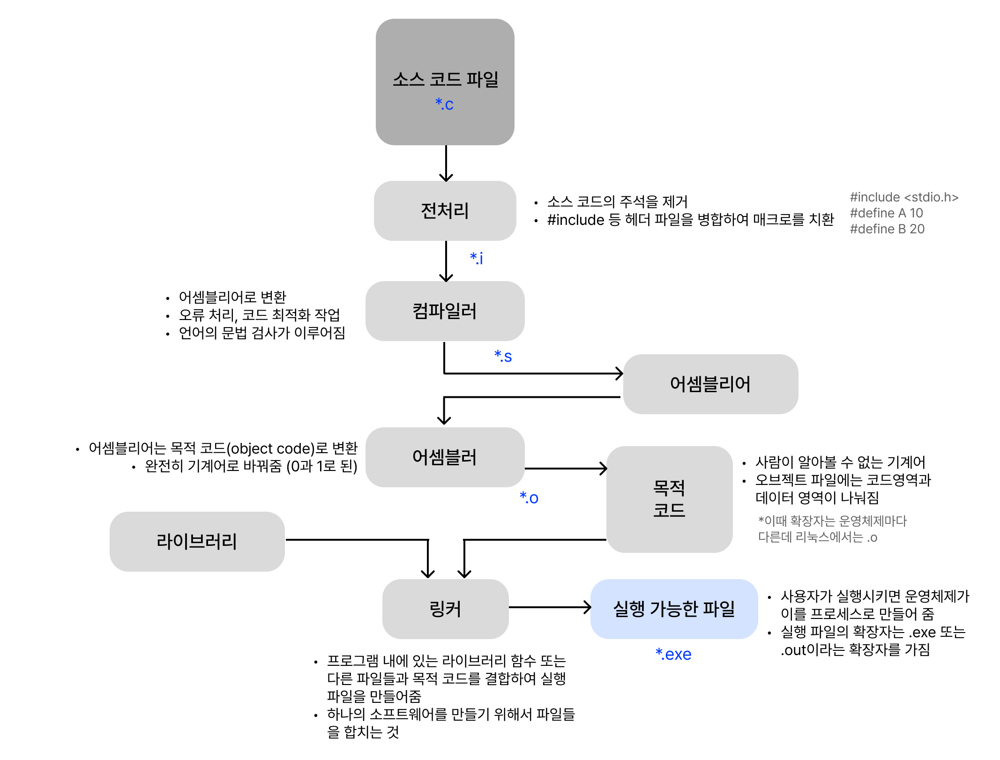

# 📑 프로세스란?

`프로세스`는 `프로그램`이 메모리에 올라가 **인스턴스화**된 것을 말한다.

쉽게 표현하자면 **컴퓨터에서 실행되고 있는 프로그램**을 말하며, CPU 스케줄링의 대상이 되는 `작업(task)`이라는 용어와 거의 같은 의미로 쓰인다.

> 인스턴스화?

`인스턴스`란 추상화 개념 또는 클래스 객체, 컴퓨터 프로세스 등과 같은 템플릿이 **실제로 구현된 것**을 말한다.

`인스턴스화`는 이러한 인스턴스를 만드는 것을 의미한다. 클래스 내의 객체에 대해 특정한 변형을 정의하고, 이름을 붙인 다음, 그것을 물리적인 어떤 장소에 위치시키는 등의 작업을 통해, 인스턴스를 만들게 된다.

 

### 프로그램과 프로세스

즉, `프로그램`이 메모리에 올라가면 `프로세스`가 되는 **인스턴스화**가 일어나고, 이후 운영체제의 CPU 스케줄러에 따라 CPU가 `프로세스`를 실행한다.

 
 

# 📑 컴파일이란?

컴파일이란 `고수준 언어`로 작성된 프로그램을 컴퓨터가 바로 실행할 수 있는 `저수준 언어` 프로그램으로 변환하는 기법을 의미한다.

 

> 고수준 언어 & 저수준 언어?

고수준 언어는 C, C++, Java 등 **사람의 언어와 비슷한 특징**을 갖는 언어를 말한다.

저수준 언어는 기계어, 어셈블리 언어 등 **컴퓨터가 이해하기 쉬운** 언어를 말한다.

 

### 컴파일러?

이러한 컴파일을 하는 프로그램을 컴파일러(Compiler)라고 한다.

 

### 원시 프로그램, 목적 프로그램?

처음 `고급언어`로 작성된 프로그램을 **원시 프로그램 (Source Program)** 이라 하고,
컴파일의 결과로 생성되는 `기계어` 프로그램을 **목적 프로그램 (Object Program)** 이라고 한다.

프로그램을 만드는 과정은 만드는 언어마다 다를 수 있으며 컴파일 언어인 C언어 기반의 프로그램을 기준으로 설명하면 컴파일러가 컴파일 과정을 통해 컴퓨터가 이해할 수 있는 기계어로 번역하여 실행할 수 있는 파일을 만들게 된다.

 

## 컴파일 과정

> 전처리 과정 → 컴파일 과정 → 어셈블리 과정 → 링킹 과정

보통 위의 4가지 단계로 나누어진다고 볼 수 있다.

 

### 1. 전처리 과정 (preprocessing)

본격적으로 컴파일하기 전에 처리할 작업들을 진행한다.

**소스 코드의 주석을 제거**하고, #define 등 프로그래밍의 편의를 위해 작성된 매크로를 변환하며 #include 등 헤더 파일을 병합하여 **매크로를 치환**하는 과정을 진행하게 된다.

### 2. 컴파일 과정 (compiling)

전처리가 완료 되어도 여전히 소스 코드이기 때문에 전처리가 완료된 소스 코드를 **저급 언어(어셈블리어)로 변환**하는 과정이다.

이 과정에서 오류 처리, 코드 최적화 작업을 진행하며 언어의 문법 검사도 이루어진다.

### 3. 어셈블 과정 (assembling)

**어셈블리어를 기계어로 변환**하는 과정입니다. 이 과정을 통해 목적 코드(object file)을 포함하는 목적 파일이 된다.

이때 확장자는 운영체제마다 다른데 리눅스에서는 .o이다. 예를 들어 program.c라는 파일을 만들었을 때 program.o 라는 파일이 만들어지게 된다.

### 4. 링킹 과정 (linking)

한 개의 프로그램을 만들기 위해 main.c, helper.c의 파일과 여러 라이브러리 함수들을 사용했다고 생각해보자. 이러한 파일들을 한개로 합쳐줄 필요가 있지 않은가? 이렇게 합쳐주는 과정을 링킹 과정이라고 한다.

즉, 프로그램 내에 있는 라이브러리 함수 또는 다른 파일들과 목적 코드를 **결합**하여 실행 파일을 만드는 과정이다. 이 때, 실행 파일의 확장자는 .exe 또는 .out이라는 확장자를 가진다.

 

**\*목적 파일 vs 실행 파일**

둘 다 기계어로 이루어진 파일이지만, 목적 파일과 실행 파일은 다른 것입니다. 목적 파일이 링킹(linking)을 거친 후에야 실행 파일이 된다.

 

> 예를들어, 리눅스 환경에서의 C언어의 **컴파일 과정**을 도식화하면 다음과 같다.

 
 

---

# 정적 라이브러리와 동적 라이브러리

라이브러리는 정적 라이브러리와 동적 라이브러리로 나뉜다.

 

## 정적 라이브러리(static library)란?

정적 라이브러리는 프로그램 빌드 시 **라이브러리가 제공하는 모든 코드를 실행 파일에 넣는 방식**으로 라이브러리를 쓰는 방법이다.

즉, 라이브러리의 동작 코드가 이를 사용하는 실행 바이너리 속에 포함되기 때문에 별도의 추가 작업없이, 독립적으로 라이브러리 함수들을 사용할 수 있다. 이는 시스템 환경 등 외부 의존도가 낮은 장점이 있다.

그러나 정적 라이브러리를 사용하는 프로그램이 늘어나면 늘어날수록 불필요하게 실행 파일들의 크기가 커지며, 라이브러리가 동시에 여러 실행 바이너리에 포함되어 실행되는 경우 메인 메모리의 공간 활용 효율이 떨어고, 코드 중복 등의 메모리 효율성이 떨어진다는 단점이 존재한다.

 

## 동적 라이브러리(DLL: dynamic linking library)란?

동적 라이브러리는 프로그램 실행 시 필요할 때만 DLL이라는 함수 정보를 통해 **참조하여 라이브러리를 쓰는 방법**이다.

동적 라이브러리는 정적 라이브러리의 장단점과 반대라고 볼 수 있다.
즉, 메모리 효율성에서의 장점을 지니지만 외부 의존도가 높아진다는 단점이 있다.

 
 
 

---

### Reference

- [https://www.youtube.com/watch?v=MYKFLepF1UM](https://www.youtube.com/watch?v=MYKFLepF1UM)
- [https://reakwon.tistory.com/52](https://reakwon.tistory.com/52)
- [https://bradbury.tistory.com/226](https://bradbury.tistory.com/226)
- [https://luyin.tistory.com/201](https://luyin.tistory.com/201)
- [https://github.com/JaeYeopHan/Interview_Question_for_Beginner/tree/master/OS#프로세스와-스레드의-차이](https://github.com/JaeYeopHan/Interview_Question_for_Beginner/tree/master/OS#%ED%94%84%EB%A1%9C%EC%84%B8%EC%8A%A4%EC%99%80-%EC%8A%A4%EB%A0%88%EB%93%9C%EC%9D%98-%EC%B0%A8%EC%9D%B4)
