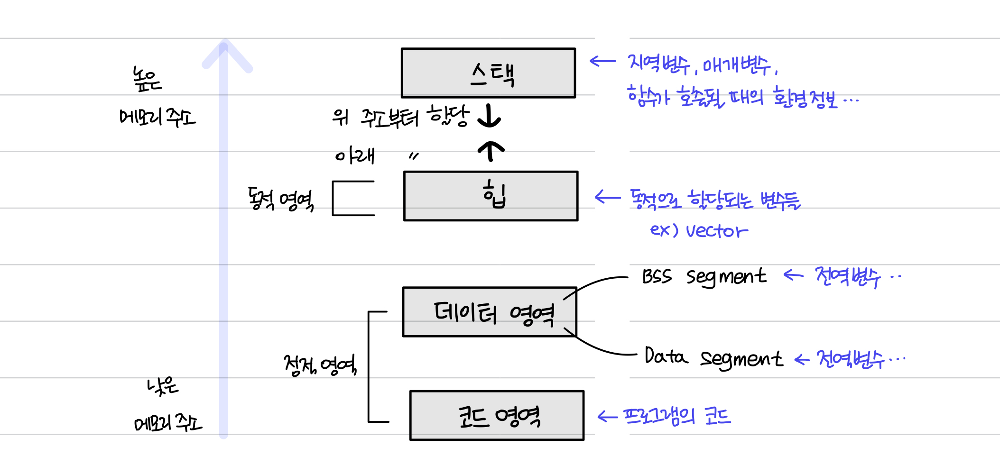

> 프로세스의 메모리 구조를 알아보기 전에, 먼저 정적 할당과 동적 할당에 대해 정리해보자.

## 📌 정적할당과 동적할당

### 정적 할당

- `컴파일` 단계에서 메모리를 할당받는다.
- 프로그램이 로딩할 때 크기를 **결정**한다.
- **장점**: 반환이 자동으로 이루어지기 때문에 메모리 누수를 걱정하지 않아도 된다.
- **단점**: 필요없어지더라도 실행 동안 공간이 유지되어 있기 때문에, 메모리 공간의 낭비가 발생할 수 있다.

### 동적 할당

- `런타임` 단계에서 메모리를 할당받는다.
- 프로그램 수행 중에 메모리 크기가 **변한다**.
- **장점**: 원하는 만큼의 메모리가 맞춤으로 할당된다.
- **단점**: 더 이상 사용하지 않는 공간을 사용자가 직접 해제해주어야 한다.

 

# 📑 프로세스의 메모리 구조

운영체제는 프로세스에 적절한 메모리를 할당하는데 다음 구조(스택, 힙, 데이터, 코드 영역)를 기반으로 할당한다.

## 📌 스택과 힙

### 1. 스택

- `지역 변수`, `매개변수`, `실행되는 함수`에 의해 늘어들거나 줄어드는 메모리 영역이다.
- 함수가 호출될 때마다 호출될 때의 환경 등 특정 정보가 스택에 계속해서 저장된다.
- 재귀 함수가 호출된다고 했을 때 새로운 스택 프레임이 매번 사용되기 때문에 함수 내의 변수 집합이 해당 함수의 다른 인스턴스 변수를 방해하지 않는다.
- 스택은 작은 메모리 공간에 대해 빠른 액세스가 가능하다.

### 2. 힙

- `동적으로 할당되는 변수`들을 담는다.
  - 예를 들어 vector는 내부적으로 힙 영역을 사용한다.
- 프로그램을 만드는 사용자, 즉 프로그래머가 직접 할당할 수 있는 저장공간이다.
- malloc(), free() 함수를 통해 관리할 수 있으며, 동적으로 관리되는 자료 구조의 경우 힙 영역을 사용한다.
- 힙은 상대적으로 느리지만, 할당 가능한 메모리 공간이 많아서 크기가 제한되지 않는다.

 

## 📌 데이터 영역과 코드 영역

- **정적 할당**되는 영역이다.

### 3. BSS segment

- `전역 변수` or `static, const로 선언되어 있고 0으로 초기화` or `초기화가 어떠한 값으로도 되어 있지 않은 변수`들이 이 메모리 영역에 할당된다.

### 4. Data Segment

- `전역 변수` 또는 `static, const로 선언되어 있고 0이 아닌 값으로 초기화된 변수`가 이 메모리 영역에 할당된다.

### 5. Code/text segment

- `프로그램의 코드`, `기계어로 이루어진 명령어`가 저장되는 영역이다.
- 데이터가 아닌 CPU가 실행할 명령어가 담기기에 쓰기가 금지된 영역이다. (read-only)

 
 

---

### 🚨 스택은 그래서 동적 영역인가 정적 영역인가….?

**스택의 크기**는 **컴파일 타임에 결정**되는 것이 맞다. 따라서 스택의 할당된 메모리 크기는 프로세스의 생애주기 동안 변하지 않는다.

그러나 크기만 결정되어 있는 것이지 비어있는 상태라고 한다. **함수가 호출**될 때 해당 지역변수 등의 데이터를 위한 공간이 할당되고, **함수가 반환**될 때 그 할당된 영역이 해제되는 것이다.
이 때, 스택의 전반적인 크기는 프로세스가 종료될 때까지 변하지 않기 때문에 계속 동일한 크기를 유지하고 있다.

이렇듯 스택의 크기는 **컴파일 타임**에 할당되는 건 맞지만, 메모리 영역안에 들어가는 값들이 함수의 실행에 따라 동적으로 변하기 때문에 **동적영역**이라고도 표현하는 것 같다.

(\*틀리면 말해주세요!)

 
 
 

---

### Reference

- [[컴퓨터 공학 기초 강의] 26강. 프로세스의 개요 - 프로세스의 메모리 영역](https://youtu.be/Jjfah3t_xWk?t=1157)
- [프로세스의 메모리 구조 - 디딤돌](https://wikidocs.net/165974)
