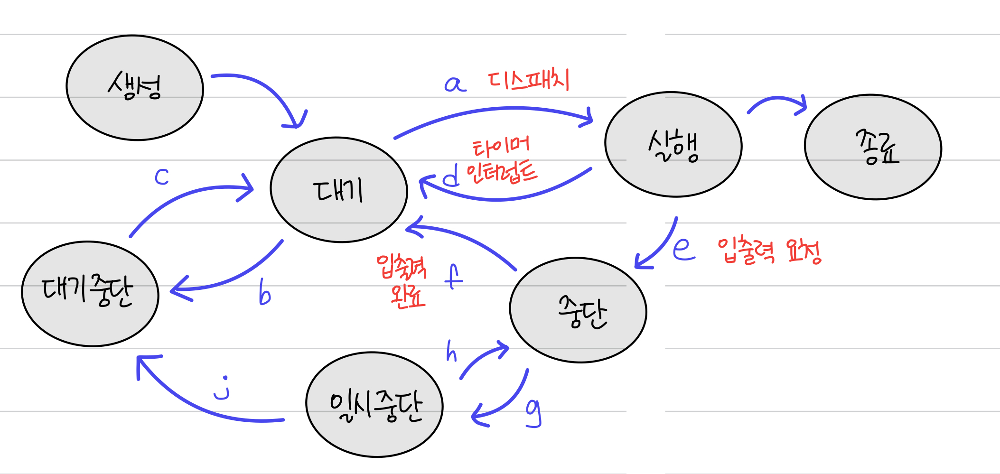

# 📑 프로세스의 상태

프로세스가 만들어져 시스템에 존재하는 동안 여러 사건에 의해 일련의 **상태 변화**를 거친다. 그리고 프로세스의 상태는 PCB에 기록된다. 프로세스의 상태는 운영체제마다 조금씩 차이가 있다.

**\*PCB**

뒤에서 나올 내용이지만 간략하게 설명하자면, PCB는 특정 프로세스에 대한 중요한 정보를 저장하고 있는 운영체제의 자료구조를 말한다.

 

 

## 1. 생성 상태 (create)

- 프로세스가 이제 막 메모리에 적재되어 PCB를 할당 받은 상태를 말한다.
- fork() 또는 exec() 함수를 통해 생성된다.
- 준비가 완료 됐다면 대기 상태로 이동한다.

### - fork()

- fork()는 부모 프로세스의 주소 공간을 그대로 복사하며, 새로운 자식 프로세스를 생성하는 함수다.
- 주소 공간만 복사할 뿐이지 부모 프로세스의 비동기 작업을 상속하지는 않는다.

### - exec()

- exec()은 새롭게 프로세스를 생성하는 함수다.

 

## 2. 대기 상태 (ready)

- 자신의 차례가 아니기에 기다리는 상태를 말한다.
- 메모리 공간이 충분하면 메모리를 할당받고, 아니면 아닌 상태로 대기하고 있으며 CPU 스케줄러로부터 CPU 소유권이 넘어오기를 기다린다.

  a. 대기 → 실행 (dispatch): CPU를 할당받으면 실행 상태로 바뀌고 실행된다.

  b. 대기 → 대기 중단: 준비 상태였다가 메모리를 뺏긴 상태를 말한다.

 

## 3. 대기 중단 상태 (ready suspended)

- 메모리 부족으로 일시 중단된 상태다.

  c. 대기 중단 → 대기: 다시 메모리를 받으면 대기 상태로 다시 돌아간다.

 

## 4. 실행 상태 (running)

- CPU를 할당받아 실행 중인 상태를 의미한다.
- CPU 소유권과 메모리를 할당받고 명령을 수행 중인 상태이며, 이를 CPU burst가 일어났다고도 표현한다.

  d. 실행 → 대기(Timeout,Timer interrupt): CPU를 받아 실행하다가, 시간 할당량을 소진하여 뺏긴 상태이다.

  e. 실행 → 중단

  - 실행 상태의 프로세스가 **입출력**이 필요하게 되어 시스템 호출하고, 입출력 처리의 종료를 기다리는 상태이다.
  - 이때, CPU는 바로 준비 상태의 프로세스 하나를 선택해 실행한다.

 

## 5. 중단 상태 (blocked)

- 어떤 이벤트가 발생한 이후 기다리며 프로세스가 차단된 상태다.
- I/O 디바이스에 의한 인터럽트로 이런 현상이 많이 발생하기도 한다.

  f. 중단 → 대기

  - 입출력이 완료되어 CPU 할당을 기다리는 상태이다.
  - 입출력 작업은 CPU에 비해 느리기에 이 경우 중단 상태로 접어드는 것이고, 입출력 작업이 끝나면 (= 입출력 완료 인터럽트를 받으면) 대기 상태로 전환된다.

  g. 중단 → 일시 중단: 메모리의 여유 공간 확보를 위해, 중단 상태에서 메모리를 뺏겨 일시 중단 상태로 전환된다.

 

## 6. 일시 중단 상태 (blocked suspended)

- 대기 중단 상태와 유사하다.
- 중단된 상태에서 프로세스가 실행되려고 했지만, 메모리 부족으로 일시 중단된 상태이다.

  h. 일시 중단 → 중단: 메모리가 확보되어 중단 상태로 전환된 경우이다.

  j. 일시 중단 → 대기 중단: 입출력이나 기다리던 사건이 종료된 경우이다.

 

## 7. 종료 상태

- 메모리와 CPU 소유권을 모두 놓고 가는 상태, 즉 프로세스가 종료된 상태를 말한다.
- PCB, 프로세스의 메모리 영역을 정리하는 상태이다.
- 종료는 자연스럽게 종료되는 것도 있지만 부모 프로세스가 자식 프로세스를 강제하는 비자발적 종료(abort)로 종료되는 상황도 있다.
- 자식 프로세스에 할당된 자원의 한계치를 넘어서거나, 부모 프로세스가 종료되거나, 사용자가 process.kill 등 여러 명령어로 프로세스를 종료할 때 발생한다.

 
 
 

---

### Reference

- [혼자 공부하는 컴퓨터 구조 + 운영체제](https://www.youtube.com/watch?v=wz9C_vqME8g&list=PLVsNizTWUw7FCS83JhC1vflK8OcLRG0Hl&index=29)
- [프로세스란? 프로세스의 상태](https://velog.io/@mingadinga_1234/%ED%94%84%EB%A1%9C%EC%84%B8%EC%8A%A4%EB%9E%80-%ED%94%84%EB%A1%9C%EC%84%B8%EC%8A%A4%EC%9D%98-%EC%83%81%ED%83%9C)
